# C4 Level 3 — Components





The Rust core decomposes into one crate per component. Each crate is the
unit of agent ownership (see [`domain-ownership.md`](domain-ownership.md)).

## Dependency rule

> A component may depend on `common` and on no other component, except
> where this document explicitly grants the dependency.

`common` holds the shared types and trait definitions. Anything else
crossing a boundary either flows through trait objects defined in
`common`, or via the orchestrator wiring everything together.

The explicit cross-component dependencies and the phase each crate first
appears in:

| Crate | First phase | May depend on |
|---|---|---|
| `common` | 1 | (nothing in this workspace) |
| `audio-capture` | 1 | `common` |
| `vad-chunker` | 2 | `common` |
| `asr-runtime` | 2 | `common` |
| `asr-parakeet` | 8 | `common` |
| `diarizer` | 6 | `common` |
| `summariser` | 5 | `common` |
| `notes-crdt` | WS4-B | `common` |
| `persistence` | 1 (minimal) → 4 (full) | `common`, `notes-crdt` |
| `model-registry` | 2 | `common`, `settings` |
| `settings` | 1 | `common` |
| `orchestrator` | 1 (minimal) → 2 (live pipeline) | `common`, `audio-capture`, `vad-chunker`, `asr-runtime`, `asr-parakeet`, `diarizer`, `persistence`, `model-registry`, `settings` |
| `agent-tools` | 9 | `common`, `persistence`, `notes-crdt`, `orchestrator`, `rag-retrieval` |
| `chat-agent` | 9 | `common`, `summariser`, `agent-tools` |
| `mcp-server` | 10 | `common`, `agent-tools` |
| `tunnel-client` | WS4-A | (nothing in this workspace) |
| `sync` | WS4-B | `common`, `notes-crdt` |
| `sync-ffi` | WS4-B (phone) | `common`, `sync`, `notes-crdt` ¶ |
| `election` | WS4-B (producer-gate) | `common`, `persistence`, `notes-crdt` |
| `doc-convert` | Attachments WS | `common` |
| `rag-retrieval` | RAG | `common` |
| `embedder` | RAG | `common`, `llama-cpp-2` |
| `ipc-bridge` | 1 | `common`, `orchestrator`, `persistence`, `notes-crdt`, `summariser`, `settings`, `agent-tools`, `chat-agent`, `doc-convert`, `embedder`, `rag-retrieval` |
| `app-main` (bin) | 1 | `common`, `orchestrator`, `ipc-bridge`, `model-registry`, `settings`, `agent-tools`, `mcp-server`†, `tunnel-client`‡, `sync`§, `election`※ |
| `headless` (bin) | WS4-B | `common`, `persistence`, `notes-crdt`, `sync`, `settings`, `tunnel-client`⊕ ‖ |

† `mcp-server` is an **optional** edge of `app-main`, gated by the `connected`
Cargo feature (default ON). The free artifact is built with
`--no-default-features` and omits `mcp-server` and its transitive rmcp stack.
See `cross-cutting.md` — "Build variants".

‡ `tunnel-client` is an **optional** edge of `app-main`, gated by the same
`connected` Cargo feature as `mcp-server` (it is part of the connected-tier
surface — the free build has no relay). The crate compiles unconditionally as a
workspace member (`cargo test`/workspace build) without requiring the
`app-main` edge, the same as `mcp-server`. The free artifact omits it. See
`cross-cutting.md` — "Build variants".

§ `sync` is an **optional** edge of `app-main`, gated by the same `connected`
Cargo feature as `mcp-server` / `tunnel-client` (it is part of the connected-tier
surface — the free build does not sync). `sync` is a near-leaf transport crate:
device-to-device sync over iroh, exchanging Yjs notes-update frames (a small
custom ALPN protocol) and content-addressed meeting-media (audio + note assets).
It takes **no** workspace edge beyond `common` (shared types / errors) and
`notes-crdt` (read the authoritative `notes.ydoc` via `NotesStore`; apply
received updates; `MeetingFolder::ensure` the inbound folder). It does **not**
depend on `persistence`: the notes-CRDT primitives were extracted into the leaf
`notes-crdt` crate (see its dependency-table row) so `sync`'s lib stays off the
C-heavy graph (libsql / audiopus / ogg) and cross-compiles to mobile targets.
`persistence::assets` (note-image round-trips) is reached only as a
DEV-dependency by `sync`'s integration tests. The `ipc-bridge` trait injection
(the `SyncControl` seam + `DisabledSync`, mirroring the `TunnelControl` seam)
takes NO `sync` edge — `ipc-bridge` carries the trait + `DisabledSync`
unconditionally and `app-main` injects the connected implementation. The
`app-main -> sync` edge (the connected `SyncControl` in `src-tauri/src/sync.rs`
that holds the `sync` engine) is gated by the
`connected` Cargo feature exactly like the `mcp-server` / `tunnel-client` edges;
the free build wires `disabled_sync()` and takes no edge. See `cross-cutting.md`
— "Build variants".

**Account-mediated peer discovery (B2, `planning/DESIGN_account-peer-source.md`).**
`sync::account` adds a SECOND, additive source of peer addresses beside manual
ticket pairing: `account::AccountEndpointSource` is a trait `sync` defines and
the consumer implements — the account-service HTTP fetcher bound to the device's
credential — so `sync` gains **no** new dependency-table edge (no HTTP/account
crate; the trait is the boundary, exactly as `election::ElectionDriver` keeps
`election` off `sync`/`orchestrator`). `account::run_account_refresh_loop` takes
the injected source, registers this device's endpoint, then on each tick fetches
the account's endpoint list and calls a caller-supplied `add_peer` closure for
every entry `account::peers_to_add` selects (self filtered, de-duplicated by
endpoint id) — `add_peer` is a closure rather than a direct `SyncEngine` call so
the loop is unit-testable without a live engine. The loop takes its `stop:
Arc<tokio::sync::Notify>` as a parameter rather than creating one, so the spawner
(app-main, B4) can wire it onto the same cancellation token as the local
peers-file poll. `SyncEngine::add_account_peer(endpoint_id: &str, relay_url:
&str) -> Result<()>` is the string-keyed primitive both the loop's `add_peer`
closure and `sync-ffi`'s wrapper call: parses both, builds the same `id + relay`
`EndpointAddr` shape `push_all_to`/`peer_relay_addr` already dial with, and
registers it via `add_peer`. Account-source and manual pairing / the file-source
fallback are additive — all feed the one `PeerDirectory`. B4 (desktop wiring)
is now implemented: `tunnel-client` gains a raw `AccountDirectoryClient`
(`GET /v1/account/devices`, `PUT /v1/account/devices/self/endpoint`, bearer-
authed with the device's `mdc_` credential, its own `DeviceEndpointEntry` DTO)
that keeps `tunnel-client` a near-leaf — it takes **no** `sync` edge; `app-main`
(the assembler) wraps it in an `AccountEndpointSource` adapter and, in
`ConnectedSync::start_engine`, spawns `run_account_refresh_loop` when the device
is account-paired (credential present), wired onto the SAME `stop` token as the
local peers-file poll so a re-bind cancels both. Peer eviction (removing a device
that left the account) remains a follow-up.

`SyncControl` gains `set_enabled(bool)` (issue 0028 follow-up F5), giving the
Settings toggle a runtime path to start or stop the sync engine (the toggle
already started the relay tunnel via `TunnelControl::set_enabled`).
`ipc_bridge::tunnel::set_connector_enabled` calls `state.sync.set_enabled(enabled)`
alongside the tunnel's own (best-effort; a sync-start failure never fails the
command). `DisabledSync::set_enabled` is a no-op; `ConnectedSync::set_enabled(true)`
requests the SAME idempotent start path `new()` uses at launch
(`ConnectedSync::request_start`, guarded by an atomic flag so construction-time
auto-start and a later runtime enable can never double-spawn the engine or the
election loop). `set_enabled(false)` persists the disabled setting (via the
tunnel's write of the shared `connector_enabled` field) but does not tear down an
already-started engine — `SyncEngine` exposes only an owning `shutdown(self)`,
and the engine `Arc` is shared with the spawned election loop and lifecycle
subscriber, so a clean stop needs a cancellation path threaded through both;
tracked as a follow-up, not a regression. No new dependency-table edge: the
trait lives in `ipc-bridge` (already unconditional) and the implementation in
`app-main` (already the `sync` edge above).

※ `election` is an **optional** edge of `app-main`, gated by the same `connected`
Cargo feature as `mcp-server` / `tunnel-client` / `sync` (it is part of the
connected-tier surface — the free build runs no election loop and never delegates
or claims processing). The
`DesktopElectionDriver` in `src-tauri/src/sync.rs` (co-located with the connected
`SyncControl`) implements `election::ElectionDriver`, adapting the leaf's `advertise`
to the `SyncEngine` discovery exchange and its `process` to `orchestrator::reprocess`
followed by (issue 0028 follow-up F4-summary) a best-effort held-summariser pass via
`ipc_bridge::run_held_summarise` — gated on `settings.auto_summarise_on_stop`, so a
delegated meeting converges with a real `summary.md` matching the non-delegated
default, rather than the permanently-empty Artifacts slot `reprocess` alone left
behind (`reprocess` itself never summarises — parity with the standalone offline
ops). `DesktopElectionDriver` carries the SAME `ipc_bridge::ChatHandles` bundle
`app-main` builds for the attachment-conversion VLM (`ElectionDeps::chat_handles`),
so `process()` drives both `reprocess` and the summarise pass through it — no new
`app-main → ipc-bridge` edge (it already has one). `app-main` spawns
`election::run_election_loop` once the sync engine is bound, passing the
`Capability` it derives from `common::probe_primary_gpu` (an eligible host claims
and processes; a GPU-less one parks sync-only). The election leaf itself takes no
`sync` / `orchestrator` / `tauri` / `ipc-bridge` edge — those collaborators sit
behind the trait — so this is the single point that binds them together, exactly as
`app-main` injects the connected `SyncControl`. The free artifact omits it. See
`cross-cutting.md` — "Build variants".

⊕ `tunnel-client` is a dependency of `headless` (account-mediated peer
discovery). `headless` uses `tunnel_client::AccountDirectoryClient` to
publish its endpoint and fetch the account's device list, adapting the
`AccountDirectoryClient` into a `sync::AccountEndpointSource`. The
`tunnel-client` crate stays a near-leaf: this edge does NOT go in the
opposite direction. The `headless → tunnel-client` edge is
**unconditional** (not feature-gated): a seeded headless instance is
always account-capable, so there is no free/connected split here.

‖ `headless` (bin) is a SECOND workspace binary beside `app-main` — the
user-installed headless server daemon (`minutist-hub`): an always-on sync hub
now, a GPU processing node post-launch. It is **not** an edge of `app-main` and
shares no code path with the desktop binary; there is no `app-main -> headless`
edge at all. Its membership is **unconditional** — once listed in
`[workspace].members` it compiles under `cargo build --workspace` exactly like
`sync`, and is **not** feature-gated. (The "connected-gated" wording on the
`sync`/`tunnel-client` footnotes refers to the `app-main -> sync` *edge*, never
to whether the crate compiles.) The desktop free (`--no-default-features`) and
connected `src-tauri` artefacts never link `headless`; it is built and shipped as
its own binary, so the cleanliness invariant is that the free `src-tauri` build
is unchanged and takes no edge to it — NOT that the crate is excluded from a
workspace build. The daemon's dependencies are `common`, `persistence`,
`sync`, `settings`, `tunnel-client` (⊕ — account-mediated peer discovery); it
takes NO `tauri::*` / `ipc-bridge` edge and wires `sync::SyncEngine` into a
daemon directly. A post-launch GPU processing-node
role adds `orchestrator` + the ML-runtime crates (`asr-runtime` / `asr-parakeet`
/ `diarizer` / `summariser` / `model-registry`) as a separate table update at
that time. See `cross-cutting.md` — "Headless server daemon".

¶ `sync-ffi` is the Android FFI wrapper over `sync` (phone companion, issue
0016). It UniFFI-exposes `sync::SyncEngine`'s transport surface to Kotlin and is
cross-compiled to `aarch64-linux-android` (a `.so` + generated bindings) in the
minutist-mobile repo's `docker/android-build` image (NDK r27 + cargo-ndk + the
pinned 1.91 toolchain), bundled by gradle. It is **mobile-only**: NOT linked by
`app-main` or `headless`, and `ipc-bridge` has no edge on it. Membership is
**unconditional** (compiled by `cargo build --workspace`), like `sync` /
`tunnel-client`; no desktop artefact links it. It takes no workspace edge beyond
`common` (the wire types it maps at the boundary — `MeetingId`,
`ProcessingLifecycle`, `MeetingMeta`, `Segment`), `sync` (the engine it wraps),
and `notes-crdt` (the C-free leaf the phone data layer rides — `MeetingFolder`,
`NotesStore`, and the lifted `read_metadata` / `write_metadata` /
`update_metadata_if_present` + `merge_processing` + `apply_synced_lifecycle_if_present`
— so save / list / get + lifecycle-apply stay off `persistence`'s C-heavy graph,
and the inbound-lifecycle precedence-merge-and-skip-if-absent logic is the SAME
implementation the desktop/hub use via `persistence`'s re-export, not a
hand-mirrored copy). It takes
**no `iroh` dependency of its own** — peers are addressed by passing hex id
strings to `SyncEngine`'s string-keyed `*_to_peer` methods, which relay-address
them internally (like `push_all_to_peer`), and `SyncEngine::peer_ids` /
`subscribe_peer_events` hand peer identity back the same way (hex `String`, not
`iroh::EndpointId`), so no `iroh` type crosses the UniFFI boundary and there is no
version-lockstep to hand-maintain. Third-party:
`uniffi` (binding generation) and `chrono` (epoch-ms ↔ RFC 3339 for the meeting
timestamps the phone model carries as numbers; same workspace pin as
`notes-crdt`, no new transitive crate). Because Option A wraps OUR `SyncEngine` (not
upstream `iroh-ffi`), `iroh-blobs` stays encapsulated behind `sync_media` /
`sync_artifacts` / `import_media` and needs no separate FFI surface. `sync_artifacts`
is the phone-initiated artifact pull (a passive capture device fetching a
processing host's `transcript.json` / `summary.md`), complementing the host-side
push in `DesktopElectionDriver`. `add_account_peer(endpoint_id: String, relay_url:
String) -> Result<(), SyncFfiError>` wraps `SyncEngine::add_account_peer` (the B2
account-peer-source seam, above) for the phone's own list→add loop over the
account service's device directory — strings only, no `iroh` type crosses the
boundary, additive to `pair` (both feed the same peer directory). The wrapper
owns its tokio
runtime (`SyncEngine` holds none); event subscriptions drain on dedicated OS
threads so a re-entrant foreign callback never `block_on`s from within the
runtime. No `tauri::*` / `ipc-bridge` imports. See `cross-cutting.md` — "Build
variants".

**WS4-B S5 phase 3 (UI):** `ui/src/state/sync-status.ts` and
`ui/src/shell/SyncSettingsPane.tsx` are purely internal to the webview layer; they
add no new Cargo edge and no new public IPC command (the four sync commands
already exist). Both are VITE_CONNECTED-gated exactly like the MCP /
ConnectionSettings panes — tree-shaken from the free bundle at build time.

Third-party deps: `iroh` (the QUIC transport, pinned EXACT), `iroh-tickets` (the
`EndpointTicket` round-trip for manual device pairing, pinned EXACT alongside the
iroh 1.0 line), `yrs` (the same workspace pin as
`persistence`), `uuid`, and `iroh-blobs` (pinned EXACT `=0.103.0`,
`fs-store` feature) for content-addressed media-blob sync: it supplies the BLAKE3
blob store and the `BlobsProtocol` handler, multiplexed onto the SAME `Endpoint` /
`Router` under a SECOND ALPN (`iroh_blobs::ALPN`) beside `SYNC_ALPN`. `iroh-blobs`
depends on `iroh ^1.0.0`; the `=1.0.0` pin is in range and there is ONE `iroh` in
the tree so the endpoint/connection types unify across the accept/connect/download
boundary. The blobs ALPN's accept side is wrapped in an authorising
`ProtocolHandler` that rejects an inbound connection from a peer not in the paired
`PeerDirectory` BEFORE delegating to `BlobsProtocol::accept` — the same
mutual-pairing guard the notes ALPN's `AcceptHook` applies, so the new ALPN does
not serve arbitrary peers. `futures-util` (workspace-pinned, already a dep of
`tunnel-client`) supplies `StreamExt` over the downloader's progress stream, so a
blob pull can be watched byte-by-byte and cut off once it crosses the per-blob
size cap (`blobs::MAX_BLOB_BYTES`) rather than only discovering an oversized
transfer after it has already landed on disk.

**Device pairing — ticket lifecycle and peer-store persistence.** Two devices
pair by exchanging `EndpointTicket`s out-of-band (there is no automatic peer
discovery). `SyncEngine::my_ticket()` encodes this device's `EndpointAddr` — its
`EndpointId` (the ed25519 public key) plus the current relay URL and direct
socket addresses — as an `iroh-tickets` `EndpointTicket` base32 string (the
`endpoint…` form); it carries only public addressing, never the secret device key
(`{app-data}/sync_node_key`, `0600`). The peer feeds that string to
`SyncEngine::add_peer_from_ticket()`, which parses it back to the `EndpointAddr`
and registers it in the `PeerDirectory`. Pairing is **mutual**: each side must
add-peer the other's ticket, and the notes/blobs `AcceptHook` rejects an inbound
connection from any peer absent from the directory. Dialing is relay-brokered —
the `PeerDirectory` backs iroh's `MemoryLookup`, so a peer resolves by
`EndpointId` + relay even when the ticket's direct addresses are on an
unreachable network (iroh uses the direct addresses opportunistically and falls
back to the relay).

The `PeerDirectory` the engine holds is **in-memory** and process-scoped — the
engine persists no peer list itself. Durable pairing is the `sync::peers` module:
a shared `{root}/peers` file (one ticket per line; blank lines and `#`-comments
ignored) with `append` (validate + dedup) and `reload_into` (authorise every
not-yet-applied ticket against the bound engine). Both frontends use it, each
rooted at its own data directory (single-writer per root):

- **Headless hub (`minutist-hub`)** roots it at `--data-dir`, pairs via the
  one-shot `print-ticket` / `add-peer` CLI subcommands, and re-reads the file on a
  poll so an `add-peer` made while it runs is honoured without a restart. The
  one-shot `create-meeting --title <t>` subcommand originates a meeting in the
  hub's data dir (for the hands-off 2-device sync-completion e2e), which the
  running hub then pushes to paired peers.
- **Desktop app (`ConnectedSync` in `app-main`)** roots it at the app-data base
  (beside `sync_node_key`). On each engine bind it loads the file, writes its own
  ticket to `{app-data}/my_ticket`, and polls the file (`PEERS_POLL_INTERVAL`) so
  a ticket appended while running is authorised without a restart. The Sync pane's
  `sync_get_my_ticket` / `sync_add_peer` Tauri commands remain the interactive
  surface, and `sync_add_peer` also appends to the file — so a desktop pairing now
  survives a restart. Because both `my_ticket` and `peers` are plain files under
  the app-data root, the desktop can also be paired out-of-band — read `my_ticket`,
  append a peer's ticket to `peers` — without the GUI; there is no MCP-tool pairing
  surface.

The notes-sync protocol exchanges yrs state vectors and computes the minimal
lib0-v1 diff with `yrs::{encode_state_vector_from_update_v1, diff_updates_v1}`
operating on the v1 update bytes `NotesStore::read_ydoc_state` already returns —
`sync` never materialises a yrs `Doc` and never re-derives the `notes.json` /
`notes.md` projections; that stays in `notes_crdt::NotesStore::apply_update`
(`notes-crdt` owns the one place that relaxes the document-opacity guarantee —
see the `persistence` "CRDT notes storage" section, which documents the `ydoc`
module now living in `notes-crdt`). `uuid` only decodes the fixed 16-byte
meeting id off the wire back into a `common::MeetingId`.

The media-sync protocol multiplexes onto the same `SYNC_ALPN`: each
bidirectional stream opens with a one-byte stream-kind tag so the accept hook
dispatches between notes reconciliation and the media-manifest exchange. The two
sides exchange a manifest of `(relative-path, BLAKE3 hash)` pairs for `audio.opus`
+ each `assets/*` file (imported into the `iroh-blobs` store at
`{meetings_root}/.blobs` — a dot-prefixed sibling that cannot collide with a
`{uuid}` folder), then each pulls the blobs it lacks over the blobs ALPN and
exports them to the per-meeting paths under the meetings root
(`notes_crdt::MeetingFolder::ensure` creates the folder; `sync` writes only the
media file).
Imported and downloaded blobs are pinned with persistent named tags
(`meeting/{id}/audio`, `meeting/{id}/asset/{name}`); the store's periodic
mark-and-sweep GC is enabled, so a tag stays retained until something unpins it —
either a deleted meeting (`BlobStore::delete_meeting_blobs`, called from
`ipc-bridge`'s `delete_meeting` command via a new `SyncControl::delete_meeting_blobs`
method — best-effort, a no-op on the free build or before the engine has started)
or a re-tagged superseded derived artifact — and a hash still tagged by another
meeting (content-addressed dedup) survives regardless, since GC roots from every
remaining tag. `sync` reads/writes only `audio.opus` and `assets/*` under the
meetings root — it does not touch metadata/transcript/notes projections in the
media path.

The derived-artifact protocol (`artifacts_proto`, `StreamKind::Artifacts` tag `4`)
mirrors the media exchange but for a meeting's DERIVED outputs — `transcript.json`
and `summary.md`, the processor→consumer files processing produces. It differs in
one load-bearing way: media blobs are immutable and content-addressed, so "pull what
I lack by hash" is the whole rule, whereas a derived artifact is MUTABLE (a meeting
can be reprocessed). So each manifest entry carries the authority that produced those
exact bytes (`produced_by` host + `produced_at`); the receiver pulls a peer entry
only when it STRICTLY supersedes its own (strict `>` on `produced_at`, ties to the
lowest `produced_by` HostRef). This is the BYTES order — newest `produced_at` wins,
so a reprocess by any host supersedes an older copy — and it shares only the
lowest-`HostRef` TIEBREAK with `notes_crdt::merge_processing`'s two-`Processed` rule,
not the whole order: that lifecycle merge is clock-INDEPENDENT (lowest HostRef
regardless of timestamp, §7 D2). Under a single producer per meeting the two never
disagree; only a cross-host reprocess — which the unbuilt producer-gate gates against
— could make `metadata.json`'s `processed_by` name a different host than the on-disk
`produced_by`, and the pull is byte-authoritative and never consults `metadata.json`,
so that divergence cannot clobber. That authority is stamped WITH the bytes and never
re-derived from `metadata.json` (whose `Processed` stamp propagates over Discovery
independently of the bytes; deriving from it would let a stale relay copy clobber a
newer producer copy). The per-(meeting, rel-path) authority RMW runs under a
per-meeting lock (the `.blobs/artifacts` analogue of the metadata lock), so
concurrent exchanges for one meeting cannot lose each other's record. The per-(meeting, rel-path) authority is persisted at
`{meetings_root}/.blobs/artifacts/{id}.json` (sync-owned, beside the blob store),
written whenever an artifact's bytes are written, so a device re-advertises the
authority that arrived WITH the bytes. The pull never overwrites an on-disk artifact
it cannot prove is superseded: a peer copy of a rel the device does not advertise is
taken only when that file is genuinely ABSENT locally — a file present but unstampable
(no provable authority) is kept, not clobbered by a copy that may be older. An
`is_artifact_rel` allow-list
(`transcript.json` + `summary.md`) is kept DISJOINT from the media path-safety
allow-list so a derived file can never ride the media union path. `sync` writes only
`transcript.json` + `summary.md` (atomically, tmp+rename) under the meetings root in
this path; the `translations.json` reconcile + UI reload signal a received transcript
implies are the consumer read-sync slice (see `planning/DESIGN_artifacts.md` §4).

The `tunnel-client` row's "May depend on" is empty by design: the crate takes
**no** workspace edge. It is the app-side half of the relay tunnel
and re-implements the relay's postcard wire frames locally rather than sharing a
crate (the relay lives in a separate private repo — EXECUTION.md X9), and it
bridges to the loopback `mcp-server` over HTTP like any external client. The
loopback URL + internal bearer + relay URL + device credential are injected by
`app-main` (from `ipc-bridge::McpServerInfo`) as configuration, so the crate
needs no `common` types. Third-party deps: `tokio-tungstenite` (WSS dial-out,
pinned to the relay's 0.29 line, rustls), `postcard` (default-features=false +
alloc — the relay's frame codec, byte-for-byte), `reqwest` (the workspace
loopback HTTP client, response streamed not buffered), `tokio`, `futures-util`,
`serde`, `thiserror`, `tracing`. None introduces a workspace-component edge. See
the `tunnel-client` component section below and `planning/WS4A_BUILD_PLAN.md` §2.

Any PR adding an edge not in this table requires an architecture-doc
update in the same commit. The `doc-convert` crate adds one new edge:
`ipc-bridge → doc-convert` (the conversion worker inside `ipc-bridge` calls
`doc_convert::convert_to_markdown`; all other components reach `doc-convert`
only transitively through `ipc-bridge`). The table tracks **runtime** edges only;
test-only dev-dependencies (e.g. `diarizer → persistence` and
`diarizer → hound` for the over-split eval's audio decode, mirroring
`orchestrator`'s test-only deps) are documented in prose where they are
used, not added here.

### Crates that grow across phases

- **`persistence`** writes `audio.opus` + `metadata.json` to a per-meeting
  folder and owns the full read/index surface: the folder readers (incl. the
  pause-including Opus decoder and the `MeetingState` assembler), the libsql
  `index.db` index + forward-only migration runner + `rebuild_from_disk` +
  self-heal `reconcile_orphans`,
  rename/delete meeting operations, and the `summary.md` path + I/O. It
  depends on `common` **and** the `notes-crdt` leaf (the notes-CRDT
  primitives it re-exports); libsql / tokio remain external crates,
  not workspace components.
- **`orchestrator`** is the state machine for
  start / stop / pause with the audio meter and capture lifecycle, driving the
  full live pipeline (VAD → ASR → transcript events → diarizer trigger).
- **`ipc-bridge`** exposes start/stop/pause commands,
  device-list query, audio-meter and state-change events, plus the
  domain-surface commands catalogued below.
- **`asr-runtime`** and **`vad-chunker`** are a unit — together they form the
  transcription pipeline; `audio-capture` alone captures audio but does not
  transcribe.

## Rust core components

### `common`
**Crate:** `crates/common`
**Owns:** shared types (`MeetingId`, `ChatSessionId`, `ModelId`,
`AudioChunk`, `Segment`,
`WordTimestamp`, `MeetingMeta`, `ModelDescriptor`, `RecordingState`,
`AppEvent`, `AudioDevice`, `AudioMeterFrame`, `AudioFormat`,
`ModelKind`, `ModelManifestEntry`, `ModelFileEntry`, `ModelStatusState`,
`ModelStatus`, `MeetingListEntry`, `Collection`, `CollectionId`, `NotesDocument`,
`NoteBlock`, `MeetingState`,
`InterAgentRequest`, `InterAgentReply`,
`AttachmentId`, `ConversionState`, `AttachmentEntry`,
`LiveDigestItem`, `LiveDigest`, `LiveAgentMode`,
`ProcessingLifecycle`, `ProcessingClaim`, `HostRef`,
`ChatSession`, `ChatMessage`, `ChatRole`, `VoiceprintSuggestion`,
`SyncStatus`, `TunnelStatus`),
trait definitions (`AsrBackend`, `Diarizer`,
`Summariser`, `DocVlm`, `Embedder` — the last is **batch-first** (`embed_batch`
primary; scalar `embed` default-delegates), and `ModelKind` carries an `Embed`
variant for the retrieval embedder), the shared `AppError` enum + `AppResult<T>` alias,
`apply_speaker_overlay(&mut [Segment], &BTreeMap<String, String>)` — the
single canonical speaker-name overlay (raw diarizer label → display name),
shared by the agent read tools and the summariser input path so a summary
refers to "Alice", not "A", and `live_agent_should_run(mode, Option<&GpuProbe>, GpuAcceleration) -> bool`
— a pure helper that resolves `LiveAgentMode` against the GPU probe + acceleration setting without any
llama.cpp dependency (used by `ipc-bridge` WU2b; fully unit-tested).
`NoteBlock { at_ms: Option<u64>, text }` (#70) is a note paragraph for the
summariser — anchored ones carry the `data-anchor-ms` recording-clock
timestamp; `Summariser::summarise` takes `&[NoteBlock]` (not flat markdown) so
notes weave into the transcript at their time.

**Attachments — shared types (Attachments WS).** Three new vocabulary types and
four new `AppEvent` variants that ride the existing `AppEventPayload` newtype + the
single `collect_events![AppEventPayload]` registration — no second registration.

- `AttachmentId` — a `Uuid` newtype (transparent serde, `specta::Type`), mirroring
  `MeetingId` / `ChatSessionId` exactly.
- `ConversionState { Pending, Ready, Failed(String) }` — serde-tagged
  (`tag = "state", content = "reason", rename_all = "snake_case"`); `Failed`
  carries a concise human reason string the UI shows on the attachment row.
- `AttachmentEntry { id: AttachmentId, hash: String, original_filename: String,
  ext: String, byte_len: u64, added_at: String, conversion: ConversionState,
  converted_md_filename: Option<String>, awareness: Option<String> }` — the
  manifest row that crosses IPC. `hash` is the hex SHA-256 of the original bytes
  (the dedup key shared with the on-disk `<hash>.<ext>` original and `<hash>.md`
  sibling). `added_at` is RFC 3339 (same convention as `ChatSession::created_at`).
  `converted_md_filename` is `Some("<hash>.md")` once `ConversionState` reaches
  `Ready`; absent otherwise (`serde(default, skip_serializing_if =
  "Option::is_none")`). `awareness` is `Some("1–3 sentence summary.\n\nKeywords:
  …")` once the awareness pass completes at attach time; absent otherwise
  (`serde(default, skip_serializing_if = "Option::is_none")`). The awareness text
  is model-generated from the converted markdown and is pinned into the live
  co-pilot prefix at worker startup (awareness tier); see
  `cross-cutting.md` — "Two-tier attachment context".

Four `AppEvent` variants (placed in a `--- Attachments ---` comment block after
`TranslationReady`, serialised via the existing `#[serde(tag="kind",
rename_all="snake_case")]`):

- `AttachmentAdded { meeting_id: MeetingId, attachment: AttachmentEntry }` —
  emitted by `ipc-bridge`'s `add_attachment` command after the original is stored
  and the manifest row written (`Pending`). The webview inserts the row without a
  re-list.
- `AttachmentConverted { meeting_id: MeetingId, attachment_id: AttachmentId }` —
  emitted by the bounded conversion worker when `<hash>.md` is written and the
  manifest row flipped to `Ready`. The webview re-reads (or patches) the row.
- `AttachmentConversionFailed { meeting_id: MeetingId, attachment_id: AttachmentId,
  reason: String }` — emitted by the bounded conversion worker on a best-effort
  conversion failure (never crashes the worker). The UI shows `reason` on the row.
- `AttachmentRemoved { meeting_id: MeetingId, attachment_id: AttachmentId }` —
  emitted by `ipc-bridge`'s `remove_attachment` command after the manifest row is
  dropped and any now-unreferenced hash files are unlinked.

**VLM OCR — `DocVlm` trait (feat/vlm-ocr).** The `DocVlm` trait is the
injection seam that keeps `doc-convert` a `common`-only leaf while giving it
access to vision inference:

    pub trait DocVlm: Send + Sync {
        fn image_to_markdown(&self, png: &[u8]) -> AppResult<String>;
    }

It lives in `common` (not in `doc-convert`) so `ipc-bridge` can implement it
against its held `LlamaSummariser` without introducing a new workspace edge from
`doc-convert` toward `ipc-bridge` or `summariser`. `doc-convert` receives an
`Option<&dyn DocVlm>` at call time — `None` in the default test path (stub or
absent VLM), `Some(GemmaVlm)` in production. Adding this trait is an
architecture-owner change; all downstream consumers are updated in the same
commit.

**Live in-meeting agent — shared types (Phase 9 auto-driver, WU1).** Three new
public types and two new `AppEvent` variants that ride the existing
`AppEventPayload` newtype + the single `collect_events![AppEventPayload]`
registration — no second registration. One pure public function.

- `LiveDigestItem { text: String, resolved: bool, source: Option<String> }` —
  one item in a digest category. `resolved` is the standing-list flag: `false`
  while outstanding, `true` once resolved or answered. The live agent carries
  this flag forward across refreshes so resolved items are not re-added. Serde
  derives; `specta::Type` (crosses IPC via `LiveDigest`); `source` is
  `#[serde(default, skip_serializing_if = "Option::is_none")]` so the common
  source-less case stays compact.

- **Post-Stop continuation (`ipc-bridge::commands::load_or_new_session` /
  `chat_turn_base_prompt`).** The meeting's `is_live` session is the co-pilot's
  one conversation for the whole meeting lifetime, not just the recording
  window. `send_chat_message` with `meeting_id` set and no `session_id` — the
  webview's shape after Stop, before the user has picked a session — resolves
  via `ChatStore::find_live` and continues that session; a fresh session is only
  minted when the meeting genuinely has none. Because that turn now runs on the
  non-live `run_chat_turn_on_held_model` path (the live worker has shut down),
  `chat_turn_base_prompt` swaps the persona base to
  `settings.live_agent_system_prompt` whenever `session.is_live`, so the
  co-pilot's voice does not shift to the generic chat persona mid-conversation.
  The tool registry and the "# Current meeting" scoping (`chat_system_prompt_for_meeting`)
  are unchanged — the co-pilot keeps its own tools post-Stop. An explicit
  `session_id` (an ordinary chat session opened alongside the live one) is
  honoured as before and is unaffected.

- `LiveDigest { meeting_id, generated_at_ms, action_items, decisions, open_asks,
  attachment_answers, unresolved_references }` — the full digest payload produced
  by the live agent on each refresh. Each category is a `Vec<LiveDigestItem>`.
  `generated_at_ms` is wall-clock epoch milliseconds. Serde derives; `specta::Type`;
  serialises as the existing `AppEvent` nested JSON shape.

- **U1 — unified co-pilot log.** `ChatRole` gains a `Digest` variant: an
  auto-generated live-agent digest turn whose `content` carries the `LiveDigest`
  serialised as JSON (mirroring how `Tool` turns carry a JSON result).
  `ChatSession` gains `is_live: bool` — the single per-meeting **live co-pilot**
  session the digest writes into (as one in-place-updated `Digest` turn,
  approach A) and in-meeting chat shares. Digest turns are persisted in this log
  but **excluded from the chat-engine prompt** (`engine_message_from_wire`
  returns `None` for them); feeding them to the engine is U2. The write path is
  `ipc-bridge`'s live-agent driver → `persistence::ChatStore::load_or_create_live`
  (the meeting's `is_live` session) → `ChatStore::save`, best-effort (a
  persistence error never breaks the digest stream). Both `common` changes cross
  IPC (`specta::Type`).

- `LiveAgentMode { Auto, On, Off }` — whether the live agent runs during an active
  recording. `Auto` (the default, `Default = Auto`) enables when GPU acceleration is
  active: a usable GPU is present AND `gpu_acceleration != Off`. `On`/`Off` are hard
  overrides. Serialises `rename_all = "snake_case"`. **Distinct from**
  `GpuAcceleration`: `LiveAgentMode::Auto` is a GPU-acceleration-active gate (run vs
  skip); `GpuAcceleration::Auto` is a VRAM-budget gate (GPU vs CPU layers — it uses
  `resolve_gpu_plan`'s thresholds, which `LiveAgentMode::Auto` does NOT).
  The `settings.live_agent_enabled` field uses this type; `ipc-bridge` (WU2b) calls
  `live_agent_should_run` to resolve it.

- `live_agent_should_run(mode: LiveAgentMode, probe: Option<&GpuProbe>, gpu_acceleration: GpuAcceleration) -> bool` —
  pure resolution of `LiveAgentMode`. `Off` → `false`; `On` → `true`; `Auto` →
  `true` iff `probe` is `Some` AND `gpu_acceleration != Off`. This is a
  **GPU-acceleration-active proxy** — the LLM runs on the GPU rather than contending
  with CPU-bound ASR. Does NOT inspect `probe.is_integrated` (the AMD Radeon 890M,
  integrated + Vulkan, is the validated SP-LIVE hardware). Does NOT invoke
  `resolve_gpu_plan`. Lives in `common` so consumers can call it without implementing
  the gate. Fully unit-tested.

Two `AppEvent` variants (placed in a `--- Live agent ---` comment block after
`ChatContextTrimmed`):

- `LiveDigestUpdated { meeting_id: MeetingId, digest: LiveDigest }` — the live
  agent produced a full replacement digest. Lossy-broadcast-safe: a dropped event
  is recovered on the next refresh (same pattern as `ChatTurnComplete.final_text`).
- `LiveDigestError { meeting_id: MeetingId, message: String }` — the live agent
  failed to produce a digest; the panel retains the last valid digest.

**Phase 9 — live digest panel (S3, webview only).** `ui/src/state/liveDigest.ts`
and `ui/src/shell/LiveDigestPanel.tsx` are purely internal to the webview layer.
The store is event-driven (no IPC command): `live_digest_updated` overwrites the
entry for the meeting wholesale (lossy-broadcast-safe, same pattern as
`ChatTurnComplete.final_text`); `live_digest_error` stores the message and retains
the last valid digest. The panel toggle in `MainWindow` is gated on whether the backend has sent any
digest event for the active meeting (`digestFor(activeMeetingId) !== null`), NOT
on `live_agent_enabled`. This avoids mirroring GPU-probe state to the frontend:
when `mode=Off` the backend never spawns and no event fires so the toggle stays
hidden; when `mode=On` or `Auto` with GPU active the toggle appears once the
first digest event arrives (≤ one cadence interval). `MainWindow` reads from
`useLiveDigestStore` for this gate (no new seam; the store is already populated
by the existing event-listener path). No new Cargo edge, no new public IPC
command — all types (`LiveDigest`, `LiveDigestItem`, `LiveDigestUpdated`,
`LiveDigestError`) are already in `bindings.ts`.

**Phase 9 precursor — chat-agent shared types.** `ChatSessionId` (a UUID
newtype mirroring `MeetingId`); six chat `AppEvent` variants (`ChatToken`,
`ChatToolCall`, `ChatToolResult`, `ChatTurnComplete`, `ChatError`,
`ChatContextTrimmed { session_id, dropped_turns }` — the last emitted when the
driver's sliding window evicts older turns, P2) that ride the existing
`AppEventPayload` newtype + the single `collect_events![AppEventPayload]`
registration — no new event registration;
`MeetingMeta.speaker_names: BTreeMap<String, String>` (diarizer-label →
display-name overlay, `#[serde(default, skip_serializing_if = …)]` so existing
`metadata.json` still deserialises and the wire shape only grows);
`MeetingMeta.notes_format: u8` (O2 notes-CRDT groundwork — `0` = JSON-only
pre-CRDT, `1` = Yjs `notes.ydoc` authoritative with derived projections;
`#[serde(default)]` so existing `metadata.json` reads as `0`, the same
defaulted-field pattern `speaker_names` used; see
`planning/DESIGN_notes-crdt.md` D-O2.7 and the `persistence` "CRDT notes
storage" section); and the
in-process bridge types `InterAgentRequest` / `InterAgentReply` (referencing
`ChatSessionId`), landed now so Phase 10's MCP `send_to_internal_agent` adds no
`common` change. `ChatToken` is a lossy hint — `ChatTurnComplete.final_text`
carries the full reconciled reply (see `cross-cutting.md` — "Agent chat loop").

**Phase 9 — chat session wire types.** The persisted/wire chat shapes the chat
UI renders and `persistence::ChatStore` serialises: `ChatRole { System, User,
Assistant, Tool }` (serde snake_case); `ToolCallRecord { id, name,
arguments_json }` (one requested tool call, the persisted mirror of
`chat-agent`'s engine `ToolCall`); `ChatMessage { role: ChatRole, content:
String, tool_name: Option<String>, tool_call_id: Option<String>, tool_calls:
Vec<ToolCallRecord>, turn_id: u64 }` (the `turn_id` matches the chat events'
per-session monotonic turn counter; `tool_name`/`tool_call_id` present only on
`Tool` messages; `tool_calls` present only on an `Assistant` message that
requested tools — the carrier that keeps a reloaded multi-tool turn a valid
OpenAI `assistant(tool_calls) → tool(result)` sequence, CQ1; both default-empty
so older `chat/*.json` still deserialises); `ChatSession { id: ChatSessionId,
meeting_id: Option<MeetingId>, title: Option<String>, messages:
Vec<ChatMessage>, created_at: String, updated_at: String }` (RFC 3339
timestamps; absent `meeting_id`/`title` omitted). These are **distinct from**
`chat-agent`'s engine-internal message type (which the engine serialises into
the oaicompat template — its `ChatMessage` likewise carries a `tool_calls:
Vec<ToolCall>` for the assistant turn, plus a `CancelFlag` cancellation signal
and a `TurnOutcome::Cancelled` outcome, P1); the `ipc-bridge` driver maps
between the two at its boundary. All wire types derive `specta::Type` (they
cross tauri-specta).

**Persisted shape — what actually shipped (P3).** The shipped wire/persisted
chat types are the `ChatRole` / `ToolCallRecord` / `ChatMessage` / `ChatSession`
set described above. A session persists as a flat
`Vec<ChatMessage>` (each carrying a monotonic `turn_id`);
turn termination is conveyed by the `AppEvent::ChatTurnComplete` / `ChatError`
events (and the engine's `TurnOutcome`); and
the session-header fields live inline on `ChatSession` (`id` / `meeting_id` /
`title` / `created_at` / `updated_at`). The
on-disk `chat/{session_id}.json` is exactly the `ChatSession` JSON.

**Phase 9 precursor — `Summariser: Send + Sync`.** The summariser trait widens
from `Send` to `Send + Sync` (SP0-verified). A held `Arc<dyn Summariser>` is
shared by the one-shot summary path and the chat agent's `resummarise` tool, so
it must cross threads AND be referenced concurrently; with only `Send` an
`Arc<dyn Summariser>` is not `Sync` and the chat tool's `async_trait` `Send`
future bound fails to compile. All impls already satisfy it: `LlamaSummariser`
holds a `LlamaModel` (`unsafe impl Send + Sync`) + a `PathBuf` + config and
builds its `!Sync` `LlamaContext` fresh per call (never stored);
`OllamaSummariser` holds a `reqwest::blocking::Client`; the test stub holds
`Mutex`-guarded fields.

The recorder-lifecycle additions `RecordingState::Finalising` and the
`AppEvent::{MeetingFinalised, TranscriptReady}` variants are documented with
their producers in the `orchestrator`/`ipc-bridge` "Responsive stop" and
re-transcribe notes below.

**VRAM-aware GPU placement — the probe + the pure plan.** `common` now exposes
the GPU auto-detection surface: `probe_primary_gpu() -> Option<GpuProbe>` (behind
the `llama-backend` feature — the same feature that owns the shared
`LlamaBackend`; `None` on a CPU-only build), the `GpuProbe { total_bytes,
free_bytes, is_integrated, name }` snapshot, the tri-state `GpuAcceleration {
Auto, On, Off }` enum (serde snake_case, `Default = Auto`, `specta::Type` — it is
a `Settings` field so it crosses IPC), the `GpuPlan { summariser_gpu, asr_gpu,
effective_prefer_large }` per-model decision, and the **pure**
`resolve_gpu_plan(probe, mode, prefer_large_asr) -> GpuPlan` that the consumers
call at each model-load moment. Private helpers `probe_budget(p) -> u64`
(headroom + free-tighten computation) and `large_asr_fits(asr_headroom,
prefer_large) -> bool` (large-ASR VRAM check) are shared by the `On` and `Auto`
branches inside `resolve_gpu_plan` to avoid duplication; they are not public.
`settings.gpu_acceleration` is now this
`GpuAcceleration` enum (was `bool`; a `deserialize_with` shim migrates a legacy
bool store, `true → Auto` / `false → Off`). `ipc-bridge` and `orchestrator` are
the consumers; the policy + thresholds live in `cross-cutting.md` — "GPU
portability". **No dependency-table edge changes:** the probe + plan live in
`common` (which every crate already depends on) and `probe_primary_gpu` reuses
the existing `llama-backend` feature, so no new crate or `use` edge is
introduced.

**Operation-progress event (live-test UX).** `AppEvent::OperationProgress {
meeting_id, op: OperationKind, fraction: Option<f32>, label: String }` (plus the
`OperationKind { ReTranscribe, Summarise, Rediarize, Finalise, Translate }` enum)
rides the existing `AppEventPayload` newtype + the single
`collect_events![AppEventPayload]` registration — no second registration.
Producers: the orchestrator's `runner::re_transcribe_buffer` emits a DETERMINATE
fraction (kept-samples processed / total) per accumulator flush; `ipc-bridge`'s
`summarise_meeting` emits a DETERMINATE fraction (tokens generated / `max_tokens`)
threaded through `LlamaSummariser::summarise_with_progress`; `ipc-bridge`'s
`translate_meeting` emits a DETERMINATE fraction (segments translated / total
segments); the re-diarize and finalise-drain paths emit INDETERMINATE (`fraction =
None`, one opaque sherpa/drain compute with no progress callback). The webview
clears the per-row indicator on the terminal `TranscriptReady` / `SummaryReady` /
`SummaryUnavailable` / `DiarizationComplete` / `TranslationReady`. The post-stop
auto-summary additionally has a busy lifecycle (`SummaryQueued` →
`SummaryReady`/`SummaryUnavailable`) that drives the summary pane independently of
this single-slot bus — see `architecture/cross-cutting.md`, "Auto-summary busy
lifecycle". See also `architecture/cross-cutting.md` — "Operation progress".

**Phase 7 — shared LlamaBackend (feature-gated).** Behind the optional
`llama-backend` feature (`dep:llama-cpp-2`, OFF by default so the default
`common` build stays pure), `common` exposes
`llama_backend::shared_llama_backend() -> AppResult<&'static LlamaBackend>` — the
single process-wide backend. `LlamaBackend::init()` is global (once per
process), and `asr-runtime`, `summariser`, and `embedder` load GGUF models in the
same app process, so they MUST share one cell; each enables the feature and delegates
to this function. A private `OnceLock` per crate would make whichever
initialises second fail.
This adds no workspace dependency edge; `llama-cpp-2` is an external FFI dep.

**Diagnostic report (issue #0014).** `DiagnosticReport { app_version, platform,
gpu, error_class, log_excerpt, backtrace: Option<String> }` (serde, snake_case,
`specta::Type` behind the `specta` feature) is the redacted snapshot the
"Report a problem" flow crosses IPC. Assembled and redacted by `ipc-bridge`'s
`get_diagnostic_report` (log-excerpt / backtrace redaction is owned there, where
the data lives) and pre-filled into a GitHub issue form by the webview's
`issueReport.ts` (the snake_case fields map onto its camelCase `DiagnosticReport`
shape). **No meeting-content field by construction** (no transcript / notes /
title / speaker-name field exists), so meeting content cannot ride this type. No
telemetry: nothing is sent except by the user's explicit browser action. No
dependency-table edge changes — the type lives in `common`.

**Phase 4 precursors.** `MeetingListEntry` (meeting-list row, FR-33),
`NotesDocument { notes_json, notes_markdown }` (the canonical wire-facing
notes carrier — `String` fields because `serde_json::Value` has no
`specta::Type`; `ipc-bridge` uses this type directly, the only notes type that
reaches the TS bindings), and
`MeetingState { meta, transcript, notes }` (the `open_meeting` restore
payload). Re-transcribe reuses `AppEvent::TranscriptSegment` — no new event.
The local index uses **libsql** (`default-features=false, features=["core"]`;
Gate-A-confirmed building on Linux + Windows MSVC); `index.db` is a derived
cache rebuildable from the per-meeting folders.

**Collections ("folders").** `Collection { id: CollectionId, name, position }`
and the `CollectionId` UUID newtype (mirroring `MeetingId`) model a user-facing
"folder" that groups meetings — **distinct** from `persistence::MeetingFolder`,
which is a single meeting's on-disk directory (the UI label is "Folders"; the
internal type is `Collection` to avoid that collision). A meeting belongs to at
most one collection: `MeetingMeta.collection_id: Option<CollectionId>`
(`#[serde(default, skip_serializing_if = …)]`, the established additive pattern)
is the authoritative membership, and `MeetingListEntry.collection_id` is its
derived mirror for filtered listing. Collection *definitions* live in
`{app-data}/collections.json`, owned by `persistence` (see below) — never in
`index.db`, which is a wiped-and-rebuilt cache.

**Voiceprint identity types (issue #0003 — WU0, one-way door).** Two UUID
newtypes that mirror `MeetingId` exactly (same derive set, `#[serde(transparent)]`,
`cfg_attr` specta, inner `#[specta(type = String)]` field):

- `VoiceprintIdentityId` — the stable primary key for a speaker identity in
  `{app-data}/voiceprints.db` (`voiceprint_identity` table, owned by
  `persistence`). Survives renames and merges. Never placed on `Segment`; the
  diarizer-label-to-name overlay at read time uses display names, not this id.
- `VoiceprintCentroidId` — the primary key for one acquisition-condition
  gallery entry within an identity (`voiceprint_centroid` table). One identity
  holds several centroid entries — one per distinct recording condition (e.g.
  in-person room mic vs VoIP). Matching runs over the flattened gallery: an
  identity's score against a query is the maximum cosine over its centroids.

Adding these types is a **one-way-door** architecture-owner change per
`domain-ownership.md` — Parallel-work rules §2. The dependency table at the
top of this file is **unchanged**: both `diarizer` and `persistence` already
depend on `common`, and neither gains a new edge here.

**`voiceprint_math` module (issue #0003 — WU0).** A new
`pub mod voiceprint_math` in `common` exposes three pure, FFI-free functions:

- `unit_normalise(v: &mut [f32])` — L2-normalise in place; no-op on a zero or
  non-finite-norm vector (cosine undefined there).
- `cosine_unit(a: &[f32], b: &[f32]) -> f32` — dot product of two already-unit
  vectors; reduces to plain dot because `||a|| = ||b|| = 1`.
- `weighted_merge(centroids: &[(&[f32], u64)]) -> Vec<f32>` — count-weighted
  mean of N established centroids, then L2-normalised. This is the merge of
  established means with different observation counts, **not** the Welford
  one-observation running-mean (`c += (u - c) / (n + 1)`) used by
  `OnlineClusterer::update_centroid`. Confusing the two produces incorrect
  centroid caches; the distinction is documented in the module docstring.

`diarizer` uses `unit_normalise` + `cosine_unit` when building per-cluster
centroids from re-embedded audio windows. `persistence::VoiceprintStore` uses
`unit_normalise` + `weighted_merge` when folding or recomputing the cached
`voiceprint_centroid.embedding` after a contribution change. Because both
crates already depend on `common`, hosting the maths here adds **no new
dependency-table edge**.

The `cos > 0.999` centroid-aligns-with-sample-mean discipline from
`diarizer::online::clusterer` is retargeted at this module via unit tests in
`voiceprint_math::tests`.

**`fs` module — shared atomic-write primitive.** A new `pub mod fs` in
`common` exposes one function:

- `write_atomic(path: &Path, bytes: &[u8]) -> AppResult<()>` — writes `bytes`
  to a sibling temp file in `path`'s parent directory, `fsync`s it, then
  renames it over `path`. The rename is the sole commit point, so a crash
  before it leaves the previous `path` untouched and a crash after it leaves
  `path` fully written. The temp file's name carries a random suffix so two
  concurrent writers targeting the same `path` never share a temp file. The
  temp file is removed on any error so no `.tmp` residue is left behind.

`persistence` (`assets`, `attachments`, `chat`, `collections`, `summary`,
`transcript`, `translations`, `metadata`), `notes-crdt` (`metadata`, `notes`),
and `settings` (`store::JsonFileStore`) all write through this one
implementation rather than each carrying its own tmp-file + fsync + rename
copy. Because all three crates already depend on `common`, hosting the helper
here adds **no new dependency-table edge**. `crates/sync` keeps its own
separate atomic-write copy in `sync/src/blobs.rs` (out of scope — that crate's
domain is not touched here).

**Captured-but-unprocessed meeting lifecycle + processing-host election
(WS4-B — issue 0016 / 0020).** `MeetingMeta` gains
`processing: ProcessingLifecycle` (`#[serde(default)] = Local`, the established
additive pattern — existing `metadata.json` reads as a locally-recorded-and-
processed meeting, no migration). Three new architecture-owned types:

- `ProcessingLifecycle` — an internally-tagged enum (`#[serde(tag = "state")]`,
  mirroring `ModelStatusState`): `Local` (default) / `PendingProcessing` /
  `Claimed { claim: ProcessingClaim }` / `Processed { processed_by: HostRef,
  at }`. Derived and host-authoritative — the claiming host authors it,
  consumers self-heal their copy from the propagated value, and it is NOT part
  of the user-editable metadata that folds into the notes-CRDT.
- `ProcessingClaim { host: HostRef, claimed_at, lease_expires_at }` — a durable,
  syncable cross-device claim, distinct from `orchestrator`'s in-memory,
  never-synced single-device offline slot (`claim_offline`). RFC 3339 UTC
  strings; the timestamps drive lease/reap timing only, never the racing-claim
  tiebreak (lowest `HostRef` wins — clock-independent; the rule lives in `sync`).
- `HostRef(pub String)` — an opaque device key mirroring `ModelId`. This is the
  load-bearing seam that keeps `iroh` OUT of `common`: `sync` maps it from/to
  its `iroh::EndpointId` at the wire boundary. **`common` gains no `iroh` dep.**

One shape serves two roles without naming a device type — a phone (0016) or a
GPU-less desktop (0020) is the capture device that writes `PendingProcessing`;
a desktop or the headless GPU hub is the processing host that claims and produces
derived outputs. A single host produces a meeting's derived outputs, but the
`Artifacts` manifest still stamps each entry with the producing host + production
time (`produced_by` / `produced_at`) bound to the bytes, so a relay or hub
forwarding those bytes multi-hop can never let a stale copy supersede a newer one
(see the `sync` `artifacts_proto` description).

The desktop **capture-side** write path is `ipc-bridge`'s
`stop_recording`: when delegation is enabled it marks the just-finalised meeting
`PendingProcessing` synchronously (via `persistence::meeting_ops::apply_processing_lifecycle`,
before returning, so the next discovery exchange advertises the offer) and skips the
local post-stop passes, rather than running ASR/diarize/summarise itself. It is gated
by the `MINUTIST_DELEGATE_PROCESSING` env knob (default OFF; a Settings toggle + UI is
the productisation follow-up — the env knob is the v1 mechanism, matching
`MINUTIST_SYNC_TOKEN` / `MINUTIST_ELECTION_*`). No new `ipc-bridge` edge — it already
owns the `persistence` edge. On a lone device the meeting simply waits as
`PendingProcessing` until an eligible host runs the election loop; the audio is on
disk regardless. The phone companion (0016) reaches the same state through its own
capture path.

**Transport is NOT in `common`:** `metadata.json` does not sync today, so the
lifecycle has no transport on its own. It rides the bidirectional
`StreamKind::Discovery` (tag `3`, **appended** so the tag stays the wire
contract) in `sync`'s `discovery_proto` — **built**: each side advertises the
`(MeetingId, ProcessingLifecycle)` of every meeting it holds over one
length-prefixed JSON frame each way, also completing the deferred meeting-list
discovery. NOT `metadata.json`-as-a-blob, NOT the `Artifacts` frame (which is
processor→consumer derived outputs, and the claim must propagate *before*
processing), NOT the notes-CRDT. `sync` *reads* a meeting's `processing` from its
`metadata.json` (via `common::MeetingMeta` + `serde_json` — both already `sync`
deps, so no new edge) to advertise, and **emits** each received `(MeetingId,
ProcessingLifecycle)` on `SyncEngine::subscribe_lifecycle_events`; it never
*writes* `metadata.json` (it has no `persistence` edge). The consumer is
**built**: each side persists a received state via
`persistence::apply_synced_lifecycle_if_present` (which skips advertisements for
meetings not held locally — the notes/media receive path seeds the folder, not
this stream). The desktop loop is
`ipc_bridge::lifecycle::run_lifecycle_subscriber` (app-main's `ConnectedSync`
subscribes the engine and hands over the receiver — its item type is
`common`-only, so `ipc-bridge` keeps no `sync` edge); the hub runs the
equivalent arm in `headless`'s serve loop. `Lagged` is non-fatal (logged);
dropped states recover only when discovery is next driven — there is no
scheduled `discover_with` caller yet, so recovery relies on inbound
peer-initiated discovery or a future scheduled caller, NOT an automatic re-run.
A skipped event for a not-yet-synced meeting is likewise not replayed when the
folder later arrives. These are tracked as known v1 limitations in
`planning/DESIGN_processing-lifecycle.md`. `SyncEngine::discover_with` is the
initiator surface. Full design + the binding §7 decisions: same doc.

Adding these types is an architecture-owner change. The dependency table at the
top of this file is **unchanged**: `sync` and `persistence` already depend on
`common`, and `common` gains no new edge (the `HostRef(String)` seam is exactly
why).

**Stable surface — locked.** The trait signatures and event variants in
this crate are the architectural contract that sub-agents implement
against in parallel. Changes here ripple to every other crate and
require an architecture-owner decision plus an update to this document
in the same commit. See [`agent-dispatch.md`](agent-dispatch.md) —
"Prerequisites for parallel dispatch".

**Phase 3 precursor — `AppEvent::RecordingClock { meeting_id, clock_ms }`.**
Additive variant carrying the live capture-sample, pause-*excluding*
recording offset (same timeline as `Segment::start_ms`), emitted throttled
(~5 Hz) by the orchestrator runner. The notes editor stamps paragraph
anchors from this, not from wall-clock `Date.now() - started_at_ms`. See
[`cross-cutting.md`](cross-cutting.md) — "Notes paragraph-anchor clock".

**`specta` feature.** All IPC-crossing types derive `specta::Type` behind
the optional `specta` feature. `ipc-bridge` enables the feature on this
crate (and on `settings`) so the generated TypeScript bindings consume
the canonical types directly — no mirror layer.

### `audio-capture`
**Crate:** `crates/audio-capture`
**Owns:** the audio device, sample-rate negotiation, the capture ring
buffer, device enumeration for the settings UI.

**Inputs:** start/stop commands (from orchestrator); device id (from
settings).
**Outputs:** an async `Stream<Item = AudioFrame>` of f32 samples at the
internal sample rate (**16 kHz mono — mandated; this matches mtmd's
encoder input rate per Spike 1's Q-P0-1**, so downstream consumers do
not resample).

**Back-pressure policy:** the capture→forwarder channel is a bounded
(`RAW_RING_CAPACITY` ≈ 10 s of buffers) `Mutex<VecDeque>` + `Condvar` ring. The
producer pushes via `try_lock` only (never blocks the RT callback); on overflow
it pops the OLDEST frame and pushes the newest, so drop-oldest is genuinely
honoured. The ring (and the `samples` tokio channel, likewise deep) are sized to
ride the model-load burst at record start — a small ring/channel back-pressured
into a drop-flood that truncated recordings. Meter window is 512 samples
(~32 ms at 16 kHz, ~30 Hz emission rate).

**Windows mic capture (platform path).** On Windows the mic is captured via
WASAPI **communications mode** (`wasapi` crate — a `cfg(windows)` dependency of
this crate): the stream is tagged `AudioCategory_Communications`, so the
OS/driver voice pipeline (array beamforming + AEC + noise suppression) delivers
a processed **mono** stream, autoconverted to 16 kHz — the app never beamforms
or averages the raw mic array itself. Falls back to the cpal raw path if the
comms path fails to initialise, and on non-Windows. See
`planning/research/windows-mic-array-capture-2026-06.md`.

**Device identity:** `AudioDevice.id` is an opaque `String` of the form
`"{enumeration-index}\u{1f}{name}"` (ASCII unit separator, which a device name
cannot contain) so same-named ALSA devices get distinct ids; `is_default` is the
first name-match. `resolve_device` parses the composite id (index authoritative,
name-consistency-checked) and falls back to name matching for legacy bare-name
ids persisted in `settings.input_device_id`.

**System/call audio mixing (loopback source + mixer).** When the
`settings.capture_system_audio` flag is on (ON by default, opt-out), `start` ALSO opens
the default **render** endpoint in **loopback** mode (a second capture source)
and SUMS it with the microphone into the SAME single `samples` stream, so a
Teams-style call transcribes all participants — not just the user. The public
`AudioStreams` / `AudioFrameBatch` shapes are unchanged, so the
orchestrator/runner are untouched; downstream diarization separates the
speakers. `AudioCaptureManager::start` takes a `capture_system_audio: bool`
parameter (the orchestrator passes `settings.current().capture_system_audio`).

- **Loopback source (`loopback.rs`, Windows-only).** Uses **cpal's transparent
  WASAPI loopback**: building an INPUT stream on a render device automatically
  sets `AUDCLNT_STREAMFLAGS_LOOPBACK`, so the existing `build_input_stream`
  machinery (sample-format dispatch, mono downmix, the drop-oldest ring) is
  reused with no extra dependency — **no `wasapi` crate is needed**. On
  non-Windows (`cfg(not(windows))`) the source is a stub returning
  `Error::LoopbackUnsupported`; enabling the toggle there (or any loopback-open
  failure) logs a warning and falls back to mic-only — the recording is never
  failed.
- **Mixer (`mixer.rs`).** Each source resamples to 16 kHz mono independently and
  feeds a bounded per-source batch channel; a mixer task drains both, SUMS
  sample-wise, clamps to `[-1.0, 1.0]`, meters the mixed output, and forwards
  `AudioFrameBatch`es into the public `samples` channel. The RT callbacks keep
  the same `try_lock`/drop-oldest discipline (one ring per source). Sync: the
  mixer emits the samples both sources have in common (`min(len)`) each tick and
  holds the faster source's surplus for the next tick (small drift tolerated by
  transcription); a source that has ENDED is zero-filled on the final flush so
  the timeline keeps advancing. The mixing math (`sum_clamp` + `MixState`) is a
  pure, unit-tested seam since the real capture devices cannot be driven in a
  unit test.

AEC is **future work** — see `cross-cutting.md` "Threading model"; v1 handles
echo only via the toggle (ON by default, opt-out — turn it off when the mic
hears the call from the speakers).

### `vad-chunker`
**Crate:** `crates/vad-chunker`
**Owns:** Silero VAD model lifecycle (via `vad-rs`), the smoothing
wrapper, silence-detection heuristics.

**Inputs:** frame stream from `audio-capture`.
**Outputs:** an async `Stream<Item = AudioChunk>` where each chunk is
bounded by detected silence ≥ the configured threshold and carries
`{start_ms, end_ms, samples}`.

The Silero VAD ONNX file is **vendored** under `resources/silero/`, not
managed by `model-registry`. See
[`cross-cutting.md`](cross-cutting.md) — Model lifecycle.

**Implementation note (Phase 2).** Smoother defaults: threshold 0.5,
onset 3 frames (90 ms), hangover 24 frames (720 ms), prefill 5 frames
(150 ms pre-roll). `process_samples` accumulates a partial-frame buffer
and only feeds the VAD complete 480-sample frames (Silero v4 panics on
any other size). The bundled ONNX is resolved at build time via
`option_env!("MINUTIST_SILERO_PATH")` falling back to
`{CARGO_MANIFEST_DIR}/../../resources/silero/silero_vad_v4.onnx`.

`VadChunker::reset()` restores the chunker to its just-opened state (Silero RNN
hidden state, smoother, partial-frame buffer, pre-roll ring, frame clock, and
any in-progress segment) **without reloading the model**. It is used at a hard
region boundary where the next audio is independent rather than a continuation —
the offline re-transcribe calls it at each detected recording **pause** (see
`orchestrator` — re_transcribe) so a post-pause utterance onsets afresh instead
of merging with the pre-pause one across the skipped silence.

### `asr-runtime`
**Crate:** `crates/asr-runtime`
**Owns:** llama-cpp-2 mtmd binding, the Qwen3-ASR model, the prompt /
template details required to drive it as ASR.

**Implements:** `AsrBackend` from `common`.
**Inputs:** an `AudioChunk`.
**Outputs:** `Vec<Segment>` for that chunk.

**Encoder-window constraint (confirmed by Phase 0 Spike 1).** mtmd's
audio encoder uses a fixed 30 s window. Sub-30 s inputs are
silence-padded internally and the model continues into the padded
region, hallucinating words that weren't in the audio. The `AsrBackend`
trait itself is unaffected — implementations handle the constraint.

`orchestrator` is responsible for shaping its calls to this trait
correctly. The Phase 2 default is the batched-VAD strategy with
silence-preservation (see `cross-cutting.md`, "ASR chunking
constraint"): collect VAD segments into a ≥25 s buffer, **keep the
original inter-utterance silences (zero-padded, capped at ~3 s each)**,
and only then dispatch.

**Output schema.** `asr-runtime` MUST stop generation on `</asr_text>`
in addition to EOG — Qwen3-ASR doesn't always emit EOG for sub-window
audio. See `cross-cutting.md` — ASR chunking constraint.

**Language hint — `AsrRuntimeConfig.language: Option<String>`.** Optional
forcing language (full English name, e.g. `Some("English")`). `None` =
auto-detect (the pre-feature behaviour). When `Some(name)`, the prompt
prefix-forces the language via an assistant-turn prefill appended AFTER
`apply_chat_template` (never inside the user message): the rendered prompt
ends with `language <name><asr_text>`, exactly the wrapper Qwen3-ASR emits
itself, so the model only generates the transcript. `None` produces the
byte-identical pre-feature prompt — the locked "Auto-detect MUST be
byte-identical" guarantee. The hint rides on `AsrRuntimeConfig` only; the
`AsrBackend` trait and the `common` dependency table are unchanged. The
orchestrator resolves it from `settings.transcription_language` at start
(via `resolve_transcription_language`, mirroring `resolve_gpu_layers`).
`Default` is `None` (auto-detect), so the no-arg/test path is unchanged.

**Implementation pattern (Phase 2).** `LlamaBackend` is a process-wide
`OnceLock` singleton; `LlamaModel` + `MtmdContext` are loaded once in
`AsrRuntime::new`; a fresh `LlamaContext` is allocated per
`transcribe_chunk` call (cheap, <100 ms) to guarantee a clean KV cache.
The `</asr_text>` early-stop checks the full concatenated detokenised
string, not per-token, so the tag is caught even when it spans a token
boundary.

**GPU-tier sibling (Phase 8).** `asr-runtime` also drives **Qwen3-ASR-1.7B**
(same mtmd path, official `ggml-org` GGUF + mmproj) as a higher-accuracy /
better-multilingual tier. The tier is requested automatically — the VRAM clamp
in `resolve_gpu_plan` decides whether it fits alongside the summariser; if not,
the 0.6B remains the CPU default. Both share the same `#21847` long-audio
limitation, so the batched-VAD chunking is mandatory for either.

**Auto-language spurious-CJK guard.** When `AsrRuntimeConfig.language` is `None`
(auto-detect), `AsrRuntime` holds a `ScriptHistory` ring buffer (last 8 chunks)
tracking script-class observations (Latin / CJK / Other) per emitted chunk.

*Trigger:* current chunk text is majority-CJK (> 50 % of non-whitespace chars are
CJK codepoints per `is_cjk`) AND the session history is majority-Latin with ≥ 2
prior Latin observations.

*Action:* re-run `transcribe_inner` once with `language = Some("English")`.
`transcribe_inner` now always returns an `InnerResult { text, mean_logprob }` —
the mean log-probability of emitted tokens computed from sample-time logits (read
between `sampler.sample` and `decode()`; log-sum-exp for numerical stability).

*Acceptance:* prefer the forced output only when (a) it passes a plausibility
check — non-empty, no CJK codepoints, non-degenerate 3-char n-gram distribution —
AND (b) its `mean_logprob` exceeds the auto run's by more than `LOGPROB_EPSILON`
(0.05). If the forced run loses or scores are within epsilon, keep the auto result
and emit `tracing::warn` — genuine Chinese utterances in a mixed room are never
silently dropped.

*v1 limitation:* in non-English Latin-script rooms the forced-English retry will
typically score WORSE and be rejected (self-correcting). The forced language here
is hardcoded to `"English"`; a future revision will derive it from the user's
locale/language settings.

*Guard is inert* when `config.language` is `Some(..)` — the `cjk_guard` path is
skipped entirely and `ScriptHistory` is not updated.

### `asr-parakeet`
**Crate:** `crates/asr-parakeet`
**Owns:** the sherpa-onnx offline-transducer binding, the Parakeet TDT 0.6B v3
model, and token→word/segment timestamp aggregation.

**Implements:** `AsrBackend` from `common` (the same trait as `asr-runtime`).
**Inputs:** an `AudioChunk`. **Outputs:** `Vec<Segment>` for that chunk, **with
per-word `start_ms`/`end_ms` populated** — the token-level timestamps the mtmd
path cannot produce.

**Output guard.** A chunk whose decode is a degenerate repetition runaway — one
word exceeding 50% of the output, or (over ≥ 8 words) a distinct-word ratio
below 0.35 — yields **no** segment. Discontinuous/starved audio (a dropped-frame
burst) drives the transducer to loop a word or clause; dropping the window keeps
the hallucinated loop out of the transcript, summary, and RAG index. This is the
Parakeet counterpart to the `asr-runtime` plausibility check.

**Why a separate crate.** Keeps the single-domain rule: `asr-runtime` is the
llama-cpp-2/Qwen domain; `asr-parakeet` is the sherpa-onnx/Parakeet domain.
sherpa-onnx already enters the workspace via `diarizer`; this is its second
consumer (FFI via `sherpa-rs`, the same `=0.6.8` pin). The two ASR backends are
interchangeable behind `Box<dyn AsrBackend + Send>`; the orchestrator selects
one per the resolved transcription language (`runner::build_asr_backend`).

**Timestamps (binding gap, confirmed by the Phase-8 spike).** sherpa-rs 0.6.8
`TransducerRecognizer::transcribe()` returns only the text and drops the
per-token timestamps the C result carries
(`SherpaOnnxGetOfflineStreamResult` → `timestamps` + `tokens`, as used by
`OfflineRecognizerResult`). This crate enables the `sherpa-rs` `sys` feature and
reads the full result directly, then groups Parakeet's sub-word tokens into
words on the leading-space boundary to fill `Segment.words`.

**Language scope + routing.** Parakeet TDT v3 covers 25 European languages
(English + EU). Languages outside that set route to the Qwen `asr-runtime` tiers
instead; `Auto-detect` routes to Qwen (broadest). The pure mapping lives in
`common` (`asr_engine_for_language`) so the UI and the orchestrator agree. See
`cross-cutting.md` — "ASR engine routing".

**License:** CC-BY-4.0 — attribution is shipped in the About dialog (distinct
from the Apache-2.0 Qwen models).

### `diarizer`
**Crate:** `crates/diarizer`
**Owns:** sherpa-onnx binding, the embedding + clustering pipeline.

**Implements:** `Diarizer` from `common`.
**Inputs:** the full buffered audio + the segment array from ASR.
**Outputs:** mutates segments in place, setting `speaker_id`.

The offline `SherpaDiarizer` pass is post-hoc — it runs after the
recording stops or as a user-triggered re-diarize. A SEPARATE, additive
`OnlineDiarizer` runs live (Phase A — see "Phase A — live online
labelling" below); it does not replace the offline pass, which stays
authoritative for the finished transcript.

**Binding pin (confirmed by Phase 0 Spike 4).** `sherpa-rs = 0.6.8`
(Thewh1teagle, MIT) with the `download-binaries` feature for dev and
`static` for the bundled release build. The `sherpa_rs::diarize::Diarize` surface
covers everything needed; no `bindgen` direct-C wrapper required. The
k2-fsa-owned alternative crate `sherpa-onnx = 1.13.x` (Apache-2.0)
should be re-evaluated against `sherpa-rs`.

Cluster IDs returned by the binding are arbitrary `i32`; the impl must
normalise to first-seen-order labels (`A`, `B`, …) before populating
`Segment::speaker_id`. The binding's `eyre::Result` is mapped to
`common::AppError::Inference` at the trait boundary.

**Phase 6 — public surface + model bundle (license-verified 2026-06).** The
crate exposes `SherpaDiarizer::open(seg_onnx, emb_onnx, DiarizerConfig)` and
`impl Diarizer` (`assign_speakers(audio, sample_rate=16000, Vec<Segment>) ->
(Vec<Segment>, u32)`), which runs sherpa `Diarize::compute`, relabels first-seen
`A`/`B`/…, and overlays `speaker_id` onto the ASR segments by max-overlap
interval-join. The raw turns are exposed as a diarizer-public POD
`SpeakerTurn { start_ms, end_ms, cluster: i32 }` (deliberately NOT a
`common::SpeakerTurn` — the orchestrator already depends on `diarizer`, so no new
dependency edge, and the `sherpa-rs` type never crosses the boundary). The sherpa
`compute` body is a public inherent `SherpaDiarizer::compute_turns(audio,
sample_rate) -> AppResult<Vec<SpeakerTurn>>` (16 kHz guard + empty short-circuit +
`engine.lock().compute()`, mapping each `sherpa_rs::diarize::Segment` to a
`SpeakerTurn` in ms); `assign_speakers` is the thin compose
`compute_turns(..).map(|turns| overlay_speakers(&turns, segments, cfg))` (#0015
— the orchestrator's re-ASR split funnel consumes `compute_turns` +
`overlay_speakers` directly, supplying turns as an explicit param so the stub
diarizer the default suite injects can still drive it). The segments are
taken and returned by value because a mixed Parakeet segment is split at the turn
boundary, which grows the list (#0015). It takes RESOLVED model paths and
depends only on `common` (NOT `model-registry`, NOT `persistence`). All
model-registry resolution lives in the orchestrator's `runner::build_diarizer`,
which ensures both model dirs and passes the resolved `&Path`s into
`SherpaDiarizer::open`. Bundled models
(settings-selectable via `model-registry`): **segmentation =
pyannote/segmentation-3.0 (MIT)**; **embedding = 3D-Speaker CAM++ zh-en
16k-common ADVANCED (Apache-2.0, "common" corpus — NOT VoxCeleb)**, chosen over
the VoxCeleb-trained TitaNet family, which is not cleanly redistributable in a
paid product; ERes2NetV2 (same license) is the
swap-in accuracy upgrade. The orchestrator owns the lifecycle: it builds the
diarizer (resolving both model dirs via `model-registry`), runs the on-stop pass
(gated on `settings.diarization_enabled`, default **on** — see
`settings`'s `default_diarization_enabled`) and the `rediarize`
re-pass, and emits `AppEvent::DiarizationComplete` on its shared bus. Ship the
MIT + Apache NOTICE/attribution (the k2-fsa / HF mirrors don't carry the
upstream notices).

**Implementation (Phase 6 Stream S1).** `SherpaDiarizer::open` constructs the
`sherpa_rs::diarize::Diarize` engine once and holds it behind a `Mutex` (the
`common::Diarizer` trait takes `&self`; sherpa's `compute` takes `&mut self`,
and diarization is single-threaded per call so the mutex is never contended on
the hot path). `DiarizerConfig` maps onto sherpa's `DiarizeConfig`:
`num_clusters = Some(n)` → exact-cluster mode; `None` → `num_clusters = Some(-1)`
(sherpa's "use threshold" sentinel, Spike 4) with `cluster_threshold`, plus
sherpa's `min_duration_on` / `min_duration_off` smoothing. The orchestrator
constructs the diarizer with `DiarizerConfig::default()` (`num_clusters = None`,
`cluster_threshold = 0.75`, `min_duration_on = 0.3`, `min_duration_off = 0.5`,
`min_cluster_share = 0.02`) for BOTH the on-stop pass and the user-triggered
re-diarize pass: at record time the speaker count is unknown, so production uses
threshold/auto-count mode to discover it rather than fixing a cluster count.
There is no `Some(1)` production path. `compute_turns` rejects any
`sample_rate != 16000` with `AppError::InvalidInput`, short-circuits empty audio
to an empty turn list, runs `Diarize::compute`, and returns the turns as
`Vec<SpeakerTurn>` (ms). `assign_speakers` composes that with a
pure `overlay_speakers(&[SpeakerTurn], Vec<Segment>, &DiarizerConfig) ->
(Vec<Segment>, u32, Vec<(i32, String)>)`:
per ASR segment it picks the max-total-overlap CLUSTER (turns already in ms,
half-open `[start_ms, end_ms)`; ties resolve to the lower cluster id; no overlap
→ `speaker_id = None`), then applies the **post-cluster prune + cap** (issue #63:
drop clusters below `min_cluster_share` of the attributed speech duration — or
below the off-by-default `min_cluster_segments` / above the off-by-default
`max_speakers` — and reassign their segments to the nearest surviving cluster).
A segment that spans two or more surviving clusters above
`multi_speaker_min_share` is **mixed**: on the Parakeet path (non-empty `words`)
it is split at the turn boundary into one sub-segment per contiguous same-cluster
word run — each word assigned to its max-overlap turn, no re-ASR, no audio cut
(#0015); the split GROWS the list, which is why segments are owned
in/out. The (post-split) surviving `i32` cluster ids relabel to first-seen-order
`A`/`B`/… across the OUTPUT segments in order, and the function returns the
owned list, the distinct-label count, AND a cluster→letter map
`Vec<(i32, String)>` in that SAME first-seen order (#0015) — so a caller
re-ASR'ing a sub-clip letters the new segments into the EXISTING scheme rather
than minting a fresh first-seen pass (which would rename speakers and break
`MeetingMeta.speaker_names` keying). It also fills `Segment::shared_speakers`
(#0002) — but only for a KEPT mixed segment (the no-words/Qwen path that is not
split): a SURVIVING cluster other than the segment's chosen primary whose overlap
reaches `DiarizerConfig::multi_speaker_min_share` (default 0.30) of the segment
duration — and only when the primary is itself that substantial — contributes its
first-seen label, so a mixed Qwen segment is flagged (not split, pending
re-ASR); a split Parakeet sub-segment is resolved per-speaker and carries no
flag. Restricted to clusters that win some segment (so every shared label matches
a `speaker_id` shown elsewhere); `0.0` disables. The prune is the
robust lever against the long-recording over-split (a single distance threshold
cannot separate a drifted same-speaker embedding from a distinct speaker); see
`cross-cutting.md` — "Offline over-split prune". The sherpa `eyre::Result` is
mapped to `Error::ModelLoad`/`Error::Inference` →
`AppError::{ModelLoad,Inference{backend:"diarizer"}}` at the boundary (eyre
arrives transitively via `sherpa-rs`; no separate `eyre` dep). `sherpa-rs =
{ workspace = true }` is added to `crates/diarizer/Cargo.toml`; `hound` and
`persistence` (test-only, the over-split eval's audio/transcript decode) are
dev-dependencies. A pure public function
`turn_boundaries_within(&Segment, &[SpeakerTurn]) -> Vec<u64>` (#0015)
returns the interior speaker-change cut points strictly inside
`(seg.start_ms, seg.end_ms)` — the start of each overlapping turn whose `cluster`
differs from the immediately preceding overlapping turn's, deduped + sorted
ascending; an empty `Vec` is the keep-whole signal. It is the time-domain analogue
of the word-run split for the Qwen (no-words) path: the orchestrator's re-ASR
split slices a mixed Qwen segment's PCM at these points.
`overlay_speakers_from_prior(&mut [Segment], &[(u64, u64, Option<String>)])` is a
pure max-overlap interval-join the orchestrator's `finalise_retranscribe` calls on
the re-transcribe path, so a re-transcribe alone preserves the existing speaker
labels (and `MeetingMeta.speaker_names`) without a fresh diarize pass: for each new
segment the prior segment with the greatest time overlap wins and its
`speaker_id` string is copied verbatim (no re-lettering). New segments with no
prior overlap keep `None`. A third pure public function
`merge_adjacent_speakers(&mut Vec<Segment>, gap_threshold_ms)` collapses a run of
adjacent segments sharing one `speaker_id` (gap `<=` threshold; a `None` label is
a hard boundary) into a single segment — `text` space-joined, `words` concatenated
in order, `[start_ms, end_ms)` unioned, `shared_speakers` the de-duplicated union
minus the run's own label, `confidence` duration-weighted — so a speaker
fragmented by the VAD hangover or the 10 s force-split reads as one turn
(#0015). `run_diarization_blocking` calls it after `assign_speakers` and
recomputes the distinct-label count from the merged segments. Two private pure
helpers back the split: `word_turn` (a word's max-overlap cluster, lower-id
tie-break) and `split_segment_by_words` (regroup a segment's words into maximal
same-cluster runs — a no-turn word joins the preceding run; a leading no-turn
word seeds with the segment's dominant cluster). Tests: the default suite covers
`overlay_speakers`
(interval-join, no-overlap=None, tie-break, first-seen relabel, stale-label
clearing, and the #0015 cluster→letter map matching the baked-in letters /
omitting pruned clusters) AND the prune/cap (tiny-share drop + reassign,
genuine-speaker keep, segment-count floor, cap-to-largest, never-zero fallback)
AND the #0015
split (`word_turn` max-overlap + tie-break, `split_segment_by_words` runs /
empty / single-cluster / leading-None / mid-run-None, the overlay split path on
a mixed Parakeet segment, and the no-split-on-mixed-Qwen case) AND
`turn_boundaries_within` (#0015 — continuous keep-whole, single + multiple
interior changes, non-overlapping distant turn ignored, edge-flush excluded,
dedup) AND `overlay_speakers_from_prior` (full-overlap, max-overlap-wins,
gap→None, label-survival, empty-prior, prior-was-None) with no model; the
env-var-gated `tests/accuracy.rs` (`MINUTIST_DIARIZE_SEG_PATH` +
`MINUTIST_DIARIZE_EMB_PATH`, skip-on-unset) runs `assign_speakers` over
committed fixtures (`tests/fixtures/two_speakers_synth.wav` = two distinct
real-speech
speaker clips concatenated, with self-authored ground truth;
`single_speaker_control.wav` = one real speaker repeated), asserting ≥ 80 %
permutation-invariant segment accuracy and exactly one label on the control.

**Phase A — live online labelling (additive).** The crate now ALSO exposes
`OnlineDiarizer::open(embedding_onnx, OnlineDiarizerConfig)`,
`OnlineDiarizer::assign_segment(&[f32] 16 kHz-mono, sample_rate) -> AppResult<String>`,
and `speaker_count() -> AppResult<u32>`. It wraps ONLY the speaker-embedding
model (no segmentation model — VAD upstream supplies the segment boundaries) via
the sherpa `EmbeddingExtractor` (`sherpa_rs::speaker_id`), and delegates
clustering to a pure, FFI-free `OnlineClusterer` (running-mean centroids, cosine
similarity, configurable `similarity_threshold` + optional `max_speakers` cap,
sticky first-seen A/B/C labels). `open` mirrors `SherpaDiarizer::open`'s loading
+ error mapping (`Error::ModelLoad` → `AppError::ModelLoad`); `assign_segment`
reuses the 16 kHz guard, rejects an empty segment as `InvalidInput`, extracts the
embedding (sherpa `eyre` err → `Error::Inference`), assigns a sticky cluster
index, and maps it via `alpha_label`.

The online-vs-offline contract: the offline `SherpaDiarizer` / `common::Diarizer`
pass remains AUTHORITATIVE for the finished transcript; `OnlineDiarizer` is an
additive live hint that emits a sticky label per VAD segment as the segment
closes and NEVER retroactively relabels. The two are independent code paths
sharing only the `alpha_label` first-seen A/B/C generator (now `pub(crate)`) and
the 16 kHz `require_supported_sample_rate` guard.

Why a pure clusterer rather than sherpa's `EmbeddingManager`: the manager has no
running-mean centroids (one fixed vector per name, no update path) and is not
FFI-test-isolable (every method crosses into `sherpa_rs_sys`), so the centroid
update rule and clustering logic could not be exercised model-free — recorded
here so the reviewer sees the decision.

`OnlineDiarizer` is wired
into the orchestrator (see the `orchestrator` "Phase B — live
diarization wiring" note) WITHOUT adding a dependency edge or a `common`-level
trait: the `orchestrator → diarizer` edge already exists,
`OnlineDiarizer` is re-exported from the `diarizer` crate, and the live path stays
a concrete struct (no second `common` trait — the existing `common::Diarizer`
trait is offline-only and unchanged). No new crate-dependency edge is introduced —
`sherpa-rs` is already a `diarizer` dependency, and `EmbeddingExtractor` /
`ExtractorConfig` live in `sherpa_rs::speaker_id` within the same crate. Tests: the pure `OnlineClusterer` is covered model-free in
`src/online/clusterer.rs` (separation, stickiness, threshold split, centroid
drift, lower-index tie-break, `max_speakers` force-join, dim-mismatch/degenerate
rejection); the env-var-gated `tests/online_embedding.rs`
(`MINUTIST_DIARIZE_EMB_PATH` only — no segmentation model — skip-on-unset)
runs `assign_segment` over committed real-speech fixtures, asserting distinct
sticky labels for two speakers, label reuse on a speaker's repeat, one label for
the single-speaker control, and `InvalidInput` for a non-16 kHz or empty buffer.

**WU1 — voiceprint centroid surface (#0003).** The crate also exposes:

- `pub struct Voiceprint { pub vector: Vec<f32> }` — a unit-length speaker
  embedding centroid. Methods: `dim() -> usize` (vector length) and
  `cosine(&Voiceprint) -> f32` (delegates to
  `common::voiceprint_math::cosine_unit`). Diarizer-public, deliberately NOT
  in `common` (mirrors `SpeakerTurn`).
- `pub struct VoiceprintExtractor` — stateless extractor wrapping a
  `Mutex<EmbeddingExtractor>`. Methods:
  - `open(embedding_path: &Path) -> AppResult<Self>` — mirrors
    `OnlineDiarizer::open` exactly: same `ExtractorConfig` build + same
    `Error::ModelLoad` mapping.
  - `embed(samples: &[f32], sr: u32) -> AppResult<Vec<f32>>` — rejects
    `sr != 16000` (`InvalidInput`), rejects empty input, extracts one raw
    192-D embedding via `compute_speaker_embedding`.
  - `centroid(windows: &[&[f32]], sr: u32) -> AppResult<Voiceprint>` —
    embeds each window, unit-normalises each result, then calls
    `common::voiceprint_math::weighted_merge` (equal weights of 1) and
    wraps the output as `Voiceprint`. This matches the `OnlineClusterer`
    running-mean-of-unit-vectors rule exactly, so voiceprints are comparable
    with online-clusterer centroids via cosine.

`online/clusterer.rs` (`unit_normalise`, `cosine_unit_vs_centroid`)
delegates to `common::voiceprint_math` — ONE shared implementation. The
Welford running-mean (`update_centroid`) stays diarizer-private and
unchanged.

No new crate-dependency edge: `common` is already a `diarizer` dependency.
The orchestrator resolves the embedding model via `DIARIZE_EMB_MODEL_ID` +
`find_file_in_dir(|name| name.ends_with(".onnx"))` for both the offline
diarizer and any `VoiceprintExtractor` it opens — the model-resolution
convergence guard test in `orchestrator/src/runner.rs` asserts this
predicate is identical, so a future edit cannot silently place
`VoiceprintExtractor` in a different embedding space than the diarizer.

Tests: `src/lib.rs` default suite covers `Voiceprint::cosine` (self → 1,
orthogonal → 0) and `voiceprint_centroid_cos_with_own_sample_gt_0999`
(near-identical windows → centroid within 0.001 of each sample) and
`voiceprint_centroid_aligns_with_plain_mean` (varied windows → centroid
aligns with the unit-normalised plain mean, cos > 0.999). No model required.

**WU7 — prune-veto (#0003, §2.5).** `overlay_speakers` and its internal helper
`surviving_clusters` accept a fourth argument `veto_ids: &[i32]`. A cluster id in
this slice is exempt from the share-floor prune AND from the `max_speakers` cap;
the veto takes priority over both. When `veto_ids` is empty (the default) the
behaviour is identical to the pre-WU7 code.

**WU9 — library-informed merge (#0023).** `overlay_speakers` accepts a fifth
argument `merge_map: &[(i32, i32)]`. Each pair `(source, canonical)` remaps the
source cluster to the canonical before the prune/cap, so the merged cluster's
combined speech mass is what `surviving_clusters` sees. An empty `merge_map` is
bit-identical to the pre-WU9 call. The remap is applied via a remapped copy of
the turns (`effective_turns`), so both the ranked-overlap computation and the
Parakeet word-split path (`split_segment_by_words` / `word_turn`) operate on
canonical cluster ids. The orchestrator's `compute_prune_veto_verdicts` now
embeds all clusters (not only low-share ones) and runs `matcher::match_each_cluster`
(collisions allowed) to find groups of clusters that match the same enrolled
identity. Groups with ≥2 members yield `merge_map` entries; the canonical is the
member with the greatest turn-duration speech mass (tie-break: lowest cluster id).
`veto_ids` and `merge_map` are derived from the same single extractor pass.

Public-signature change (WU7 + WU9 combined):

```
pub fn overlay_speakers(
    turns: &[SpeakerTurn],
    segments: Vec<Segment>,
    config: &DiarizerConfig,
    veto_ids: &[i32],               // WU7 — pass &[] for no veto
    merge_map: &[(i32, i32)],       // WU8 — pass &[] for no merge
) -> (Vec<Segment>, u32, Vec<(i32, String)>)
```

`surviving_clusters` (private) gains the same `veto_ids: &[i32]` parameter from WU7.
`assign_speakers` (the one-shot `Diarizer` impl entry point) passes `&[]` for both
— the veto and merge are only exercised when the orchestrator calls
`overlay_speakers` directly with populated lists.

New constant: `pub const PRUNE_VETO_MIN_WINDOWS: u64 = 3` — the minimum number
of 1.5 s audio windows a low-share candidate cluster must contribute before the
orchestrator will attempt to embed it and check it against the gallery. Mirrors
`matcher::NOISE_GUARD_MIN_WINDOWS`. Value is a placeholder; WU6 calibrates.

New function in `orchestrator::matcher`: `pub fn match_each_cluster(queries:
&[QueryCluster], gallery: &[StoredVoiceprint]) -> Vec<(String, Option<(VoiceprintIdentityId,
f32)>)>` — per-cluster independent argmax, collisions allowed (unlike
`assign_identities` which is injective). Used by `compute_prune_veto_verdicts`
for the merge-group pass.

No new dependency-table edge: `overlay_speakers`, `surviving_clusters`, and
`match_each_cluster` are pure logic consuming only types already in scope.

Tests (model-free, diarizer):
`prune_veto_keeps_low_share_enrolled_cluster` (veto cluster survives the share-floor),
`prune_veto_non_enrolled_cluster_still_pruned` (vetoed cluster kept; adjacent non-vetoed
cluster still pruned), `prune_veto_exempt_from_cap` (vetoed cluster survives even when
cap would exclude it), `merge_map_empty_is_bit_identical` (empty merge_map is a no-op),
`merge_map_two_clusters_same_identity_unified` (two clusters relabelled to canonical),
`merge_map_different_identities_not_merged` (empty merge_map → two speakers stay
separate), `merge_map_combined_mass_passes_prune` (merged mass counted together by prune).

Tests (model-free, matcher): `match_each_cluster_two_clusters_same_identity`
(collision allowed — both get Alice), `match_each_cluster_two_clusters_different_identities`
(distinct matches, no collision), `match_each_cluster_unenrolled_stays_none` (no match
below T_REJECT), `match_each_cluster_margin_too_small_drops_match` (margin guard applies
per-cluster).

### `summariser`
**Crate:** `crates/summariser`
**Owns:** llama-cpp-2 text-LLM lifecycle, summarisation prompts, the
optional external-LLM dispatcher (Ollama / LM Studio).

**Implements:** `Summariser` from `common`.
**Inputs:** transcript + notes (read via `persistence`).
**Outputs:** a markdown summary written via `persistence`.

**Bundled default model (Phase 5, primary-source verified 2026-06).**
**Gemma 4 E4B-it** (`gemma4` arch, **Apache-2.0** — Google moved Gemma 4 off
the restrictive Gemma ToU), the newest on-device Gemma. Loads in the pinned
llama.cpp b8783 (vendored by `llama-cpp-2 =0.1.146`) with no bump; 128K
context fits a 30-min transcript in one pass. Bundle the **text-only**
Q4_K_M GGUF (skip the multimodal `mmproj`). Low-end tier: **Gemma 4 E2B-it**
(same family/loader). Fallback if the Gemma-4 PLE forward-graph bug
(llama.cpp #22243) degrades quality: **IBM Granite 4.1-3b** (Apache-2.0,
dense, no PLE, non-thinking). The model is **settings-selected** — never
hard-coded — so switching is a manifest + `llm_model_id` change.

**Chat-template handling — MODEL-AGNOSTIC (Phase 0 Spike 2).** Use
`LlamaModel::chat_template(None::<&str>)` to read the GGUF's **baked-in**
template, then `LlamaModel::apply_chat_template(template, messages,
add_ass=true)` to render the prompt. Do NOT pull in `tokenizers` and do NOT
hand-build a model-specific scaffold (the old ChatML scaffold only matched
Qwen) — relying on the GGUF's own template keeps the summariser model-agnostic
across Gemma 4 / Qwen / Granite. If the template is missing, fail the request
explicitly (`AppError::InvalidInput`) rather than guessing. For Gemma 4 run
with **thinking disabled** (do not inject the `<|think|>` token); if a future
selected model emits a `<think>` block, strip it before persisting the summary.
The system prompt is folded into a SINGLE `user` turn, NOT a separate `system`
message (several templates, notably Gemma, have no `system` role). That alone is
insufficient: the bundled llama.cpp cannot RENDER a template newer than itself
(Gemma 4 postdates the vendored build), so `apply_chat_template` returns `ffi
error -1` even for a user-only message set. On that failure the summariser falls
back to a hand-built Gemma turn-format prompt (`<bos><start_of_turn>user …
<end_of_turn>` then an open `model` turn) — the format the shipped LLM uses;
other models keep their baked template. BOS is explicit because generation
tokenises `AddBos::Never` and `str_to_token` parses special tokens.

**Prefill must chunk by `n_batch`** — see `cross-cutting.md`, "llama.cpp
prefill batching". Long transcripts exceed `n_batch` (default 512) and
will assert otherwise.

**Use `AddBos::Never` after templating** (the template embeds the BOS
itself). Stop generation on `model.is_eog_token(token)`, which covers
both EOS and `<|im_end|>` for Qwen.

**Implementation (Phase 5 Stream S1).** `LlamaSummariser::open(model_path,
SummariserConfig)` loads the GGUF once (process-wide `LlamaBackend` `OnceLock`
singleton, mirroring `asr-runtime`) and retains the `LlamaModel`; each
`summarise` call allocates a fresh `LlamaContext` sized to `config.n_ctx` /
`config.n_batch`. `SummariserConfig` adds a `threads` field (default
`(num_cpus / 2).clamp(1, 8)`, matching `asr-runtime`) alongside `n_ctx`
(32 768), `n_batch` (512), `max_tokens` (2 048). The chunked-prefill split is a
pure `plan_prefill(prompt_len, n_batch) -> PrefillPlan` function (unit-tested
without a model): it tiles `[0, prompt_len)` into `≤ n_batch` chunks and marks
the final chunk's last token as the sole `logits = true` position. Generation
is greedy with incremental `encoding_rs` detokenisation; a `<think>…</think>`
block (if a model emits one) is stripped before return. The optional
`external-ollama` feature adds `OllamaSummariser` (a `reqwest::blocking`
dispatcher to a local `/api/chat` endpoint); `reqwest` + `serde` are pulled in
only by that feature.

**`translate_segment(text, target_language) -> AppResult<String>`.** A
concrete method on `LlamaSummariser` (not on the `Summariser` trait) that
translates one segment text into the named language. Builds a minimal
single-turn prompt ("Translate … into {language}. Output only the
translation.") and calls the shared `generate_with_config` path with a 512-token
cap (a translated segment is never longer than a full summary). The Gemma
chat-template fallback applies identically. The method is concrete on
`LlamaSummariser` (which always holds a local `LlamaModel`), so there is no
remote-backend path and no remote-backend guard. `ipc-bridge` holds the
concrete `Arc<LlamaSummariser>` and calls
this method per-segment in a `spawn_blocking` translation loop.
Env-gated test: `translate_segment_produces_spanish_translation` requires
`MINUTIST_LLM_MODEL_PATH` (Gemma 4 E4B Q4_K_M, ~7 s
per segment on CPU). No new dependency edge — `summariser` still depends only
on `common`.

**Phase 9 — model exposure for the chat engine (D5, the ONLY summariser
change).** `LlamaSummariser` gains `pub fn model(&self) -> &LlamaModel`, the
substrate seam the `chat-agent` engine borrows. `summarise()` is
unchanged. `ipc-bridge` holds the concrete `Arc<LlamaSummariser>`, lends
`&LlamaModel` to `chat-agent`'s `LlamaTurnBackend`, and coerces the same handle
to `Arc<dyn Summariser>` for the `agent-tools` `ToolContext`. The model is
`unsafe impl Send + Sync` (`llama-cpp-2`), so it crosses threads and is
referenced concurrently; the chat engine builds its own `!Sync` `LlamaContext`
fresh per turn, exactly as `summarise` does — no GGUF is reloaded per turn.
Keeping this an accessor (not a wrapper) preserves `summarise()` and avoids a
`summariser → chat-agent` edge: `chat-agent` depends on `summariser`, never the
reverse. `pub fn gpu_layers()` (the compile-time GPU-offload ceiling) is also
re-used by `chat-agent`'s `LlamaTurnConfig` default. No new dependency edge —
`summariser` still depends only on `common`.

**Image OCR surface (attachments WS).** `LlamaSummariser` also gains
`pub fn ensure_vision(&self, mmproj_path) -> AppResult<&Mutex<MtmdContext>>` and
`pub fn image_to_markdown(&self, png) -> AppResult<String>`: a lazily-built
vision `MtmdContext` bound to the already-loaded Gemma-4 `LlamaModel` (no second
model, same GPU budget), and the per-image OCR call. The held vision context
lives here, not in `ipc-bridge`; `ipc-bridge`'s `GemmaVlm` is a thin adapter that
resolves the held summariser and delegates to these methods (see `cross-cutting.md`
— "Held model serves vision"). Still no new dependency edge — `summariser`
depends only on `common`.

**Notes weaving + two-phase progress (#69/#70).** The `common::Summariser`
trait's `summarise` now takes `notes: &[NoteBlock]` (was `notes_markdown:
&str`). `NoteBlock { at_ms: Option<u64>, text }` is a `common` vocabulary type;
`persistence::note_blocks_from_json` / `read_note_blocks` project a meeting's
`notes.json` into these (anchored paragraphs carry their `data-anchor-ms`
recording-clock timestamp). When any note is anchored, `render_user_content`
merges the transcript and the anchored notes into ONE time-ordered, `[m:ss]`-
prefixed timeline so the model sees each note beside what was being said when it
was written; un-anchored notes trail the timeline. With no anchored notes the
prior plain transcript + flat `# Notes` block is rendered byte-for-byte (no
extra context tokens). `summarise_with_progress` now reports a two-phase
`SummariseProgress` (`Prefill { done, total }` per prompt chunk, then `Generate
{ done, max }` per token); `ipc-bridge` maps the phases — plus an indeterminate
model-load / context-prepare phase — onto labelled `OperationProgress` (see
`cross-cutting.md` — "Operation progress"). Still depends only on `common`.

**Attachments feed — `Summariser::summarise` signature widening (Attachments WS).**
The `common::Summariser` trait gains a new leading parameter:

    fn summarise(&self, transcript: &[Segment], notes: &[NoteBlock],
                 attachments_markdown: &str, system_prompt: &str) -> AppResult<String>;

`attachments_markdown` is placed before `system_prompt` so `system_prompt` stays
last, matching the build-prompt fold order. An empty string produces byte-identical
output to the no-attachment path (the prepend is guarded by
`!attachments_markdown.is_empty()`). This is an **architecture-owner change** — the
trait is the stable surface that every `Summariser` impl contracts against; all call
sites are updated in the same commit: `LlamaSummariser`, `OllamaSummariser`, the
`agent-tools` `resummarise` tool (passes `""`), `ipc-bridge`'s
`summarise_meeting_inner` test stub, and the `mcp-server` + `agent-tools` test
stubs. The prompt assembly change lives in `summariser::render_user_content`, which
prepends a leading `# Reference material (attachments)` section when the string is
non-empty — see the `summariser` section below.

**Reference material (attachments) — Attachments WS.** When the meeting has
Ready attachments, `ipc-bridge` assembles an `attachments_markdown: String` by
concatenating each attachment's `<hash>.md` content in manifest order, each
under a `## Attachment: <original_filename>` header. This string is passed into
`summarise` as the new `attachments_markdown` parameter. `render_user_content`
prepends a leading `# Reference material (attachments)` section — placed BEFORE
`# Transcript` — when the string is non-empty. Attachments are reference material,
NOT time-woven (they are not transcript lines or notes and never enter the `(ms,
kind)` merge in `render_user_content`). An empty string produces byte-identical
output to a run with no attachments (the prepend is conditional).

Budget guard: before calling `summarise`, `ipc-bridge` deterministically truncates
the assembled string if it would overflow `n_ctx` minus reserves (transcript +
notes + generation headroom). Truncation is per-attachment, equal-share, and appends
a visible `[truncated]` marker on any trimmed part. The truncation logic lives in
`ipc-bridge` (which holds the `SummariserConfig.n_ctx` value) and is a pure helper
function tested without a model. The `OllamaSummariser` has no `n_ctx` field; its
callers apply the same truncation before calling `summarise`.

**`external-ollama` test coverage + verification.** `OllamaSummariser`'s
deterministic seams are factored into pure functions — `chat_url` (base-URL
normalisation, trailing slash tolerant), `build_chat_request` (the
`ChatRequest` serde shape: system/user roles + `stream: false`), and
`inference_error_for_status` (non-2xx → `Error::Inference` → `AppError::Inference`
with the `"summariser"` backend label) — each covered by `#[cfg(test)]` unit
tests in `ollama.rs` (no live server; the `reqwest` `send()` is the only
untested line). Because the feature is off by default, `cargo test -p
summariser` does not compile these; the gated verification harness
(`scripts/run-tests-windows.ps1`) runs `cargo test -p summariser --features
external-ollama` as an extra step whenever `-Package summariser`, so the ollama
tests are exercised (the feature build reports more tests than the default
build).

### `model-registry`
**Crate:** `crates/model-registry`
**Owns:** the on-disk model cache, the model-manifest schema, download
+ resume + hash verification, version metadata exposed to other
components.

The only component allowed to write to the model directory.

**Manifest:** `resources/models.json` at the repo root (loaded via `include_bytes!`
in `app-main`). Per-kind cache layout: `{app-data}/models/{asr,llm,diarize}/{model-id}/`.
Concurrent `ensure(same_id)` calls are coalesced via an `Arc<Notify>` in-flight map
so each model is downloaded at most once per process lifetime.

**Event source.** `ModelRegistry::new(cache_root, manifest, event_tx)` takes a
`broadcast::Sender<AppEvent>` — the *same* channel the orchestrator broadcasts on
(app-main constructs the channel once and shares it; see `app-main`). The registry
emits `AppEvent::ModelDownloadProgress` directly onto that bus during `ensure`,
throttled to ~10 Hz. So the registry is a legitimate first-class event source
alongside the orchestrator, not solely a path provider — the IPC forwarder's single
subscription sees its progress events too. (This refines `cross-cutting.md` "Model
lifecycle", which still frames the registry as handing out paths: that remains true
for model *files*, but the registry additionally publishes download-progress events.)

Progress is reported against an entry's **aggregate** byte total (the sum of every
file in the manifest entry), not per-file: a multi-file model (e.g. the ASR
`gguf` + `mmproj` pair) drives one monotonic 0→100% bar rather than resetting
between files. A terminal `bytes_done == bytes_total` event is emitted once all
files verify, so a consumer's completion check fires deterministically rather than
depending on a throttled per-chunk emit coinciding with the last byte. Verification
failures (e.g. a SHA-256 mismatch from a stale manifest) are returned to the
`ensure` caller, not the broadcast bus — the webview surfaces them at that seam.
Manifest file URLs MUST pin an immutable commit revision; a moving ref (`main`)
drifts when the upstream repo is re-uploaded and silently breaks hash verification.

### `notes-crdt`
**Crate:** `crates/notes-crdt`
**Owns:** the notes-CRDT primitives — the Yjs (`yrs`) `ydoc` module (the
authoritative `notes.ydoc` blob + its lossless ProseMirror-JSON conversion and
the lib0 v1/v2 encoding hops), `NotesStore` (read/write `notes.ydoc` + derive
`notes.json` / `notes.md`, plus `note_blocks_from_json`), the `MeetingFolder`
on-disk layout (`{root}/{uuid}/`, including `ensure` and the canonical
`folder::list_meeting_ids` scan), and the public `metadata.json` writer
(`write_metadata` + the shared `write_metadata_atomic`).

**`apply_synced_lifecycle_if_present(meetings_root, id, processing) ->
AppResult<bool>` (`lifecycle.rs`).** The inbound-lifecycle-apply body: applies a
peer-advertised `ProcessingLifecycle` to a meeting's `metadata.json` by
precedence merge (`merge_processing`) via `update_metadata_if_present`,
skipping (`Ok(false)`) a meeting not held locally. It uses only primitives
already owned by this leaf (`update_metadata_if_present` + `merge_processing` +
a private log-label helper) — never `libsql` or `index.db` — so it belongs here
rather than in `persistence`. `persistence::meeting_ops::apply_synced_lifecycle_if_present`
re-exports it (a thin `async` wrapper, since
the desktop/hub subscribers `.await` it); `sync-ffi`'s `apply_inbound_lifecycle`
calls it directly (the phone has no `persistence` edge). This is the SINGLE
implementation of the merge-and-skip-if-absent logic.

**`notes_lock` — per-meeting `notes.ydoc` write serialisation.** `NotesStore`'s
three `notes.ydoc` writers (`save`, `apply_update`, `seed_ydoc_if_needed`) each
do a read→merge/rebuild→write over the file; without serialisation, two
concurrent writers of the same meeting — routine when the sync inbound path
(`crates/sync/src/notes_proto.rs` `apply_inbound`) races a local editor
autosave, or when two hub peers reconcile the same meeting — each load the
same base doc and last-writer-wins on the file, silently dropping the other's
merged update (the atomic tmp+fsync+rename rules out a *torn* file, not a
*lost* one). `notes_lock(id)` is a process-wide per-meeting
`Arc<Mutex<()>>` registry (`std::sync::Mutex`, never held across an `.await` —
every guarded RMW is synchronous `std::fs`), the same shape as `metadata_lock`
(`crates/notes-crdt/src/metadata_lock.rs`, the equivalent lock for
`metadata.json` — see the guarded-RMW note in the `persistence` section
below). It is a **dedicated** lock, not shared with `metadata_lock`:
`notes.ydoc` and `metadata.json` are independent files with independent
writers, and sharing one lock would needlessly serialise unrelated updates
(e.g. a title rename blocking on an in-flight notes merge). All three writers
acquire the lock once at the public entry point and delegate to a `_locked`
inner body (`std::sync::Mutex` is not reentrant, so `apply_update` — which
calls `seed_ydoc_if_needed` internally — calls that function's `_locked` body
directly rather than re-acquiring the lock).

`folder::list_meeting_ids(root)` is the ONE enumeration of "which meetings this
device holds" — the `{uuid}` directories under the meetings root (`.blobs` and
non-UUID entries skipped). It lives here, beside the folder layout it scans;
`sync`'s discovery exchange and the `headless` hub delegate to it (the latter via
the `persistence::folder` re-export), and the producer-gate election loop reads it,
so there is no per-consumer copy to drift.

A **leaf** (depends only on `common`). Third-party deps: `yrs` (the Yjs CRDT
port, workspace-pinned), `chrono`, `serde` / `serde_json`, `thiserror`,
`tracing`. No libsql / audiopus / ogg — that is the point of the crate: keeping
the C-heavy graph out of this leaf is what lets `sync` (which depends on
`notes-crdt`, not `persistence`) cross-compile its lib to mobile targets
(e.g. aarch64-linux-android).

These primitives live in `notes-crdt`; `persistence` depends on it and
**re-exports every symbol at the `persistence::*` paths its consumers already
use** (`persistence::{MeetingFolder, NotesStore, NotesData,
note_blocks_from_json, write_metadata}` and the `persistence::{ydoc, notes,
folder}` modules). So `persistence`'s consumers — orchestrator, ipc-bridge,
agent-tools, app-main — are unaffected, and `persistence` stays the sole writer
under `{app-data}/meetings/`; it simply delegates the notes-CRDT bodies to the
leaf. The `notes-crdt` `Error` is a light subset (`Io` / `FolderExists` /
`Serialise` / `InvalidState` / `MeetingNotFound`) with a `From<notes_crdt::Error>
for common::AppError`; `persistence::error` keeps the libsql / audiopus variants
and adds `From<notes_crdt::Error>` so its own `Error` absorbs the leaf's.

The `persistence` "CRDT notes storage" / "Note image assets" sections below
describe the same `ydoc` / `NotesStore` / `MeetingFolder` surface hosted by
`notes-crdt`. See `planning/DESIGN_notes-crdt.md`.

### `election`
**Crate:** `crates/election`
**Owns:** the host-election state machine for capture-but-unprocessed meetings —
the producer side of the processing lifecycle (`planning/DESIGN_producer-gate.md`).
`run_election_loop(config, driver, meetings_root, capability)` polls the meetings on
disk and, for each claimable one (`PendingProcessing`, or a `Claimed` whose lease
has expired) **with `audio.opus` already present in its folder**, claims it via the
conditional guarded RMW (`update_metadata_if`), runs the pipeline, and writes
`Processed` — propagating each state change over the existing Discovery exchange via
the driver's `advertise()`. No new wire message.

A **leaf** (`common` + `persistence` only). The two collaborators it must not depend
on directly — the `sync` `SyncEngine` (advertise) and the `orchestrator` (reprocess)
— sit behind the `ElectionDriver` trait, so this crate carries no `sync` /
`orchestrator` / `tauri` / `iroh` edge, the ONE state machine is reused by both
eligible host types (desktop-with-GPU + the future headless GPU node), and the
contention paths are unit-testable with a mock driver. It reaches
`folder::list_meeting_ids` and the guarded `update_metadata_if` through the
`persistence` re-exports (no `notes-crdt` edge). The `Capability` is PASSED IN by the
binding crate (app-main / headless), so this leaf does not link the GPU probe.

**Correctness core** (pure, exhaustively tested): a meeting is claimable iff
`PendingProcessing` or a `Claimed` past its lease; a claim is *superseded* (stop
renewing) only by a `Processed`-by-other or a LIVE lower-`HostRef` `Claimed` — an
EXPIRED lower-`HostRef` claim is a stale replay (re-injected by `merge_processing`'s
clock-independent lowest-`HostRef` resolution from a peer sweep) and is reapable
regardless of `HostRef`, so the renewal re-asserts over it rather than self-aborting
(`DESIGN_producer-gate.md` §10, review CRITICAL-1). The renewal step re-stamps the
lease atomically under the per-meeting lock — refreshing our own claim (preserving
its original `claimed_at`), reaping a stale expired claim, or taking over a
higher-`HostRef` live claim we win the tiebreak over — and stops only when genuinely
superseded; it never regresses a `Local`/`Processed`. Two eligible hosts may briefly do
duplicate-but-idempotent work; the authoritative winner falls out of convergence
(`merge_processing` + the Artifacts authority rule), not a settle timer — so the loop
never cancels an in-flight `process()`. The desktop `DesktopElectionDriver` (app-main,
`connected`-gated) and the future headless GPU-node driver implement the trait.

**Candidate scan skips audio not yet synced (issue 0028 follow-up F4c).** In the hub
topology `metadata.json`'s lifecycle state can propagate over Discovery before the
`audio.opus` media blob has synced in (the two are separate protocols). `process()`
(→ `Orchestrator::reprocess`) reads `audio.opus` from disk with no way to wait for
it, so the scan (`scan_candidates`) additionally requires `audio.opus` to already be
a file in the meeting folder before a candidate is claimable; a candidate missing its
audio is skipped (logged at debug) and stays `PendingProcessing` for a host that
already has it, or for this host once the blob arrives on a later poll.

**Failed `process()` releases the claim (F4a).** On a `process()` error the loop
releases the claim back to `PendingProcessing` via a guarded `update_metadata_if`
(only if the on-disk claim is still ours) rather than leaving it `Claimed{self}`
to lapse the full (default 30 min) lease — which would otherwise strand the
recorder-busy and audio-not-yet-synced cases for the whole hold window with no
early reap. The very next poll tick — this host's or a peer's — therefore retries
immediately, decoupling recovery latency from the lease sizing.

**Lease renewals propagate to peers (F4b).** `renewal_loop` takes the driver `Arc`
and calls `driver.advertise()` after every tick that keeps renewing (a successful
re-stamp, or a harmless no-write skip), not just on the initial claim and the
terminal `Processed`. Advertising only on the initial claim and the terminal
`Processed` would leave a peer's copy of the lease pinned at the original
claim-time value, and would reap + duplicate any job that outlived it,
deterministically, with no hub required.

**Terminal write is merge-aware (M2).** The final `Processed{self}` write
(`persistence::meeting_ops::apply_own_processing_if_not_superseded`) routes through
`notes_crdt::merge_processing`'s precedence rather than writing unconditionally, so
a host whose `process()` finishes after a peer's stronger/tied state (e.g. a
lower-`HostRef` `Processed` that converged onto this disk while we were still
processing) cannot regress it.

**Blocking `std::fs` runs on `spawn_blocking`.** The per-poll candidate scan and
every guarded RMW (claim, release-on-failure, lease renewal, the terminal write) are
blocking filesystem work; each is wrapped in `tokio::task::spawn_blocking` rather
than run inline on the async worker, so a slow disk cannot stall the tokio scheduler
that also serves IPC and events. The per-meeting `std::sync::Mutex` guard inside each
RMW is still never held across an `.await` — it lives entirely inside the
`spawn_blocking` closure.

### `persistence`
**Crate:** `crates/persistence`
**Owns:** the per-meeting folder layout (via the re-exported `notes-crdt`
`MeetingFolder`), the libsql index schema and migrations, the collection
("folder") definitions store (`collections.json`), Opus audio encoding,
Tiptap JSON I/O (via the re-exported `notes-crdt` `NotesStore` / `ydoc`).

**Opus encoder pin.** `audiopus = "0.3.0-rc.0"` (the explicit pre-release
tag is required at workspace level; Cargo's semver does not resolve
pre-releases from a `"0.3"` constraint). Container is Ogg via the `ogg`
crate. Phase 1 writes 16 kHz mono 32 kbps.

**CRDT notes dependency — `notes-crdt` (`yrs`).** The Yjs (`yrs`) CRDT
machinery that stores the authoritative `notes.ydoc` and derives `notes.json` /
`notes.md` from it (see "CRDT notes storage" below) now lives in the leaf
`notes-crdt` crate; `persistence` depends on it (a crate-to-crate edge, in the
dependency table above) and re-exports the surface at the historical paths. The
underlying `yrs` is pure-Rust with no network surface and is embedded in BOTH
build variants; only the sync *transport* is `connected`-gated (the `sync`
crate). Durable whole-state blobs use the lib0 v2 encoding. The extraction left
`persistence`'s public notes surface byte-for-byte identical to its callers — it
exists so `sync` can transport the CRDT without `persistence`'s C-heavy graph
(see the `notes-crdt` section above). See `planning/DESIGN_notes-crdt.md`
D-O2.1/D-O2.2/D-O2.4.

**Inputs:** typed write commands from orchestrator and IPC bridge.
**Outputs:** typed read responses; emits no events itself.

The only component allowed to read or write under `{app-data}/meetings/`
and `{app-data}/index.db`.

**Phase 1 surface:** writes `audio.opus` (Opus 16 kHz mono 32 kbps, Ogg
container) and `metadata.json` per meeting. Pause/resume inserts zero-sample
(silent) Opus frames so decoded duration equals wall-clock duration including
pauses (±20 ms per frame). The libsql index (`index.db`) and
transcript/notes/summary storage are Phase 4.

**Meeting durability — `metadata.json` written at open, not only finalise.**
`MeetingWriter::open` writes an in-progress `metadata.json` stub
(`duration_ms = 0`, a synthesised `"Recording <timestamp>"` title,
`started_at = now`) as its last step, before returning the writer — so the
meeting folder is a real, self-heal-recoverable meeting the moment recording
starts rather than only once it finalises. `finalise` overwrites the stub with
the complete record. The write is guarded on the metadata file not already
existing, so it never downgrades an already-finalised (richer) record. See
`cross-cutting.md` — "`metadata.json` is written at recording start, not only
at finalise".

**Phase 2 surface growth:** `TranscriptWriter` writes `transcript.json` (JSON array of `Segment`) per meeting. Flushed on each ASR-worker return so a crash mid-recording loses at most one flush's worth of transcript.

**Phase 4 surface growth — `write_transcript(meeting_dir, &[Segment])`.** A free
function (in the `transcript` module) that rewrites `transcript.json` wholesale
from a slice, atomically (tmp + fsync + rename), for the Phase-4 offline
re-transcribe path (`orchestrator::re_transcribe`). An empty slice removes any
existing `transcript.json` rather than writing `[]`, preserving the
"absent-means-empty" invariant `TranscriptWriter` already honours.

**Phase 3 surface growth — notes.** `NotesStore` is a standalone, stateless
reader/writer for `notes.json` + `notes.md`, **independent of `MeetingWriter`**:
there is no shared open file handle. `MeetingWriter` owns `audio.opus` /
`transcript.json` / `metadata.json` while recording and never touches the notes
files; `NotesStore` only ever touches `notes.json` / `notes.md`. This split lets
the editor autosave (FR-18/FR-35) run concurrently with an active recording.

- `NotesStore::save(root, meeting_id, notes_json: &serde_json::Value, notes_md: &str) -> AppResult<()>`
  and `NotesStore::load(root, meeting_id) -> AppResult<Option<NotesData>>`, where
  `NotesData { json: serde_json::Value, markdown: String }`.
- **`notes.json` is stored as an opaque `serde_json::Value`** — the document
  shape is never modelled in Rust. Unknown/custom node types (the Phase-4
  transcript-chip node) round-trip losslessly. This opacity is the Phase-4
  transcript-chip guarantee; do not introduce a typed Tiptap model in this crate.
- Writes are **atomic** (write to a sibling `*.tmp` in the same dir, fsync,
  rename into place); a successful save leaves no `.tmp` residue. Loading an
  absent `notes.json` returns `Ok(None)`. `save` writes into the **existing**
  meeting folder — it does not create the folder and leaves sibling files
  (`audio.opus` / `transcript.json` / `metadata.json`) untouched.
- `MeetingFolder` exposes `notes_path()` / `notes_md_path()` helpers.

**CRDT notes storage (`ydoc` module — O2, `planning/DESIGN_notes-crdt.md`).**
When present, `notes.ydoc` (a single atomic lib0-v2 Yjs/`yrs` whole-state blob)
is the **authoritative** notes document; `notes.json` and `notes.md` are
**derived projections** (D-O2.1). The on-disk file set per meeting is therefore
`notes.ydoc` (authoritative binary) + `notes.json` (derived ProseMirror JSON) +
`notes.md` (derived markdown). `persistence` is the sole owner of all three.

- `NotesStore::save` builds a `yrs` doc from the incoming document JSON, writes
  `notes.ydoc` first (authoritative), then writes `notes.json` **derived from
  that doc** plus the caller-supplied `notes.md` — all three atomically in the
  one save call (D-O2.4). Markdown is caller-supplied because rendering it needs
  the editor's typed schema, which this crate does not model.
- `NotesStore::load` returns the JSON **derived from `notes.ydoc`** when it
  exists (so the projection self-heals if `notes.json` is missing or stale,
  exactly as the libsql index self-heals from the folders); it falls back to
  reading `notes.json` directly when `notes.ydoc` is absent (a pre-CRDT meeting
  not yet seeded). `Ok(None)` only when neither file exists.
- **Incremental editor write path (B6 WU7 — CRDT editor binding).**
  `NotesStore::apply_update(root, meeting_id, update: &[u8], notes_md: &str)`
  MERGES a lib0-**v1** Yjs update (as produced by the editor's `Y.Doc`
  `'update'` event) onto the stored `notes.ydoc`, then re-derives `notes.json` /
  `notes.md` and writes all three atomically (same tmp+fsync+rename path as
  `save`, `notes.ydoc` first). This is the **primary write for an open
  Yjs-native editor** — it preserves the CRDT history that `save`'s
  rebuild-from-JSON discards; `save` is retained for back-compat / non-collab
  callers. `NotesStore::read_ydoc_state(root, meeting_id) -> Option<Vec<u8>>`
  returns the stored doc encoded as a v1 state update for the editor to
  `Y.applyUpdate` on open (`None` when no `notes.ydoc` exists). The durable blob
  stays v2; only the editor interchange is v1 — the two encodings are NOT
  interchangeable (a v2 blob fed to JS `applyUpdate` silently corrupts the doc),
  so `ydoc` exposes `encode_state_v1` / `apply_update_v1` distinct from the v2
  `encode_ydoc` / `decode_ydoc`. See `planning/DESIGN_notes-crdt.md` §8.
- The `ydoc` module owns the JSON↔Yjs conversion (`json_to_ydoc`,
  `ydoc_to_json`, `encode_ydoc`, `decode_ydoc`) plus the editor-interchange v1
  hops (`encode_state_v1`, `apply_update_v1`, `new_ydoc`). It is the
  **single, narrow**
  relaxation of the notes opacity guarantee: deriving ProseMirror JSON from the
  Yjs `XmlFragment` requires knowing the document is ProseMirror-shaped, but the
  walk is **generic** — element tags, attributes (stored as typed `yrs::Any`),
  text marks, and nesting all round-trip by structure, so unknown/custom nodes
  (transcript-chip atom, note images, future nodes) survive losslessly. No typed
  Tiptap node model is introduced. The mapping matches y-prosemirror (top-level
  `XmlFragment` named `"prosemirror"`, the doc node's children as the fragment's
  children) so the editor-side Yjs binding interops. Because `notes.json` is now
  a derived projection rather than a verbatim store, it is normalised to valid
  ProseMirror shape — custom node *types and attributes* are preserved, which is
  exactly what the transcript-chip guarantee requires.
- A round-trip test suite covers `JSON → yrs → JSON` (and the durable
  `JSON → yrs → v2 blob → yrs → JSON` hop) over the full editor schema —
  StarterKit blocks + marks, Link, lists, blockquote, code block, headings, the
  ParagraphAnchor `data-anchor-ms` attr, the TranscriptChip atom, NoteImage, the
  AttachmentRef atom (#0038 — its portable `attachmentId`/`filename`/`ext`
  attrs), and Table(+row/header/cell). It is the CRDT analogue of the
  `NotesStore` opacity test.

**Note image assets (`assets` module).** Images pasted/dropped into the notes
editor are stored as **separate files** under `{root}/{meeting_id}/assets/`,
NOT embedded in `notes.json`. The `assets` module is the sole writer/reader of
that subdirectory; `notes.json` is untouched (the opacity guarantee holds — the
editor stores only a bare filename into the document, which `NotesStore`
round-trips verbatim).

- `save_note_asset(root, meeting_id, bytes: &[u8], ext: &str) -> AppResult<String>`
  — creates `assets/` on demand and writes the bytes to
  `<sha256(bytes)>.<ext>` (a **content-hash** filename, so identical pastes
  dedupe to one file), via an atomic tmp+rename; returns the bare filename. The
  content hash uses the `sha2` crate, newly a direct dependency of
  `persistence` (already in the workspace dep set — `model-registry` uses it
  for model verification). This is a third-party dependency, not a
  crate-to-crate edge — it adds no row to the dependency table (`persistence`'s
  only workspace edges are `common` and the `notes-crdt` leaf).
- `read_note_asset(root, meeting_id, filename: &str) -> AppResult<Vec<u8>>` —
  **REJECTS** any `filename` containing a path separator or a `..` component
  (path-traversal guard, `AppError::InvalidInput`) before reading, so a request
  can only ever name a file directly inside the meeting's `assets/`.
- `MeetingFolder::assets_dir()` exposes the `{folder}/assets` path. The returned
  filename is a **portable** reference: it names only the file, so the meeting
  folder (with `assets/`) can be copied to another machine and the notes still
  resolve. `meeting_ops::delete_meeting`'s `remove_dir_all` removes `assets/`
  with the folder — no separate cleanup. See `cross-cutting.md` — "Note image
  assets".

**Phase 9 surface growth — `ChatStore` (chat session persistence).** `ChatStore`
is a standalone, stateless reader/writer for a meeting's chat sessions under
`{root}/{meeting_id}/chat/{session_id}.json` (one file per session), mirroring
`NotesStore`'s shape — **independent of `MeetingWriter`**, no shared handle.

- `ChatStore::save(root, meeting_id, &common::ChatSession) -> AppResult<()>`
  (atomic tmp+rename in the `chat/` subfolder, created on first save),
  `ChatStore::load(root, meeting_id, session_id) -> AppResult<Option<ChatSession>>`,
  `ChatStore::list(root, meeting_id) -> AppResult<Vec<ChatSession>>`
  (most-recently-updated first; an absent `chat/` folder is an empty list; a
  single unparseable session file is logged and skipped), and
  `ChatStore::delete(root, meeting_id, session_id) -> AppResult<()>` (idempotent).
- The chat driver in `ipc-bridge` persists a session **at turn end** through this
  store; `persistence` stays the **sole writer** under `meetings/`. `delete_meeting`
  already removes the whole meeting folder, so a meeting's chat sessions go with
  it — no separate chat cleanup is required.

**Attachments storage (Attachments WS).** New `crates/persistence/src/attachments.rs`
module (`pub mod attachments` + re-exports in `lib.rs`). Still depends only on
`common` — `sha2` and `chrono` were already direct dependencies.

Per-meeting on-disk layout (subdir `attachments/`, distinct from `assets/` to
avoid collision with the notes-image assets path):

```
{app-data}/meetings/{uuid}/attachments/
    attachments.json          # manifest (Vec<AttachmentEntry>, atomic tmp+rename)
    <sha256>.<ext>            # content-addressed original
    <sha256>.md               # converted markdown sibling (written when Ready)
```

Public surface:

- `save_attachment_original(root, meeting_id, bytes, ext) -> AppResult<String>` —
  SHA-256-names the file (`<hash>.<ext>`), creates `attachments/` on demand, writes
  atomically (tmp + fsync + rename, mirroring `assets.rs`), dedupes (no-op if the
  target already exists). Returns the hash hex.
- `read_attachment_original(root, meeting_id, filename) -> AppResult<Vec<u8>>` —
  `is_safe_asset_filename` traversal guard FIRST (rejects any `filename` containing
  a path separator or `..`), then reads.
- `save_attachment_markdown(root, meeting_id, hash, md) -> AppResult<String>` —
  writes `<hash>.md` atomically, returns the filename.
- `read_attachment_markdown(root, meeting_id, filename) -> AppResult<String>` —
  guarded read.
- `unlink_attachment_files(root, meeting_id, hash, ext)` — best-effort remove
  `<hash>.<ext>` + `<hash>.md`; ignores `NotFound`.

Manifest read-modify-write uses a process-wide per-meeting `std::sync::Mutex`
registry (`OnceLock<Mutex<HashMap<MeetingId, Arc<Mutex<()>>>>>`) — the same
claim-style pattern as the orchestrator's offline mutex, but local to the
attachments module. Every manifest operation (read, add, set-conversion, remove)
holds the per-meeting lock for the whole read-modify-write so concurrent
`add_attachment` calls cannot lose-update.

Public manifest ops:

- `read_manifest(root, meeting_id) -> AppResult<Vec<AttachmentEntry>>` — absent
  file returns `Ok(vec![])` (mirrors `chat.rs`'s `NotFound` short-circuit).
- `add_manifest_entry(root, meeting_id, entry) -> AppResult<()>` — lock, read,
  push, write atomically.
- `set_entry_conversion(root, meeting_id, id, state, md_filename) ->
  AppResult<Vec<AttachmentEntry>>` — lock, read, find by id, mutate, write, return
  new list (so the conversion worker can emit events).
- `remove_manifest_entry(root, meeting_id, id) -> AppResult<Option<AttachmentEntry>>`
  — lock, read, remove by id, write; then dedup-safe unlink: `unlink_attachment_files`
  is called only if no surviving row shares the removed entry's hash. Returns the
  removed entry (`None` → idempotent).

Auto-cleanup: `meeting_ops::delete_meeting`'s `remove_dir_all` already removes the
whole meeting folder including `attachments/` — no new cleanup path required (same
as `assets/`, documented in `cross-cutting.md`).

**Phase 4 surface growth — readers, libsql index, summary, meeting ops.**
The minimal write-only crate grows to its full read/write surface. The
`libsql` dependency moves from "planned" to declared in
`crates/persistence/Cargo.toml` (the workspace pin already existed;
`tokio` is also now a direct dependency for `spawn_blocking`). No new
cross-component dependency edge is added — `persistence` still depends only
on `common`.

- **Readers (`reader` module), synchronous blocking `std::fs`.** Callers in
  an async context drive them via `tokio::task::spawn_blocking` (the
  threading-model rule). All take an explicit `meeting_dir` (`{root}/{uuid}/`):
  - `read_metadata(meeting_dir) -> AppResult<MeetingMeta>`
  - `read_transcript(meeting_dir) -> AppResult<Vec<Segment>>` — an absent
    `transcript.json` reads as an empty `Vec` (a zero-segment meeting writes
    no file), not an error.
  - `read_audio_pcm(meeting_dir) -> AppResult<Vec<f32>>` — the **graduated
    Opus decoder**. Returns the full **pause-INCLUDING**
    16 kHz mono f32 buffer: the silent frames written for pause gaps decode to
    real zero samples, so the buffer's duration equals wall-clock recording
    duration. This is what Phase 6 diarization and Phase 4 re-transcribe
    consume, and why the orchestrator sources audio through this reader so
    `diarizer` need not depend on `persistence`. The pause-INCLUDING property is
    covered in the **default** suite by a deterministic test
    (`test_read_audio_pcm_includes_silent_gap_deterministic`) that drives the
    actual pause path — `pause()` then a `#[cfg(test)]` `resume_with_pause_frames`
    seam that runs the same `finish_resume` silent-frame synthesis as `resume()`
    but with an injected frame count (no wall-clock sleep) — and asserts the
    decoded buffer spans ~4 s (so the synthesised pause silence was not dropped)
    with the injected-pause region decoding to ~zero. Because it exercises the
    real synthesis path, a regression that stops `resume()` writing silent frames
    fails this test.
  - `read_meeting_state(meeting_dir) -> AppResult<MeetingState>` — assembles
    `meta` + `transcript` + optional `notes` (via `NotesStore::load`, mapped to
    `common::NotesDocument`; the opaque `notes.json` value is re-serialised to
    the wire-facing string). This is the `open_meeting` restore payload. It is
    also the **lazy notes-CRDT migration trigger** (D-O2.7): on open, when
    `notes.ydoc` is absent but `notes.json` exists, it seeds `notes.ydoc` from
    the JSON (`NotesStore::seed_ydoc_if_needed`) and flips
    `MeetingMeta::notes_format` to `1` (rewriting `metadata.json`). The seed is
    idempotent (a no-op once `notes.ydoc` exists), build-invariant (the free
    build seeds too; only the sync transport is gated), and per-meeting — a
    never-opened meeting is never touched and stays JSON-readable. After
    seeding, `notes.ydoc` is authoritative.
  - `read_note_blocks(meeting_dir) -> AppResult<Vec<NoteBlock>>` (#70) —
    projects `notes.json` into `common::NoteBlock`s for the summariser via the
    pure `note_blocks_from_json(&Value)`. A best-effort READ projection (one
    block per non-empty `paragraph` node, carrying its `data-anchor-ms` anchor
    when present); it does NOT model the Tiptap schema or weaken the
    `NotesStore` opacity guarantee. Used by `ipc-bridge`'s summarise path and
    `agent-tools`' `resummarise` so notes weave into the transcript at their
    timestamp.
- **libsql index (`index` + `migrations` modules).** `MeetingIndex` opens (or
  creates) `index.db` at an **injected** path (`":memory:"` in tests) and runs
  a **forward-only migration runner** (`migrations::run`): a single-row
  `schema_version` table records the highest applied migration; `run` is
  idempotent and converges both an empty DB and a prior-schema DB onto the
  current schema additively (each step is `CREATE TABLE/INDEX IF NOT EXISTS`),
  so a derived-cache rebuild never loses reconstructable rows. The index holds
  one `meetings` row per `MeetingListEntry`. libsql is **async (tokio)**; the
  index API is `async fn` and the crate **never calls `block_on`**:
  - `MeetingIndex::open(db_path) -> AppResult<MeetingIndex>`
  - `list_meetings() -> AppResult<Vec<MeetingListEntry>>` (most-recent first,
    `started_at DESC`)
  - `search(query) -> AppResult<Vec<MeetingListEntry>>` (case-insensitive
    `LIKE` over title + excerpt; user wildcards escaped to match literally)
  - `upsert(&MeetingListEntry) -> AppResult<()>` (keyed on `id`)
  - `delete(MeetingId) -> AppResult<()>` (no-op when absent)
  - `rebuild_from_disk(meetings_root) -> AppResult<usize>` — `index.db` is a
    **derived cache**: this clears and repopulates the index by scanning every
    `{root}/{uuid}/` folder containing a `metadata.json`, deriving each
    `MeetingListEntry` (excerpt = first transcript segment). One unreadable
    folder is skipped with a warning rather than aborting the rebuild.
  - `reconcile_orphans(meetings_root) -> AppResult<usize>` — the in-session
    **self-heal**: an ADD-only (never deletes) counterpart to
    `rebuild_from_disk`. A `readdir` + set-diff against the indexed ids; only
    folders present on disk but missing from the cache incur a
    `metadata`/transcript read + `upsert`. Called by `ipc-bridge`'s
    `list_meetings` so a meeting can never stay hidden after a missed stop-time
    `upsert` (e.g. the process killed between finalise and the upsert) without
    waiting for the next startup `rebuild_from_disk`. A folder with **no**
    `metadata.json` but real recording data (`audio.opus` and/or
    `transcript.json`) is recovered rather than skipped: a minimal metadata is
    synthesised (`started_at` from the earlier of the two files' mtimes, title
    `"Recovered recording <date>"`, `duration_ms` from the last transcript
    segment) and written before the folder is indexed via the normal path —
    this recovers a meeting killed before `MeetingWriter::open`'s own initial
    write landed, and pre-durability-fix orphans recorded before that write
    existed at all. A folder with neither file is left alone. Synthesis
    failures are logged and that folder is skipped, never aborting the reconcile.
- **Meeting operations (`meeting_ops` module).** `rename_meeting(root, &index,
  id, new_title)` and `delete_meeting(root, &index, id)` (both `async fn ->
  AppResult<()>`) keep the on-disk folder and the index row consistent: the
  folder is authoritative (rename rewrites `metadata.json` atomically, delete
  removes the folder), then the index row is updated/removed to match. A crash
  between the two steps leaves the index stale-but-rebuildable.
  `set_speaker_name(root, id, label, name) -> AppResult<speaker_names map>`
  is the third op: a read-modify-write of `metadata.json`'s `speaker_names`
  (empty `name` clears the entry). It touches no index row (speaker names are
  not indexed), so unlike rename there is nothing to reconcile.
  `apply_processing_lifecycle(root, id, processing) -> AppResult<()>` is the
  fourth op: a read-modify-write of `metadata.json`'s `processing`
  (`ProcessingLifecycle`) and the persistence half of the lifecycle consumer.
  The host-authoritative state arrives over the sync lifecycle exchange; a
  subscriber in a crate depending on both `sync` and `persistence` (`ipc-bridge`
  / `headless`) calls this, since `sync` has no edge to `persistence`.
  Racing-claim conflict is resolved upstream in `sync`, so this writes the given
  state, overwriting the inbound `Local` placeholder (DESIGN_processing-lifecycle
  §7 Q4). Its consumer-side wrapper `apply_synced_lifecycle_if_present(root, id,
  processing) -> AppResult<bool>` applies a peer-advertised state only when the
  meeting is held locally (else `Ok(false)` — discovery advertises the peer's
  meetings, and the notes/media receive path, not this stream, seeds a folder).
  The precedence-merge-and-skip-if-absent BODY is owned by the `notes-crdt` leaf
  (see that crate's section above) — this is a thin `async` re-export at the
  historical `persistence::meeting_ops` path so the `ipc-bridge` / `headless`
  lifecycle subscribers, which `.await` it, are unchanged; `sync-ffi` calls the
  `notes-crdt` implementation directly. Keeping the meeting-folder layout owned
  in that leaf means neither caller constructs `{meetings_root}/{uuid}` paths
  itself.
  `apply_own_processing_if_not_superseded(root, id, processing) ->
  AppResult<MetaUpdate<()>>` (issue 0028 follow-up M2) is a fifth, GUARDED
  counterpart for a host's own terminal `Processed` write: unlike
  `apply_processing_lifecycle`'s unconditional overwrite, it routes through the
  SAME `notes_crdt::merge_processing` precedence `notes_crdt::apply_synced_lifecycle_if_present`
  applies to an inbound peer state, committing only when `processing` wins the
  merge against the current on-disk state. This op itself stays in `persistence`
  (it needs `update_metadata_if`'s conditional-commit shape, not the
  skip-if-absent one, and is `election`'s terminal write, not a lifecycle-sync
  consumer). The `crates/election` loop's terminal
  write uses this (not the unconditional op) so a host whose `process()` finishes
  after a peer's stronger/tied state (e.g. a lower-`HostRef` `Processed` that
  already converged onto this disk) cannot regress it. Synchronous (like
  `update_metadata_if`), so `election` runs it on `spawn_blocking`. Like
  `set_speaker_name` it touches no
  index row (`processing` is not
  indexed) and adds no cross-component dependency edge (stays inside
  `persistence`; its workspace edges remain `common` + `notes-crdt`). Privacy
  invariant (#0014 audit): these ops log the meeting id (and the diarizer
  `label`), never the `new_title` or speaker `name` — both are user content that
  must not reach a log line (and thus the crash file / report excerpt, which
  capture info+ log lines). All of these RMWs go through the guarded primitive
  `update_metadata(root, id, |meta| {…}) -> AppResult<R>` (and
  `update_metadata_if_present -> AppResult<Option<R>>`): it takes the per-meeting
  `notes_crdt::metadata_lock`, reads, applies the closure, and writes atomically,
  so a caller cannot forget the lock. It is the single guarded `metadata.json`
  RMW entry point — the `orchestrator`'s post-processing writes and `agent-tools`'
  write tools route through it / the `meeting_ops` fns too (issue 0025), so every
  in-process writer of a meeting's `metadata.json` — including `agent-tools`'
  write tools — serialises on this ONE lock, rather than each keeping its own
  per-meeting mutex. See
  `cross-cutting.md` — "Per-meeting metadata.json write lock".
- **Collections store (`collections` module + `collections.json`).** A user-facing
"folder" grouping meetings — distinct from [`MeetingFolder`] (a single meeting's
directory). `CollectionStore` is the authoritative reader/writer for the flat
`Vec<Collection>` in `{app-data}/collections.json` (atomic tmp+fsync+rename,
beside `index.db` — NOT under it, since the index is a wiped-and-rebuilt cache
while the folder list must survive a rebuild): `load` (absent file → empty list),
`create` (assigns the next `position`; trims + rejects empty), `rename`.
Membership is authoritative on each meeting's `metadata.json`
(`MeetingMeta::collection_id`, written by `meeting_ops::set_meeting_collection`,
which also refreshes the index row); the forward-only migration runner adds a
derived `collection_id` column to the `meetings` index table at **schema version
2** (a nullable `ALTER TABLE ADD COLUMN` + a `collection_id` index) for filtered
listing. The async free fn `collections::delete_collection(app_data_root,
meetings_root, index, id)` first clears the membership of every meeting filed
under the collection (found via `MeetingIndex::ids_in_collection`, cleared through
`set_meeting_collection(None)`) so no `metadata.json` keeps a dangling reference,
then removes the definition. No new cross-component dependency edge (this stays
inside `persistence`; its workspace edges remain `common` and `notes-crdt`).

**Summary hook (`summary` module + `MeetingFolder::summary_path()`).**
  `write_summary(meeting_dir, &str)` (atomic tmp+rename) and
  `read_summary(meeting_dir) -> AppResult<Option<String>>` for `summary.md`.
  Phase 5's `summariser` produces the file; Phase 4 lands only the path helper
  and the I/O seam.

**RAG store (`rag` module + per-meeting `meeting.db`) — RAG Phase B.** `RagStore`
is the per-meeting retrieval cache in `{root}/{uuid}/meeting.db` (libsql; a
**derived, rebuildable** cache — re-chunk + re-embed to reconstruct, never
authoritative). Tables: `rag_chunk` (id, doc_type, source_id, chunk_text,
byte_offset), `rag_embedding` (chunk_id, embedding BLOB, dim, model_id), and a
self-content `rag_chunk_fts` FTS5 index. One db per meeting, so rows are not keyed
by `meeting_id`.
- `RagStore::open(db_path) -> AppResult<RagStore>` (creates the schema on open)
- `has_source(source_id) -> AppResult<bool>` — lets the caller skip re-embedding a
  content-addressed (unchanged) source
- `index_source(source_id, doc_type, model_id, &[NewChunk]) -> AppResult<usize>` —
  delete-then-insert, replacing a source's chunks in one transaction
- `append_source_chunks(source_id, doc_type, model_id, &[NewChunk]) -> AppResult<usize>`
  + `max_byte_offset(source_id) -> AppResult<Option<u64>>` — INSERT-only growth and
  the indexed watermark, used by the live-agent incremental transcript indexer to
  append only the turns that have newly sealed (never re-embedding indexed turns).
  The post-stop `index_source` pass later replaces the source wholesale, so these
  live chunks are transient.
- `forget_source(source_id) -> AppResult<u64>`; meeting-wide deletion is the
  folder delete (the db lives inside `{uuid}/`)
- `retrieve_dense(query_embedding, model_id, k)` / `retrieve_lexical(query_text, k)`
  — the two retrieval legs (brute-force cosine via `common::voiceprint_math`; FTS5
  `bm25()` over sanitised, quoted query tokens), fused by the caller (Reciprocal
  Rank Fusion). The dense leg scores ONLY vectors stored under `model_id` and of
  matching dimension (`common::Embedder` now exposes `model_id()`); a foreign
  vector is skipped, not truncate-scored, so a model swap degrades to "no
  comparable vectors" instead of corrupting the ranking. Splitting the legs keeps
  `persistence` free of a `rag-retrieval` edge — its workspace edges remain
  `common` + `notes-crdt`.
The f32↔BLOB helpers (and the descending finite-first sort comparator) are shared
via `common`; `persistence::meeting_db_path` is the single owner of the `meeting.db`
layout. `RagStore::open` sets a `busy_timeout` so overlapping indexers retry.

**Phase 6 surface growth — public atomic `write_metadata(meeting_dir,
&MeetingMeta)`.** A public free function (now living in `notes-crdt`'s `metadata`
module, re-exported at the `persistence` crate root) that **atomically** (tmp +
fsync + rename, matching the notes/summary writers) rewrites `metadata.json`
inside an existing `{root}/{uuid}/` folder. It is the seam the orchestrator uses
to update `metadata.json`'s `{ speaker_count, diarizer }` after the diarization
pass while `persistence` stays the **sole** writer under `meetings/{uuid}/` (the
diarizer itself never touches disk). It does not create the folder and leaves the
sibling files (`audio.opus` / `transcript.json` / `notes.json`) untouched. The
Phase-1 `MeetingWriter::finalise` path (which stays in `persistence`) writes
through the same atomic implementation by delegating its crate-private
`write_metadata_to_path` to `notes_crdt::write_metadata_atomic`; `meeting_ops`'s
rename re-uses the public function. No new workspace edge beyond the
`persistence → notes-crdt` dependency added by the extraction.

**Translations sidecar — `translations.json`.** The `translations` module
holds per-language translations of transcript segments as a derived view. The
sidecar is indexed by `(language, segment_index)` and written by `ipc-bridge`'s
`translate_meeting` command.

- `translations_path(meeting_dir)` — path helper; mirrors the `summary_path()`
  and `notes_path()` helpers on `MeetingFolder`.
- `read_translations(meeting_dir) -> AppResult<HashMap<language, HashMap<index, text>>>`
  — absent file returns empty map.
- `merge_translations(meeting_dir, language, &HashMap<usize, String>)` — atomic
  read-modify-write that adds or overwrites entries for one language, leaving
  other languages untouched. The caller batches segments and flushes on a
  ~200 ms cadence (matching the progress-emit throttle) plus unconditionally
  on loop exit so partial progress survives interruption without O(n²) I/O.
- `clear_translations(meeting_dir)` — removes `translations.json`; idempotent
  on an absent file.

**Invariant:** `write_transcript` calls `clear_translations` after writing the
segment array — the clear lives inside `write_transcript` itself, so every
caller that replaces the segment array clears stale translations, not only
retranscription. A full retranscription renumbers segment indices, which is
the clearest case translations must not survive. `orchestrator`'s
`finalise_diarization` (shared by the on-stop diarization pass and the
user-triggered re-diarize; see the `orchestrator` section) also calls
`write_transcript` unconditionally: diarization rewrites the segment array
itself — splitting/merging segments at speaker-turn boundaries (issue #0015),
not just relabelling `speaker_id` — so translations do not survive a
diarization pass either. A translation must be regenerated after any
(re-)diarization. No new dependency edge — `persistence` still depends only on
`common`.

**Voiceprint library — `VoiceprintStore` + `voiceprints.db` (issue #0003, WU2).**
`crates/persistence/src/voiceprints.rs` and `crates/persistence/src/voiceprints_migrations.rs`.

`VoiceprintStore` is backed by a separate durable libsql database
`{app-data}/voiceprints.db` (see `cross-cutting.md` — "Voiceprint matching" and
"Filesystem layout"). Open via `VoiceprintStore::open(db_path)`, which runs the
forward-only migration runner (`voiceprints_migrations::run`) before any query.
A migration or open error is returned as `Error`; the caller maps it to
enrolment-OFF (the corruption degrade-to-off contract).

**Three-table schema (§2.9.1):**
- `voiceprint_identity` — one row per enrolled speaker; stable across renames
  and merges. Columns: `id` (VoiceprintIdentityId), `display_name`, `model_id`,
  timestamps.
- `voiceprint_centroid` — one acquisition-condition gallery entry per identity.
  `embedding` is a cached `f32` LE blob: `unit_normalise(Σ count_i · contribution_i.embedding / Σ count_i)`.
  `sample_count = Σ count_i`. `ON DELETE CASCADE` from identity.
- `voiceprint_contribution` — one `(meeting_id, label)` that fed a centroid.
  Retains the per-contribution centroid vector so the gallery centroid is
  recomputable (and refinement reversible) by dropping contributions and calling
  `weighted_merge` over survivors. `ON DELETE CASCADE` from centroid.

**Invariant.** Any operation changing a centroid's contribution set MUST call the
private `recompute_centroid` helper in the same transaction — `weighted_merge`
over the surviving contributions, then update `embedding` and `sample_count`.

**Public surface:**
- `enrol(name, embedding, dim, model_id, source_meeting, label) -> AppResult<VoiceprintIdentityId>` —
  create identity + first centroid + first contribution (the unit-normalised
  `embedding`).
- `refine(identity_id, contribution, count, model_id, meeting_id, label) -> AppResult<()>` —
  (§2.9.3) rejects on `model_id` mismatch; finds the nearest gallery centroid by
  cosine; folds if `sim >= FOLD_GATE`, else adds a new condition centroid;
  cap-and-merges if the gallery exceeds `GALLERY_CAP = 4`; clamps `count` to
  `min(count, existing_sample_count × REFINE_WEIGHT_CAP)` (bounded-weight poison
  defence — §2.9.3).
- `merge_identities(keep_id, merged_id) -> AppResult<()>` — re-homes centroids +
  contributions from `merged_id` to `keep_id`, cap-and-merges `keep_id`, deletes
  `merged_id`.
- `rename_identity(id, new_name) -> AppResult<()>` — update `display_name` in
  place; trims whitespace and rejects an empty result (WU8).
- `delete_identity(id)`, `clear_all()`.
- `forget_meeting(meeting_id) -> AppResult<()>` — drops every contribution whose
  `meeting_id` matches, recomputes affected centroids, drops zero-contribution
  centroids and zero-centroid identities (§4 meeting-granularity erasure).
- `find_identity_by_name_and_model(display_name, model_id) -> AppResult<Option<VoiceprintIdentityId>>` —
  exact-match lookup by `display_name + model_id`; used by the orchestrator to
  decide enrol (first association) vs refine (confirmed subsequent association,
  §2.9.3). Returns `None` when no such identity exists.
- `all(model_id) -> AppResult<Vec<StoredVoiceprint>>` — flattened gallery for
  `model_id`; returns zero rows for a foreign `model_id` (hard-invalidation —
  caller surfaces "N voiceprints from a previous model").
- `identities_with_gallery() -> AppResult<Vec<IdentityWithGallery>>` — every
  identity with per-condition centroid summaries (`CentroidSummary`: centroid_id,
  sample_count, condition_label — no embedding vector). Returns all identities
  regardless of model_id. Used by the management UI; safe for IPC (no embedding
  bytes — §2.2). Added WU8.

**`StoredVoiceprint` POD** — owned by `persistence`; `embedding` bytes never cross
IPC (they stay out of `common`/specta).

**`IdentityWithGallery` + `CentroidSummary` PODs (WU8)** — management-UI query
result; embedding-free, safe for IPC. `IdentityWithGallery` holds `identity_id`,
`display_name`, `model_id`, and a `Vec<CentroidSummary>`.

**Path helper:**
- `voiceprints_db_path(app_data_root: &Path) -> PathBuf` — mirrors `index_db_path`;
  `app-main` uses this when constructing the effective path after `resolve_data_roots`.

**Threshold constants** (placeholders — calibrated by WU6): `FOLD_GATE = 0.70`,
`GALLERY_CAP = 4`, `REFINE_WEIGHT_CAP = 0.30`.

No new cross-component dependency edge — `persistence` depends on `common` for
`voiceprint_math::weighted_merge` / `unit_normalise` / `cosine_unit`, which was
already a permitted edge. The `uuid` workspace dep is added to `persistence/Cargo.toml`
for generating contribution-row primary keys (plain `TEXT PRIMARY KEY`, no typed
newtype); `uuid` is a third-party dep, not a crate-to-crate edge, so the
dependency table above is unchanged.

### `orchestrator`
**Crate:** `crates/orchestrator`
**Owns:** the live recording state machine. Wires `audio-capture →
vad-chunker → asr-runtime → persistence`, kicks off `diarizer` on stop,
emits typed events (transcript-segment-appended, meter-level,
state-changed) that the IPC bridge forwards to the webview.

**Thorniest crate.** Any change to the live pipeline lives here.
Parallel agents working on capture / VAD / ASR cannot independently
change the orchestrator's wiring — that's an orchestration-owner
decision and needs an architecture-doc update.

**Live meeting title (`set_pending_title`).** The state machine holds a
`pending_title: Option<String>` set by
`set_pending_title(meeting_id, title)` — a no-op unless `meeting_id` is the live
`Recording`/`Paused` meeting (via `InternalState::live_meeting_id`), reset at
`start()`. `stop()` consumes it as the finished `MeetingMeta.title` in place of
the synthesized `Recording <timestamp>` default. This is how the UI names a
meeting DURING recording. `MeetingWriter::open` does write an in-progress
`metadata.json` stub the moment recording starts (so the folder is
self-heal-recoverable — see `persistence`'s "Meeting durability" note above),
but `rename_meeting` still cannot be used on the live meeting: `finalise`
unconditionally overwrites `metadata.json` with the full record at stop, so a
`rename_meeting` write racing the live recording would be silently discarded
the moment it finishes. The title is user content and is never logged (#0014,
mirroring `rename_meeting`).

**Phase 1 surface (broadcast policy).** `AppEvent` fan-out uses
`broadcast::channel(256)` (~8 s of meter at 30 Hz). Slow subscribers
receive `RecvError::Lagged` from tokio and must warn at their call site;
the orchestrator does not pre-emptively drop subscribers. Meeting
titles use the placeholder convention `"Recording {ISO-8601 start
timestamp}"` until Phase 3/4 rename support lands.

**ASR flush backpressure (Phase 2).** The runner→ASR-worker flush path
uses an `Arc<Mutex<VecDeque<FlushPayload>>>` (capacity 4) + `Arc<Notify>`
instead of a plain `mpsc`. On overflow the runner drops the **oldest**
pending flush (not the newest) from the front of the deque; this is a
self-healing, log-only WARN (NOT an `AppEvent::ErrorOccurred` — it can fire
repeatedly under sustained load, e.g. CPU-only ASR). Audio is always preserved
in `audio.opus`, and the `incomplete` flag drives a post-stop re-transcribe that
restores the dropped flush's transcript. The runner additionally emits a
dedicated, non-error `AppEvent::AsrBackpressure { meeting_id }` on the drop: the
webview ignores it, while the live co-pilot driver
(`ipc-bridge::live_agent::run_driver_task`) observes it and pauses its own
transcript-turn cadence for a cooldown so it does not compound the backpressure
(see `cross-cutting.md` — "Cadence yields under ASR backpressure").

**Panic safety (Phase 2 close-out).** Each per-flush `transcribe_chunk` call is wrapped in `std::panic::catch_unwind`; a panic is caught, converted to `AppError::Internal`, emitted as `AppEvent::ErrorOccurred`, and the worker continues to the next flush. A `worker_exited` flag on `FlushQueue` ensures `stop()` is never wedged by a terminated worker.

**Phase 3 — `AppEvent::RecordingClock` emission.** The runner loop emits a
throttled `AppEvent::RecordingClock { meeting_id, clock_ms }` (~5 Hz; at most one
every 200 ms, tracked by a `last_clock_emit: Instant`) at the sample-batch
receive point, with `clock_ms = batch.end_ms` — the capture-sample,
pause-*excluding* clock (same timeline as `Segment::start_ms`). It is only sent
on the sample-receive path, so the paused branch (which never receives sample
batches) naturally does not advance the clock. The notes editor stamps paragraph
anchors from this event — see `cross-cutting.md` "Notes paragraph-anchor clock".
This is purely an additional event emission; the live pipeline wiring is
unchanged.

**Phase 4 — `Orchestrator::re_transcribe(&MeetingIndex, MeetingId)`.** The
offline re-run of transcription for a previously-recorded meeting (FR-33). It
refuses unless the recorder is `Idle` (returns `AppError::InvalidInput`) — an
offline re-transcribe must not contend with the live pipeline for the ASR model.
It decodes the meeting's `audio.opus` to the pause-INCLUDING 16 kHz mono PCM via
`persistence::reader::read_audio_pcm`, then **reuses the live runner's batched-VAD
machinery**: the same `VadChunker` + `Accumulator` (zero-padded, `MAX_GAP_MS`-capped
silence preservation) + the same `FLUSH_MIN_SECS` size-trigger + the same
proportional re-split (`emit_segments_proportional`) and the same `AsrRuntime`
resolution path (`init_asr_runtime` → model-registry `ensure`) the live worker
uses (`runner::re_transcribe_buffer`). The 30 s encoder-window constraint and the
silence-preservation rule therefore hold identically; the accumulator code is not
re-implemented. To reconstruct the pause-EXCLUDING clock it splits the decoded
PCM into the non-pause regions (a run of ≥`PAUSE_MIN_MS` near-silence is a pause)
and feeds only those, advancing the clock over kept audio only. At each region
(pause) boundary it **flushes and `reset()`s the `VadChunker`** so the pre-pause
utterance is closed there — the skipped silence would have closed it via hangover
in the live path — instead of merging with the post-pause utterance across the
join (the live path splits at the pause; the offline path must match it).
Differences from the live path: no flush queue / ASR-worker
thread — the work runs synchronously on one `spawn_blocking` thread, one
accumulator flush at a time, so segments can be collected in order. As segments
are produced it emits `AppEvent::TranscriptSegment` (the same event the live path
emits), then `finalise_retranscribe` **carries the prior diarization onto the new
segments** via `diarizer::overlay_speakers_from_prior` (time-overlap join against
the old `transcript.json`; see `diarizer` section) so `MeetingMeta.speaker_names`
stays valid without any key remapping — a meeting that was never diarized leaves
all new segments as `None` with no regression. `metadata.json`'s `speaker_count`
is updated to reflect the distinct labels in the new transcript. Then rewrites
`transcript.json` via `persistence::write_transcript` (atomic tmp+rename; an empty
result removes the file), and refreshes the index row (`MeetingIndex::upsert`) so
the meeting-list excerpt reflects the new first segment, then emits
`AppEvent::TranscriptReady { meeting_id }` so the webview re-reads the transcript
(mirroring `DiarizationComplete`). The ASR run is wrapped
in a length-relative timeout (`retranscribe_timeout`: ≈3× real-time, floored 5
min / capped 30 min — generous, since ASR is slower than diarization), so a
wedged run cannot hold the offline claim forever. Unlike the live path's
best-effort skip when no model is present, an explicit user-triggered
re-transcribe with no available model is an error (`AppError::ModelLoad`). The
orchestrator does not own a `MeetingIndex`; the index handle is passed in by
`ipc-bridge` (which owns it in `IpcState`). Besides the user-triggered command,
`ipc-bridge` also spawns this as a **background pass after `stop()`** when the
live transcript fell behind (`take_transcript_incomplete()` — set by the runner
on a drop-oldest flush or a stop-drain timeout), repairing both mid-recording
drops AND a truncated tail from the complete audio; that background invocation
logs and swallows errors (a missing model, or an `InvalidInput` claim-skip when
the recorder is busy) rather than surfacing them, since the live transcript is
already on disk. A failed/skipped background re-transcribe is NOT auto-retried
(the flag is consumed) — the user-triggered command is the recovery.

**Test seam — `re_transcribe_with_backend(&MeetingIndex, MeetingId, Box<dyn
AsrBackend + Send>)`.** A `#[cfg(any(test, feature = "test-source"))]`-gated
sibling of `re_transcribe`, mirroring the live path's
`start_with_streams_and_backend`. It decodes `audio.opus` and drives the **same**
`runner::re_transcribe_buffer` machinery (real Silero VAD + the batched-VAD
accumulator + `transcribe_one_flush` + `write_transcript` + index `upsert`) the
production `re_transcribe` uses, but with a caller-supplied `AsrBackend` stub
instead of resolving a real `AsrRuntime`. Both paths share the private
`ensure_idle_for_retranscribe` (the `Idle`-only invariant) and
`finalise_retranscribe` (transcript rewrite + index-row refresh) helpers, so the
only difference is segment *production*. This lets the **default** test suite
cover the whole offline path over the committed real-speech fixture without a
~1 GB model (see "Integration tests" below). It is compiled out of production
builds, so the public production surface is unchanged.

**Phase 5 — `Orchestrator::ensure_model_path(&ModelId) -> AppResult<PathBuf>`.**
An **additive** thin wrapper over the existing `model-registry` handle
(`ModelRegistry::ensure`, which downloads + verifies when absent) that returns
the resolved per-model **directory**. `ipc-bridge`'s `summarise_meeting` calls
it to locate the selected LLM directory before opening the summariser, keeping
the `model-registry` edge inside the orchestrator. This adds **no**
`orchestrator → summariser` edge — the summariser is loaded in `ipc-bridge`
(the granted `ipc-bridge → summariser` edge), not here.

**Phase 6 — diarization (FR-11): the granted `orchestrator → diarizer` edge,
the on-stop pass, and `Orchestrator::rediarize`.** The orchestrator owns the
diarizer lifecycle (per the `diarizer` section above): `diarizer = { path =
"../diarizer" }` is added to `crates/orchestrator/Cargo.toml`, realising the
`orchestrator → diarizer` edge in the dependency table. A lazy builder
(`runner::build_diarizer`, mirroring `build_asr_runtime_for_retranscribe`)
resolves the two diarize model directories via `model-registry`
(`ModelRegistry::ensure` for `pyannote-segmentation-3-0` +
`3dspeaker-campplus-zh-en-advanced`), locates each `.onnx`, and opens
`SherpaDiarizer::open(seg, emb, DiarizerConfig::default())` — so the
`model-registry` edge stays inside the orchestrator and `diarizer` need not
depend on `persistence` (the orchestrator sources audio through
`persistence::read_audio_pcm`).

- `Orchestrator::rediarize(&MeetingIndex, MeetingId)` — the offline
  user-triggered re-diarize, copying `re_transcribe`'s one-shot idiom: it refuses
  unless `Idle` (`AppError::InvalidInput`), then decodes the pause-INCLUDING PCM
  (`read_audio_pcm`) + reads `transcript.json` (`read_transcript`), runs the
  bundled `SherpaDiarizer::compute_turns(&audio, 16000)`, overlays first-seen
  speaker labels (`diarizer::overlay_speakers`), and (#0015) re-ASRs each
  kept mixed Qwen segment into single-speaker sub-clips. It rewrites
  `transcript.json` with the overlaid `speaker_id`s (`write_transcript`), updates
  `metadata.json`'s `{ speaker_count, diarizer: Some(ModelDescriptor{..}) }`
  (`persistence::write_metadata`), refreshes the supplied index row's
  `speaker_count` (`MeetingIndex::upsert`), and emits `AppEvent::DiarizationComplete
  { meeting_id, speaker_count }` on the shared `event_tx`. The index handle is
  passed in by `ipc-bridge` (the orchestrator does not own one), exactly as for
  `re_transcribe`. The (uninterruptible) sherpa `compute` + the N re-ASR
  `transcribe_chunk` passes are wrapped in a **length-relative timeout** sized
  like `retranscribe_timeout` (≈3× real-time, floored 5 min / capped 30 min —
  ASR is the slow part once the split runs, so the diarize-only `diarize_timeout`
  curve would cut a split-heavy meeting off mid-split); on timeout
  `rediarize_inner` returns `AppError::Inference` BEFORE any write, so a
  pathologically slow or wedged pass leaves the meeting un-diarized instead of
  blocking forever. (`tokio` cannot cancel the `spawn_blocking` thread, so a true
  infinite hang leaks one thread until exit; the budget bounds the wait, not the
  thread.)
- **#0015 phase 4 — re-ASR split of mixed Qwen segments.** The blocking core is
  the free fn `diarize_split_merge(turns, segments, pcm, Option<backend>, config,
  …)` — turns + backend are EXPLICIT params (it does NOT dispatch through the
  `common::Diarizer` trait), so the default suite drives the whole split with
  stub-supplied turns + a stub `AsrBackend` (no `SherpaDiarizer`, no Qwen GGUF),
  mirroring `transcribe_pcm_window_blocking`'s stub seam. The async caller builds
  the `SherpaDiarizer` + the routed Qwen backend best-effort
  (`runner::build_asr_backend_for_retranscribe`; absent model → `None` → degrade
  to the prior keep-whole-and-flag, no regression), honouring `gpu_plan`, and
  drops the backend at the end of the split loop (the Qwen GGUF is co-resident
  with the sherpa diarizer models). The core: `overlay_speakers` (labels +
  flags mixed Qwen segments + returns the cluster→letter map) → `merge_adjacent_speakers`
  → for each kept mixed Qwen segment (non-empty `shared_speakers` AND empty
  `words`) take `diarizer::turn_boundaries_within` cuts on the SAME
  pause-INCLUDING clock the turns + PCM share (the segment's pause-EXCLUDING
  `[start_ms,end_ms)` is mapped to PCM via `runner::pcm_window_for_excluding_range`),
  energy-snap each cut (`runner::snap_to_energy_min`, ±150 ms RMS argmin; `None`
  on continuous speech → keep-whole), slice the PCM, re-ASR each single-speaker
  sub-clip via `backend.transcribe_chunk`, letter it from the cluster→letter map
  by its dominant `SpeakerTurn.cluster`, and stamp its `start_ms` on the EXCLUDING
  transcript clock via the inverse `runner::excluding_ms_for_pcm_sample` →
  re-run `merge_adjacent_speakers` + recompute the count. Keep-whole when the cuts
  are empty, any snap returns `None`, or the backend is `None`. The single-clock
  discipline (INCLUDING turns are NEVER compared against EXCLUDING bounds) +
  the inverse map are the two phase-4 clock blockers; see `cross-cutting.md` —
  "Notes paragraph-anchor clock". Each re-ASR'd sub-clip is also emitted as
  `AppEvent::TranscriptSegment` (it is genuinely fresh ASR text — the same event
  the re-transcribe path uses); the final `write_transcript` + `DiarizationComplete`
  refetch remains authoritative.
- **On-stop pass — decoupled, background.** Diarization is NOT run inline in
  `stop()`. `stop()` finalises the meeting and returns it **un-diarized**
  (`speaker_count 0`, `diarizer None`) the instant it is on disk and the recorder
  is back to `Idle`, exposing the user's choice via
  `Orchestrator::diarization_enabled()`. When that is true, `ipc-bridge` — AFTER
  it has indexed the meeting (so visibility is immediate) — **spawns `rediarize`
  in the background**: the on-stop pass IS the re-diarize pass, just
  auto-triggered, so it claims the offline slot, applies the timeout above,
  rewrites `transcript.json` + `metadata.json`, refreshes the index row, and emits
  `DiarizationComplete` when done. A slow or hung diarization therefore can never
  wedge `stop()` or hide the meeting. The flag defaults to **false**.
- **Test seam — `rediarize_with_split_inputs(&MeetingIndex, MeetingId,
  Vec<SpeakerTurn>, Option<Box<dyn AsrBackend + Send>>, DiarizerConfig)`.** A
  `#[cfg(any(test, feature = "test-source"))]`-gated sibling of `rediarize`
  (mirroring `re_transcribe_with_backend`): both delegate to a shared
  `rediarize_inner` taking a `DiarizationJob` (production `SherpaDiarizer` + Qwen
  backend, or stub turns + backend), so the default suite exercises the full
  decode → overlay → split → merge → `transcript.json` rewrite → `metadata.json`
  update → index-upsert → `DiarizationComplete` wiring with caller-supplied turns
  + a stub `AsrBackend` (NO sherpa model, NO Qwen GGUF). `DiarizationComplete` is
  emitted by the **orchestrator**, not `ipc-bridge`.

**Integration tests** live in `crates/orchestrator/tests/` (per
`cross-cutting.md` — Testing). Phase 1 integration tests:
`start_record_stop` (full lifecycle + pause/resume decoded-duration
accuracy + invalid transitions) and `back_pressure` (slow subscriber
lag and subscriber-gone survivability). Phase 2 integration test:
`transcription_e2e` (env-var-gated end-to-end pipeline: DummyAudioSource
→ VAD → ASR → TranscriptSegment events + transcript.json on disk). Run with
`cargo test -p orchestrator --features test-source`. Phase 4 offline
re-transcribe tests (`re_transcribe`): the gated
`re_transcribe_rewrites_transcript_over_fixture` (records via the real ASR model,
then re-transcribes) plus the **default-suite, model-free**
`re_transcribe_with_stub_backend_rewrites_transcript_over_fixture` — it encodes
the committed LibriSpeech fixture into `audio.opus` via the persistence Opus
encoder, empties `transcript.json`, then runs `re_transcribe_with_backend` with a
`StubAsrBackend` so the real Silero VAD + offline accumulator + transcript
rewrite + index-excerpt refresh are exercised in CI without a model. Phase 6
diarization tests: the **default-suite, model-free** lib tests
(`tests::diarization`) drive the re-diarize + #0015 split inner path via
`rediarize_with_split_inputs` (synthetic turns + a stub `AsrBackend`):
`transcript.json` rewrite with `speaker_id`s, the mixed-Qwen-segment split into
single-speaker sub-clips with correct letters + EXCLUDING-clock `start_ms`, the
keep-whole fallbacks (backend `None` / no clear energy minimum), the
no-re-merge-across-the-new-boundary guard, `metadata.json` `speaker_count`, and
`DiarizationComplete`; two `stop()` tests
assert diarization is now **decoupled** from `stop()` — both
`diarization_enabled = true` (`stop_with_diarization_enabled_is_decoupled_from_stop`)
and `false` return the meeting un-diarized (`speaker_id == None`, `speaker_count
0`, and no `DiarizationComplete` from `stop()` itself — the background `rediarize`
pass emits it), with `diarization_enabled()` surfacing the toggle for ipc; plus
the env-var-gated `rediarize` integration test
(`MINUTIST_DIARIZE_SEG_PATH` + `MINUTIST_DIARIZE_EMB_PATH`, skip-on-unset)
that stages the two real sherpa models into the registry cache and re-diarizes a
meeting whose audio is the S1 two-speaker fixture.

**Phase B — live diarization wiring (additive).** At record start, gated on
`diarization_enabled` AND the embedding model being locally `Available` (no
download), the orchestrator builds an `Arc<OnlineDiarizer>` (embedding-only) via
a local-only resolver (`runner::build_online_diarizer`, reusing
`DIARIZE_EMB_MODEL_ID` — the SAME embedding model the on-stop `build_diarizer`
uses, so live + offline share one model on disk). The resolver does a synchronous
`Available`-check (`ModelRegistry::list_models` → `compute_status_sync`, a
`std::fs` size-only check — the same non-blocking, no-network precedent
`init_asr_runtime` uses) and NEVER calls `ensure()`; the heavy
`EmbeddingExtractor::new` load runs inside a `spawn_blocking` so the async runtime
is never stalled, mirroring the on-stop diarizer build. The resulting
`Option<Arc<OnlineDiarizer>>` is threaded into the runner (`spawn_runner` →
`run_drain_loop` → `finalise_on_stop`). `assign_segment` is called per VAD segment
at SegmentEnd, on the runner's drain-loop thread, from the still-un-padded
per-segment slice (the accumulator's `MAX_GAP_MS` zero-pad cap makes per-segment
boundaries unrecoverable from the flushed buffer, so the label MUST be assigned
here, not re-derived in the ASR worker). The label rides a parallel
`Option<String>` column: `Accumulator.speaker_ids` → `FlushPayload.speaker_ids`
→ `emit_segments_proportional` → `Segment.speaker_id` (indexed by the same
enumerate `i`, defensively via `.get(i)`), so each re-split sub-Segment inherits
its originating VAD segment's label. Best-effort and additive: setting off / model
absent / open failure / per-segment `assign_segment` error all degrade to "no
label" (logged) with recording and transcription unaffected — no `ensure()`, no
download, no block, no `unwrap` on the diarizer path. The on-stop `SherpaDiarizer`
pass remains AUTHORITATIVE: when `diarization_enabled` is true it rewrites the
whole transcript on stop, overwriting the live labels. No dependency-table change
(the `orchestrator → diarizer` edge already exists; `OnlineDiarizer` is re-exported
from the `diarizer` crate). Tests: model-free default-suite unit tests cover the
label threading through `emit_segments_proportional` (positional carry, all-None
regression, short-slice `.get(i)` guard, mixed Some/None) and the `Accumulator`
label column (lockstep len invariant, drain reset, gap-cap correspondence), plus
`build_online_diarizer_returns_none_when_model_absent` (the no-download guarantee
over an empty cache); the `live_diarization` integration test asserts the None-path
yields all-None `speaker_id` (the "must not break transcription" regression guard),
with an env-var-gated (`MINUTIST_DIARIZE_EMB_PATH`) positive case asserting
non-None live labels.

**Pause/resume command delivery.** `Orchestrator::pause`, `resume`, and `stop`
all deliver their writer commands (`WriterPause`/`WriterResume`/stop) onto the
runner's `cmd_tx` channel via the awaiting `send()` — control commands are
back-pressured, never dropped. The state lock is released before the await so it
is never held across an async yield; the runner never takes the state mutex, so
a busy or exited writer cannot deadlock the caller (a closed channel returns an
error, which is logged). Reliable delivery is what keeps the encoder-pause
silence aligned with the pause-excluding timeline: a lost `WriterPause` would
leave the encoder running, and a lost `WriterResume` would strand it in Paused
with every subsequent `push_samples` failing.

**Stop drains queued samples through the VAD.** Both stop branches of the runner
loop (Recording-stop and paused-stop) drain every sample batch still queued in
`streams.samples` through the persistent writer (`push_batch`) AND the VAD
(`process_samples`) — via the shared `drain_samples_through_vad` helper, so the
two branches cannot diverge — before calling `finalise_on_stop`, whose
end-of-stream flush then closes any in-progress segment from the tail audio.
The paused branch otherwise blocks on `cmd_rx` and never reads
`streams.samples`, so batches accepted before the pause would be stranded and
the recording's final utterance lost.

**Phase 9 — `Orchestrator::transcribe_pcm_window(MeetingId, start_ms, end_ms,
language) -> AppResult<Vec<Segment>>`.** Backs the `agent-tools`
`relisten_section` tool. A **read-only** compute op — it does NOT rewrite
`transcript.json` and does NOT take the offline claim, so it is safe during a
live recording (at a transient second-ASR-model memory cost; the backend is
built fresh inside `spawn_blocking` and dropped after the call). `start_ms`/`end_ms`
are **transcript-clock (pause-EXCLUDING)** timestamps — the only timeline an
agent reading a transcript has. The pause-clock conversion onto the
pause-INCLUDING decoded PCM lives in `runner::pcm_window_for_excluding_range`,
which walks the `pause_excluding_segments` kept regions and **clamps a window
that straddles a pause to the kept region containing its start** (the documented
W1 decision — re-transcribed timestamps cannot be cleanly re-mapped back across a
pause concatenation seam; `pause_excluding_segments` stays `pub(crate)`). ASR
backend resolution reuses the live/re-transcribe engine routing via
`runner::build_asr_backend_for_retranscribe`, keeping the `model-registry` edge
inside the orchestrator — `agent-tools` never reaches `model-registry`. A
`#[cfg(any(test, feature = "test-source"))]` sibling
`transcribe_pcm_window_with_backend` injects an `AsrBackend` stub (mirroring
`re_transcribe_with_backend`) so the window-mapping + read-only behaviour are
covered model-free; the `runner::pcm_window_for_excluding_range` mapping has
gating unit tests over a synthetic PCM with a known mid-window pause.

**Issue #0023 — `Orchestrator::extract_segment_wav(MeetingId, start_ms,
end_ms) -> AppResult<Vec<u8>>`.** Backs the transcript pane's per-segment
"play" control (`ipc-bridge`'s `meetingrecording:` scheme — see that section).
Read-only and, unlike `transcribe_pcm_window`, runs **no inference**: it
decodes `audio.opus` (`persistence::read_audio_pcm`), maps the pause-EXCLUDING
`[start_ms, end_ms)` transcript window onto the pause-INCLUDING PCM via the
same `runner::pcm_window_for_excluding_range` clamp-across-a-pause rule, and
returns a self-contained 16 kHz mono PCM16 WAV of exactly that slice — so the
webview plays the clip start-to-finish with no seeking, keeping the Ogg
granule-position non-conformance (#0024) and container quirks out of the
playback path. Caps the requested span before any decode (`MAX_RELISTEN_CLIP_MS`,
so the pause-window clamp can never amplify a crafted oversized `end_ms` into a
whole-region WAV), and — mirroring `transcribe_pcm_window`'s W2 guard —
rejects a meeting that is still recording/finalising (its `audio.opus` is
mid-write). Bounds concurrent whole-file decodes via a semaphore and caches
the decoded PCM plus its pause-excluding region table single-entry
(`relisten_pcm_cache`), so clicking through several segments of one meeting
decodes `audio.opus` and runs the pause scan once. See `cross-cutting.md` —
"Recording-audio re-listen serving".

**Phase 9 — rediarize clears `speaker_names` (§4.4).** The shared
`finalise_diarization` metadata write now also clears
`MeetingMeta.speaker_names` (in the same `write_metadata` it already performs —
no second write). A (re-)diarization pass can re-letter speakers, so a
user-set name map keyed on the OLD letters would silently mis-label; clearing is
the only safe cross-consumer behaviour (an MCP client cannot re-map the way the
UI could). See `cross-cutting.md` "Agent chat loop".

**Issue #0003 WU3 — `Orchestrator::enrol_voiceprint(meeting_id, label, name,
&VoiceprintStore) -> AppResult<Option<VoiceprintIdentityId>>`.** Enrols a
speaker voiceprint from a finished meeting. Called by `ipc-bridge::set_speaker_name`
after a successful name write, when `settings.voiceprint_enrolment_enabled` is
true, with the shared `IpcState::voiceprints` store passed through.

- **Lock discipline.** Takes the per-meeting offline claim
  (`claim_offline`/`release_offline`) for the duration, so a concurrent
  `reprocess` cannot rewrite `transcript.json` mid-enrolment. If the claim is
  unavailable (a reprocess is in progress), enrolment returns `Ok(None)` (best-effort
  skip) rather than blocking the rename — the rename itself always succeeds.
- **Clock mapper.** Segment `start_ms`/`end_ms` are on the pause-EXCLUDING
  transcript clock; `read_audio_pcm` returns pause-INCLUDING PCM.
  `runner::pcm_window_for_excluding_range` (`pub(crate)`, also used by the
  #0015 re-ASR split and `transcribe_pcm_window`) translates each clean
  segment to the correct PCM slice. The W1 clamping decision applies: a segment
  spanning a pause is clamped to the kept region that contains its start.
- **Cleanliness filter (§2.3.1).** Only segments with `speaker_id == label`,
  empty `shared_speakers`, and duration ≥ 1.0 s are used. If no clean segment
  clears the minimum, enrolment is skipped (`Ok(None)`) — never forced.
- **Model resolution.** Resolves the embedding ONNX via the same
  `DIARIZE_EMB_MODEL_ID` / local-only `Available`-check as
  `build_online_diarizer` (no download). Returns `Ok(None)` if the model is
  absent (the diarizer models may not yet be downloaded on first use of the flag).
- **No new dependency edge.** The orchestrator already depends on
  `diarizer` + `persistence`. `ipc-bridge` already depends on both (via
  `orchestrator` + `persistence` direct). The `VoiceprintStore` is passed in by
  `ipc-bridge` so there is no `orchestrator → ipc-bridge` edge.

**Issue #0003 WU3b — refinement-on-confirm wiring inside `enrol_voiceprint_claimed`.**
After building the centroid, the method calls
`VoiceprintStore::find_identity_by_name_and_model(name, model_id)` to check for an
existing identity:

- **None returned (first confirmed association):** calls `VoiceprintStore::enrol` to
  create a new identity + centroid + contribution row, as before.
- **Some(id) returned (subsequent confirmed association):** calls `VoiceprintStore::refine`
  with `(id, centroid.vector, window_count, model_id, meeting_id, label)`. The
  `window_count` (number of clean PCM windows used to build the centroid) is the
  contribution weight. `refine` applies `REFINE_WEIGHT_CAP` internally; the
  orchestrator passes the raw count.

The spawn_blocking return type is `Option<(Voiceprint, u64)>` (centroid + window
count), carrying the count through
to the async store call. All other lock-discipline, clock-mapper, and
cleanliness-filter behaviour is unchanged from WU3.

**Confirmation gate (§2.9.3 — binding).** The UI rename path (WU3) is always a
confirmed association: typing a name is trigger (a). Unconfirmed or uncertain-band
matches (WU5, not yet wired) must NOT call `enrol_voiceprint` — they must wait
for the explicit confirmation path before the centroid is folded. This is the
primary slow-poison defence; the gating is in `ipc-bridge` (only `set_speaker_name`
triggers enrolment), not in the orchestrator.

### `agent-tools`
**Crate:** `crates/agent-tools`
**Owns:** the shared tool layer — one `Tool` trait + one `ToolRegistry`, the
single place a chat-agent / MCP tool is defined. Both consumers (the
internal chat agent and the MCP server) drive the SAME registry, so the
"internal agent and an external MCP client use the same tools" constraint is
satisfied by there being exactly one definition site per tool. Edges: `common`,
`persistence`, `orchestrator`.

**Deliberately NOT edges.** No `summariser` edge — the one LLM-using tool
(`resummarise`) drives an `Arc<dyn common::Summariser>` held in `ToolContext`,
constructed by `ipc-bridge`/`app-main` (which own the `summariser` edge; the
bundled impl is `Send + Sync` per SP0). No `model-registry` edge —
`relisten_section` resolves and builds its ASR backend through
`Orchestrator::transcribe_pcm_window`, never by calling `model-registry`. No
`tauri`/`specta` — `serde_json::Value` results cross the IPC boundary as a
`String` in `ipc-bridge`'s event envelope, not here; the `AppError → McpError`
mapping is Phase 10's concern and lives in `mcp-server` (keeps `rmcp` out of this
crate).

**The `Tool` trait** (`Send + Sync`, async `execute`): `name() -> &'static str`
(stable snake_case wire name), `title() -> &'static str` (required — every tool
MUST implement it; a missing impl is a compile error; the title is a short
human-readable label distinct from the snake_case name, projected onto the MCP
`tools/list` `title` field via `Tool::with_title` in `mcp-server`),
`description()`, `input_schema() ->
serde_json::Value` (JSON Schema 2020-12, object root, **no regex `pattern`** — the
vendored llama.cpp schema→GBNF converter rejects PCRE shorthands), `is_write() ->
bool`, `expose_over_mcp() -> bool` (default `!is_write()`), and the async
`execute(&ToolContext, args) -> AppResult<ToolOutput>`. `execute` is async because
the backing ops are async (the orchestrator's offline ops, libsql index queries);
tool bodies still push CPU/fs/inference work onto `spawn_blocking`.
`ToolDescriptor` carries `name`, `title`, `description`, and `input_schema` (pure
projection; `ToolRegistry::descriptors` / `mcp_tool_descriptors_gated` emit it).
The rmcp 1.7 `Tool` type exposes `.with_title(str)` which sets the top-level
`title` field on the MCP tool object (MCP spec 2025-11-25 §tools.title); the
`mcp-server` handler uses this method, not `ToolAnnotations.title`, because the
spec promotes title to a first-class field from revision 2025-11-25 onward.

**`ToolContext`** (Clone): `Arc<Orchestrator>`, `Arc<MeetingIndex>`,
`meetings_dir: PathBuf`, `Arc<dyn Summariser>`, the shared
`broadcast::Sender<AppEvent>`, an optional `default_meeting` (the internal-UI
session scope; MCP leaves it `None` so an MCP caller passes `meeting_id`
explicitly), a per-meeting metadata-write mutex map, and (Phase 10) an optional
inter-agent bridge SENDER. `default_meeting` lets a tool resolve an omitted
`meeting_id` via `resolve_meeting`, but the MODEL must also be TOLD a meeting is
in scope or it asks the user for an id: when the chat is meeting-scoped,
`send_chat_message` / the inter-agent bridge append a "# Current meeting" block
(meeting id + title) to `chat_system_prompt` via
`chat_system_prompt_for_meeting`, instructing the agent to call the tools
(which default to this meeting) rather than ask, AND relax `meeting_id` from the
offered schemas' `required` (`agent_tools::relax_meeting_id_requirement`) so a
schema-respecting model is free to omit it. The context also holds a
per-meeting metadata-write mutex map and (Phase 10) an optional
inter-agent bridge SENDER (`mpsc::Sender<(InterAgentRequest, oneshot)>`, set via
`with_inter_agent_bridge` for the MCP registry context only; `None` for the
internal agent so it cannot message itself). The bridge uses only `common` types
+ tokio channels — no `chat-agent` edge.

**`ToolRegistry::v1(include_inter_agent_bridge: bool)`** registers the 23 base v1
tools in insertion order; `ipc-bridge` passes `false` (the internal agent must
not message itself) and `app-main` passes `true` for the MCP registry instance,
which APPENDS `send_to_internal_agent` (24 tools). `descriptors()` /
`mcp_tool_descriptors()` are pure name/description/schema projections (single
source of truth); `mcp_tool_descriptors()` honours `expose_over_mcp()`.
**`mcp_tool_descriptors_gated(allow_writes)`** (Phase 10) composes the
`mcp_write_tools` setting (D3) on TOP of `expose_over_mcp()`: with it off, write
tools are dropped (reads + the inter-agent tool only); with it on, the reversible
writes join; `reprocess_meeting` is never `expose_over_mcp` and so never
appears regardless. `mcp_call_allowed(name, allow_writes)` mirrors that gate on
`tools/call` (defence in depth). `dispatch(ctx, name, args)` is the one routing
path: unknown name → `InvalidInput`; shallow arg-shape validation → `InvalidInput`;
then `execute`.

**v1 tools.** Read/compute: `list_meetings`, `search_meetings`, `get_meeting`,
`get_transcript`, `get_transcript_slice`, `get_summary`, `get_notes`,
`get_metadata`, `get_recording_state`, `search_within_transcript`,
`retrieve_chunks` (hybrid dense + FTS5 retrieval over a meeting's attachments and
transcript via `meeting.db`, fused by RRF; embeds the query through the held
`Embedder`, errors gracefully when none is wired),
`relisten_section`, `resummarise`, `speaker_talk_time`, `list_attachments`
(returns manifest rows — id, filename, ext, conversion state, byte size, and
`converted_md_filename` when Ready — for a meeting; backed by
`persistence::read_manifest`), `get_attachment_markdown`
(reads the converted markdown for a Ready attachment; the `filename` argument
is the `converted_md_filename` value from the manifest row; backed by
`persistence::read_attachment_markdown`, which applies the path-traversal guard
before any filesystem access). No new dependency-table edge
— `agent-tools` already depends on `persistence`. Writes:
`set_speaker_name`, `rename_meeting` (both MCP-allowlisted — reversible, low
blast radius), `reprocess_meeting` (internal-only — heavy; re-transcribes then
re-diarizes under one claim, #0015; holding the offline claim via MCP would
block the user's ability to record).
Record-control writes (#62): `start_recording` (optional `device_id`, returns the
new `MeetingId`), `stop_recording` (returns the finished meeting's id + title +
duration), `pause_recording`, `resume_recording` — each dispatches to the
matching `Orchestrator` method (`start`/`stop`/`pause`/`resume`), adding no new
dependency edge. All four are `is_write` AND override `expose_over_mcp() == true`,
so they are **write-gated** like `set_speaker_name`/`rename_meeting`: absent +
rejected when `mcp_write_tools` is OFF (the default), exposed + callable when it
is ON — the deliberate opt-in that lets an external MCP client drive the
record→transcribe→read loop for E2E (off by default, behind the bearer token +
loopback). The internal UI chat (no MCP gate) can always drive them.
`set_recording_title(meeting_id, title)` is a fifth record-control write
delegating to `Orchestrator::set_pending_title` (UI-only — no agent-tool / MCP
exposure); it names the live meeting before it finalises, capped at 512 chars.
MCP-only
(`v1(true)`): `send_to_internal_agent` — forwards one
message to the internal chat agent over the bridge channel and returns its reply
(body in `agent-tools`; chat-engine driver in `ipc-bridge::inter_agent`).

**Speaker-name overlay.** `get_transcript`, `get_meeting`,
`search_within_transcript`, and `speaker_talk_time` apply the
`MeetingMeta.speaker_names` map at read time, rewriting a segment's `speaker_id`
label (`"A"`) to its display name (`"Alice"`) where one is set. Presentation-only
— the on-disk transcript is never mutated. `set_speaker_name` writes the map via
`persistence::write_metadata`; `reprocess_meeting` resets it in its diarize phase
(orchestrator §4.4).

**Write serialization (§4).** `persistence` stays the sole writer under
`meetings/`. `reprocess_meeting` inherits the orchestrator's
offline claim for free (`InvalidInput` when busy). `set_speaker_name` and
`rename_meeting` are read-modify-writes of `metadata.json` that bypass that
claim, so they take a `ToolContext`-owned **per-meeting async mutex** across the
read-modify-write — the one tool-layer-owned write lock. `relisten_section` and
`resummarise` are read-only-with-compute (write nothing). The record-control
tools (`start_recording`/`stop_recording`/`pause_recording`/`resume_recording`)
own no write lock of their own — they delegate straight to the orchestrator's
recording state machine, which serialises lifecycle transitions under its own
lock and rejects an invalid transition with `InvalidInput`.

### `chat-agent`
**Crate:** `crates/chat-agent`
**Owns:** the stateless, OpenAI-compatible, tool-calling chat TURN engine over
the bundled local LLM. It sits ABOVE both `summariser` (the loaded-model
substrate) and `agent-tools` (the tool descriptors); folding the loop into
`summariser` would force a backwards `summariser → agent-tools` edge. Edges:
`common`, `summariser`, `agent-tools` (+ external `llama-cpp-2`, `serde`,
`serde_json`, `thiserror`, `tracing`, `encoding_rs`).

**Deliberately NOT edges.** No `tauri`/`specta`, no `persistence`/`orchestrator`
directly (the DRIVER reaches those through `agent-tools`), no `model-registry`
(it reuses the held model via the substrate seam), no `common`-trait addition —
the engine types (`ChatEngine`, `ChatMessage`, `TurnOutcome`, `SamplerConfig`,
`TurnBackend`) live in `chat-agent`, not `common`, because no `common`-level
signature names them (the asymmetry with `common::Summariser` is principled:
`Summariser` is named by a `common` type — `agent-tools::ToolContext` — so it
stays in `common`).

**Stateless per call; the driver owns the loop (§1.2/§1.3).** The engine runs
ONE assistant turn: `ChatEngine::run_turn(history: &[ChatMessage],
tool_descriptors: &[agent_tools::ToolDescriptor], cfg: &SamplerConfig, token_cb:
&mut dyn FnMut(&str)) -> AppResult<TurnOutcome>`. It does NOT own the
conversation history, does NOT dispatch tools, and does NOT emit `AppEvent`s
(it holds no broadcast handle). The DRIVER (`ipc-bridge`, a later phase) owns the
`Vec<ChatMessage>` history + the sliding window + the turn loop + the
max-iteration cap, dispatches via `agent_tools::ToolRegistry::dispatch`, appends
a tool-result message, and calls `run_turn` again. A `TurnOutcome` is either
`Final(String)` (a final assistant reply — stop the loop) or
`ToolCalls(Vec<ToolCall>)` (calls for the driver to execute).

**oaicompat tool calling (§0a).** `run_turn` converts the history to an
OpenAI-format `messages_json` and the descriptors to an OpenAI `tools_json`
(`{"type":"function","function":{name,description,parameters:<input_schema>}}`),
then the real backend renders the prompt via
`LlamaModel::apply_chat_template_oaicompat` (the GGUF's own tool template),
generates over a FRESH `LlamaContext` (clean KV cache), streams content via the
`ChatParseStateOaicompat` streaming parser (tool-call JSON is NEVER streamed
through `token_cb`), and does a final authoritative `parse_response_oaicompat`
into a `RawTurn`. The engine maps `RawTurn` → `TurnOutcome`: non-empty tool
calls ⇒ `ToolCalls`; else non-empty text ⇒ `Final`; else malformed →
`AppError::InvalidInput`.

**Sampling (§6.4).** A `temp/top_p/dist(seed)` chain by default; **greedy when
`temperature == 0.0`** (the deterministic test mode). A lazy GBNF grammar
(`json_schema_to_grammar` over the offered-tool schemas, snapped via
`grammar_lazy` on the template's tool-call trigger) is the reliability backstop
for the 4B model — wired but behind `SamplerConfig::grammar_backstop`.

**The substrate seam (D5).** The real turn needs the loaded `LlamaModel`.
`summariser` exposes it via `LlamaSummariser::model() -> &LlamaModel`.
`ipc-bridge` holds the concrete `Arc<LlamaSummariser>`, lends `&LlamaModel` to
`LlamaTurnBackend`, and coerces the same handle to `Arc<dyn Summariser>` for the
`agent-tools` `ToolContext`. The model is `Send + Sync`; no GGUF is reloaded per
turn.

**Testability (the `TurnBackend` seam).** The FFI LLM call is behind a
`TurnBackend` trait (`run(messages_json, tools_json, cfg, token_cb) ->
Result<RawTurn, Error>`). The real `LlamaTurnBackend` uses the oaicompat APIs; a
test stub returns canned text/tool-calls. The engine's turn logic (prompt
assembly, outcome parsing, tool-call extraction, error mapping, the
sliding-window trim, and the CI gate that compiles every registry schema through
`json_schema_to_grammar`) is unit-tested with the stub (no model);
`LlamaTurnBackend` gets a gated test (`#[ignore]` / skip-on-unset
`MINUTIST_LLM_MODEL_PATH`), mirroring the `summariser`/`asr-runtime` gated
tests.

**Context budget (§6.2, "until context full").** A pure `trim_to_budget`
helper + a `fits_budget` check live here even though the DRIVER applies them: it
pins turn 0 (the system prompt + tool list, NOT the full transcript), evicts the
oldest non-pinned turns until the re-tokenised windowed prompt fits `prompt +
max_tokens + reserve <= n_ctx`, and reports a hard floor (`HARD_FLOOR_REJECT`)
when a single turn is genuinely too large (the driver rejects it as
`AppError::InvalidInput`).

**Live-session engine (`live.rs` — SP-LIVE E2, S2a).** An explicit departure
from the stateless-fresh-context turn engine above. The live in-meeting agent
requires holding one `LlamaContext` for an entire recording session so the prefix
is prefilled once rather than re-paid on each cadence tick (see `cross-cutting.md`
"Live in-meeting agent"). The engine is prefix-agnostic — it prefills whatever text
the caller hands it. Attachment / earlier-transcript context is retrieved into
per-turn content by `ipc-bridge` (Phase D), not pinned to the prefix. The surface is:

- `LiveSessionBackend` trait — the testable seam, mirroring `TurnBackend`.
  Operations: `prefill_prefix(text) -> Result<usize, Error>` (chunked-prefill the
  prefix text ONCE, retaining KV state); `refresh(tail, cfg, cancel, token_cb) ->
  Result<RawTurn, Error>` (prune-to-prefix and decode a fresh tail — post-meeting
  `LiveSession::refresh` path only, not the live keep-alive loop);
  `reset_to_prefix() -> Result<(), Error>` (eviction primitive — prune the KV to
  `prefix_len` without appending any tail; `n_past <= prefix_len` is a no-op);
  `has_room_for(estimated_tokens, max_gen) -> bool` (capacity check:
  `n_past + estimated + max_gen <= n_ctx`; always `true` for the unbounded stub);
  `n_past() -> i32` (current KV depth, used by the eviction path for tracing).

- `LlamaLiveBackend<'m>` — the real impl. Borrows `&LlamaModel` from the same
  `LlamaSummariser` substrate (`ipc-bridge` lends it), builds one `LlamaContext`
  at construction (n_ctx = 32 768, KV-quant OFF per SP-LIVE E3), and tracks
  `n_past` + `prefix_len`.
  **Prune-to-prefix bounded context (post-meeting `refresh` path, #0022):** each
  `refresh` first restores the KV back to `prefix_len`, dropping the previous
  refresh's tail AND its generated answer, then decodes the fresh tail on top —
  so the held context never grows beyond `prefix_len + tail + generation`.
  **KV checkpoint (U2-A1, post-meeting `refresh` path):** immediately after
  `prefill_prefix` completes, the full per-sequence KV state (positions
  `0..prefix_len`) is serialised into a private `snapshot: Option<Vec<u8>>` via
  `state_seq_get_data_ext`. Each `refresh` can restore it via
  `state_seq_set_data_ext` (bool-returning, so a failure is detectable and treated
  as fatal) instead of `clear_kv_cache_seq`. Promotion from the opt-in path
  (`USE_KV_CHECKPOINT = false`, active path remains `clear_kv_cache_seq`) to active
  requires **both** `#[ignore]`d real-model gated tests to pass (env var
  `MINUTIST_TEST_GEMMA_GGUF`): `kv_checkpoint_round_trip_smoke` (raw
  `state_seq_*_ext` round-trip under SWA) and `kv_checkpoint_refresh_path_a_smoke`
  (the same identity through `refresh`'s path A). Dirty-prefix invalidation: a
  FNV-1a hash of the prefix text discards a stale snapshot before re-capture — a
  snapshot-coherence backstop that is NOT exercised under the current call-once
  driver (`prefill_prefix` runs at most once per backend; a settings/recording
  change builds a fresh backend), so it does not imply mid-recording re-seed
  support. `snapshot_size() -> Option<usize>` is a public accessor for driver
  logging. `prefill_prefix` caps the prefix at `n_ctx / 2` so the per-refresh tail
  always has headroom. `prefix_len` is a private field; the public API surface is
  otherwise unchanged.
  **Keep-alive append-turn (live co-pilot path):** `LlamaLiveBackend` implements
  `append_turn(role, content, &ChatTemplateResult, cfg, cancel, token_cb) -> RawTurn`.
  Each call appends ONLY the turn framing + content tokens on top of the growing KV
  WITHOUT pruning or restoring (the context grows monotonically across the recording).
  Framing: if `n_past > prefix_len` (prior turns exist), prepend `"{turn_close}\n"`
  (the close the EOG-breaking gen loop never wrote), then
  `"{turn_open}{role}\n{content}{turn_close}\n{turn_open}model\n"`.
  `turn_open` and `turn_close` are the model-detected markers from
  `detect_turn_markers` (e.g. `<start_of_turn>`/`<end_of_turn>` for Gemma 2/3,
  `<|turn>`/`<turn|>` for Gemma 4); framing is model-agnostic at runtime.
  All tokens are tokenised with `AddBos::Never`; BOS is present only in the initial
  prefix seed. The `ChatTemplateResult` argument is the once-rendered tool machinery
  (grammar, streaming parser, chat format) from `LlamaTurnBackend::render_tool_machinery`
  — NOT re-rendered per turn. The generated reply is left resident in the KV,
  becoming context for the next turn. `build_lazy_grammar` (private) builds the GBNF
  sampler from the reused `ChatTemplateResult` when `cfg.grammar_backstop` is set.
  Two module-private helpers (`content_delta_from_oaicompat`, `parse_oaicompat_message`)
  mirror the corresponding helpers in `llama.rs` so `append_turn` can filter streaming
  deltas and parse the final message without a cross-module call.
  The live co-pilot prefix (`ipc-bridge::build_prefix`) is a complete, closed user
  turn (`<bos>{turn_open}user\n{system_prompt}{turn_close}\n`) — not an open turn
  closed per-refresh. Each `converse` call (via `ConversationalTurn`) appends a fresh
  user turn on top of the growing KV; no JSON digest reply is parsed on the live path.
  `LlamaContext` is `!Send`; `LlamaLiveBackend` is therefore also `!Send`. The
  S2b driver in `ipc-bridge` owns the dedicated thread and calls these methods
  only from there — this crate never asserts `Send` on it.

- `LiveSession<B: LiveSessionBackend>` — the driver type. Enforces the
  invariant: `seed_prefix` is idempotent (second call is a no-op); `refresh`
  passes only the new tail since the last call; `refresh` before `seed_prefix`
  is an `AppError::Inference` (incoherent KV state). Generic over the backend
  so unit tests drive the full loop with a stub backend (no FFI, no model)
  asserting prefix-once discipline.

**U2 once-rendered tool machinery (`llama.rs`).** `LlamaTurnBackend` gains
`render_tool_machinery(messages_json, tools_json) -> ChatTemplateResult` — a
public wrapper around the private `render` call. The returned `ChatTemplateResult`
carries the grammar, streaming parser, chat format, and `parse_response_oaicompat`
derived from the tool definitions + model template; its `.prompt` is discarded.
Hold it for the session and pass it by reference to each `append_turn` call.
`run_on_persistent_ctx` is retained as a thin bridge: it calls `render` to get
the tool machinery for the current call, extracts the last message's role + content
via `last_message_role_content`, and delegates to `live_backend.append_turn`.
The fresh-context `TurnBackend::run` path is unchanged.

**No new dependency edge.** `llama-cpp-2` is already a hard dep; `summariser::plan_prefill`
is already reused. No new crate or workspace edge is introduced by the U2
append-turn primitive.

### `mcp-server`
**Crate:** `crates/mcp-server`
**Owns:** the in-process Streamable HTTP MCP server that exposes the
`agent-tools` registry to external agents over loopback. It is a SECOND consumer
of that registry and adds **no tools of its own** — it projects
`ToolRegistry::mcp_tool_descriptors_gated(allow_writes)` onto MCP `tools/list`
and `ToolRegistry::dispatch` onto `tools/call`. Any tool logic, schema, or name
living here rather than in `agent-tools` is a reviewer finding. Edges: `common`,
`agent-tools` (+ the external `rmcp` SDK 1.7 and its `hyper`/`hyper-util`/
`http`/`http-body-util`/`tower-service`/`tokio-util` leaf crates — the
`AppError → McpError` mapping is the **only** place rmcp error types are
constructed). SDK: `rmcp` 1.7 (`server`, `macros`,
`transport-streamable-http-server`, `schemars`); rmcp's own hyper-based
`StreamableHttpService` serves the single `/mcp` endpoint — **no `axum`** (Gate-A
SP1: `cargo tree -d` showed no `http`/`hyper`/`tower` skew against Tauri 2.11,
which already resolves the same majors).

**Deliberately NOT edges.** No `tauri`/`specta` (the listener is spawned by
`app-main` via `tauri::async_runtime::spawn`; `mcp-server` takes the registry +
context + a shutdown receiver + bind/token config and serves until shutdown). No
`chat-agent` edge — the inter-agent bridge tool (`send_to_internal_agent`)
reaches the chat engine through a `common`-typed channel held on the
`agent_tools::ToolContext` (the SENDER), whose receiver + the single chat turn
live in `ipc-bridge`. No direct `persistence`/`orchestrator` edge — it drives the
`ToolRegistry`, whose `ToolContext` carries those handles (built by `app-main`).

**`serve(registry, ctx, config, shutdown)`** binds `config.bind_addr`
(`127.0.0.1:{mcp_port}`), wraps rmcp's `StreamableHttpService` in a thin
bearer-check hyper service (401 before rmcp sees the request — the session id is
never the credential), and serves until the `watch` shutdown flips. Host + Origin
validation are rmcp-native (`StreamableHttpServerConfig`: the loopback
`allowed_hosts` default, kept; `allowed_origins` set to the loopback origins so a
cross-origin browser request is a 403). The write-tool exposure gate
(`allow_writes` = `settings.mcp_write_tools`, D3) is applied at projection AND on
call (`mcp_call_allowed`). See `cross-cutting.md` — "MCP transport".

**Tool projection** (`McpToolHandler::list_tools_projection`): for each gated
descriptor, builds an rmcp `Tool` via `Tool::new(name, description, schema)` then
calls `.with_title(title)` (rmcp 1.7 `Tool::with_title`, setting the top-level
`title` field — not `ToolAnnotations.title`) and `.with_annotations(...)` for
`readOnlyHint` / `destructiveHint` / `openWorldHint`. Every projected rmcp `Tool`
carries a non-empty `title` distinct from its snake_case `name` (asserted by two
tests in `handler.rs`: `every_projected_tool_has_non_empty_title_distinct_from_snake_case_name`
checks the descriptor level; `list_tools_projection_rmcp_tools_have_title` checks
the rmcp `Tool` structs AND asserts that `serde_json::to_value` produces a
top-level `"title"` key, confirming spec compliance through the serde layer).
The title originates from `Tool::title()` in `agent-tools` — the single source of
truth.

**The inter-agent tool placement.** `send_to_internal_agent` is DEFINED in
`agent-tools` (registered only on `ToolRegistry::v1(true)`, the MCP registry) so
the single-tool-definition rule holds, but its BODY only `try_send`s an
`InterAgentRequest` over the bridge channel + awaits the reply (with a timeout).
The chat-engine driver that services the channel lives in
`ipc-bridge::inter_agent` (using the INTERNAL `v1(false)` registry so the agent
cannot message itself). This keeps `agent-tools` free of a `chat-agent` edge and
`mcp-server` free of both.

### `settings`
**Crate:** `crates/settings`
**Owns:** the settings schema, validation, change notifications.
Backed by a single JSON file (`{app-data}/settings.store`) read/written via
`serde_json` + `std::fs`; the resolved `PathBuf` is injected by `app-main` at
construction time (no `tauri::*` in this crate). Change notifications use a
`tokio::sync::watch` channel (capacity 1; subscribers always see the latest
value) broadcast directly from `SettingsHandle::update` — not via the
orchestrator.

Single source of truth for runtime configuration. Other components read
settings via this crate; nobody else parses the store directly.

**Phase 3 field — `autosave_interval_secs: u32`.** Notes-editor autosave
cadence (FR-18/FR-35), `#[serde(default = ...)]` defaulting to 5; an older
store JSON written before the field existed deserialises to 5. `Settings`
carries an explicit `Default` impl (the field's default is non-zero, so
the derived `Default` would not suffice).

**Phase 5 fields — `summary_system_prompt: String` (FR-28) and
`llm_model_id: Option<ModelId>` (FR-35).** The summary prompt
`#[serde(default = ...)]`-defaults to a structured-summary instruction
(headings / key decisions / action items) the `summariser` forwards verbatim
as the chat `system` message; an older store deserialises to that default.
`llm_model_id` selects the summarisation LLM, `#[serde(default)]`-defaulting
to `None` ("use the bundled default model"); the model is settings-selected,
never hard-coded (switching is a manifest + `llm_model_id` change). `ModelId`
is re-used from `common` — no new dependency edge.

**Phase 6 field — `diarization_enabled: bool` (FR-11).** Gates the post-hoc
diarization pass. `#[serde(default)]`-defaults to `false` (diarization is
post-hoc and off by default); an older store written before the field existed
deserialises to `false`. The orchestrator reads this flag to decide whether to
run the on-stop diarizer pass (and the user-triggered re-diarize), per the
diarizer design above. Added to the hand-written `Default` impl alongside the
Phase-3/Phase-5 fields. No new dependency edge.

**Phase 7 field — `onboarding_completed: bool`.** Gates the first-run
onboarding flow. `#[serde(default)]`-defaults to `false` (first run shows
onboarding); an older store deserialises to `false`. The webview gates the main
UI on it; the onboarding flow's final step sets it `true` through the existing
`update_settings` command (no dedicated `complete_onboarding` command). No new
dependency edge. (Phase 7 also adds
two app-main updater events to `common` — `AppEvent::UpdateAvailable` /
`UpdateProgress` — see `cross-cutting.md` "Auto-update".)

**Field — `gpu_acceleration: GpuAcceleration`.** The runtime GPU-acceleration
mode, now the tri-state `common::GpuAcceleration { Auto, On, Off }` (was `bool`).
`#[serde(default = ...)]`-defaults to `Auto`; an older store written before the
field existed deserialises to `Auto`, and a `deserialize_with` shim migrates a
legacy bool store (`true → Auto`, `false → Off`). Added to the hand-written
`Default` impl (`Auto`). `Auto` probes GPU VRAM at each model load and offloads a
model to the GPU only when it fits; `On`/`Off` are hard overrides that never
consult the probe. GPU offload only ever happens in a build compiled with a GPU
feature (`vulkan`/`metal`/`cuda`/`rocm`); a default CPU-only build is always on
CPU. The orchestrator reads it (`current().gpu_acceleration`) into a `GpuPlan`
via `gpu_plan()` to resolve the live + offline-re-transcribe + re-listen + prewarm
ASR `n_gpu_layers` and ASR tier, and `ipc-bridge`'s held-summariser load reads it
into a `GpuPlan` to resolve the summariser `n_gpu_layers`. No new dependency edge
(the probe + plan live in `common`). See `cross-cutting.md` — "GPU portability".

**Field — `capture_system_audio: bool`.** Whether to capture the system/call
(loopback) audio alongside the mic and MIX them into one transcribed stream, so
a Teams-style call captures all participants. `#[serde(default = ...)]`-defaults
to `true` (opt-out — capturing the call audio is the point of a meeting-notes
app; an older store deserialises to `true`). Added to the hand-written
`Default` impl (`true`). The orchestrator reads it
(`current().capture_system_audio`) and passes it into `AudioCaptureManager::start`,
which opens the loopback source + mixer when on (Windows-only; mic-only fallback
otherwise — see the `audio-capture` section). No new dependency edge.

**Field — `transcription_language: String`.** ASR language hint (Qwen3-ASR).
`#[serde(default = ...)]`-defaults to `"English"` (forces English, fixing the
spurious-Chinese auto-detect bug for the primary user); an older store written
before the field existed deserialises to `"English"`. Added to the hand-written
`Default` impl (`"English"`). It is a `String`, not an enum, deliberately: the
supported set (30 languages + dialects) belongs to `asr-runtime`, not the
settings schema, so a String keeps `settings` decoupled from the ASR language
table and lets `"auto"` be a reserved sentinel rather than a schema variant. The
value is NOT validated against the language table — the UI dropdown constrains it
to valid names, and an unrecognised name simply rides into the prompt prefix and
degrades gracefully (the model treats it as context); only `"auto"`/empty is
special-cased (→ no prefix). The
orchestrator reads it (`current().transcription_language`) and resolves it via
`resolve_transcription_language` to `AsrRuntimeConfig.language: Option<String>`:
the sentinel `"auto"` (case-insensitive), empty, and whitespace-only → `None`
(auto-detect, no prefix = pre-feature behaviour); any other value → the full
English name, trimmed and forwarded verbatim → prefix-force. The same resolver
feeds the live, offline-re-transcribe, and test-source start paths. No new
dependency edge. See the `asr-runtime` "Language hint" note above.

**Phase 9 fields — `chat_system_prompt: String` and the summary prompt
presets (D4).** `chat_system_prompt` `#[serde(default = ...)]`-defaults to a
meeting-notes-assistant instruction the chat engine forwards verbatim as the
session `system` message; an older store deserialises to that default. The
existing summarise feature gains selectable presets: a `SummaryPreset` enum
(`Default` | `FilterChitChat` | `ActionItems` | `Detailed`, serde snake_case,
`Default` impl = `Default`) and a `summary_preset: SummaryPreset` field
(`#[serde(default)]` → `Default`, the prior behaviour). `preset_prompt(preset)
-> &'static str` is a pure function returning the built-in prompt per preset
(`Default` is byte-identical to the prior `summary_system_prompt` default, so
existing behaviour is preserved). `Settings::effective_summary_prompt(&self) ->
String` resolves the prompt: the user's `summary_system_prompt` when it is a
non-empty custom override, else `preset_prompt(self.summary_preset)`.
`ipc-bridge`'s `summarise_meeting` reads `effective_summary_prompt()` (was
`summary_system_prompt`) so the preset picker and the custom override share one
resolution point. Both new fields are added to the hand-written `Default` impl.
No new dependency edge.

**Field — `auto_summarise_on_stop: bool` (#68).** Gates the third post-stop
background pass: when `true`, `ipc-bridge`'s `stop_recording` auto-runs
summarisation AFTER any re-transcribe / re-diarize so the summary is generated
from the final transcript (see the `ipc-bridge` "Decoupled background
post-processing" note). `#[serde(default = ...)]`-defaults to `true` — auto-summarise
is ON by default; an older store written before the field existed deserialises to
`true`, so existing users adopt the new behaviour. Added to the hand-written
`Default` impl (`true`). `ipc-bridge` reads it (`current().auto_summarise_on_stop`)
as the third gate of `post_stop_passes`. No new dependency edge. See
`cross-cutting.md` — "Finalise returns to the meeting list".

**Field — `preload_summariser: bool`.** Whether the shared summary/chat LLM is
warmed at app startup (and kept resident — the held `OnceCell` never unloads).
`#[serde(default = ...)]`-defaults to `true`; an older store deserialises to
`true`. `app-main` reads it via `ChatHandles::maybe_preload_summariser` on a
background startup task (mirroring `prewarm_asr`): when `true` AND the LLM is
already downloaded (checked via `Orchestrator::list_models`, no download), it
calls `ensure_summariser` so the first Summarise / chat is instant; when `false`
the model loads on-demand on first use. It NEVER downloads at startup. See
`cross-cutting.md` — "ASR prewarm".

**Field — `output_language: String`.** Language for all LLM-generated text
(summaries and chat replies). Does NOT affect transcription — the transcript is
always left as-is. The sentinel `"auto"` instructs `ipc-bridge` to resolve the
output language from the host system locale at generation time (via
`sys-locale`); a full English language name (e.g. `"French"`, `"German"`)
passes through verbatim. `#[serde(default = ...)]`-defaults to `"auto"`; an
older store written before the field existed deserialises to `"auto"`. The
resolved language name is appended to the summariser and chat system prompts by
`ipc-bridge` — the transcript itself is never touched. No new dependency edge
on the `settings` crate. See the `ipc-bridge` "Output-language resolution" note.

**Live-agent fields (Phase 9 auto-driver, WU1).** Ten new fields, all
`#[serde(default = ...)]` so an older store written before any of them existed
deserialises to the defaults below:

| Field | Type | Default | Notes |
|---|---|---|---|
| `live_agent_enabled` | `LiveAgentMode` | `Auto` | Whether the live agent runs. `Auto` = discrete-GPU-presence gate (NOT a VRAM-budget check, NOT `resolve_gpu_plan`); `On` = always; `Off` = never. Resolved by `live_agent_should_run` in `common`. |
| `live_agent_min_segments` | `u32` | `8` | Minimum new transcript segments before a digest refresh fires. |
| `live_agent_min_seconds` | `u32` | `45` | Minimum wall-clock seconds before a digest refresh fires. Both thresholds must be met. |
| `live_agent_digest_action_items` | `bool` | `true` | Include action items in the digest panel. |
| `live_agent_digest_decisions` | `bool` | `true` | Include decisions in the digest panel. |
| `live_agent_digest_open_asks` | `bool` | `true` | Include open / unanswered asks in the digest panel. |
| `live_agent_digest_attachment_answers` | `bool` | `true` | Include attachment-sourced answers in the digest panel. |
| `live_agent_digest_unresolved_references` | `bool` | `true` | Include unresolved references in the digest panel. |
| `live_agent_retrieval_budget_chars` | `usize` | `80_000` | Char backstop on the attachment / earlier-transcript context retrieved into the live agent's tail per refresh (`live_agent_retrieval_k` is the dominant knob). `serde(alias)` reads the pre-rename `live_agent_attachment_budget_chars` key. |
| `live_agent_retrieval_k` | `usize` | `8` | Top-k chunks retrieved + injected per refresh (the discrete-GPU tier; an integrated GPU is scaled down by `tier_scaled_k`). `0` disables retrieval. |
| `live_agent_system_prompt` | `String` | (built-in) | System prompt emphasising UPDATE-the-standing-list-don't-regenerate, per §3 of the SP-LIVE spec. |

`LiveAgentMode` is a `common` type (serde `rename_all = "snake_case"`; `Default = Auto`;
`specta::Type` so it crosses IPC). All ten fields are added to the hand-written
`Default` impl. No new `settings` dependency edge (`LiveAgentMode` / `GpuProbe`
are already in `common` which `settings` already depends on).

### `doc-convert`
**Crate:** `crates/doc-convert`
**Owner role:** `data-engineer`
**Depends on:** `common` only (no workspace-component edge beyond `common`).
Third-party deps include `image` (decode an image attachment and re-encode it
to PNG for the VLM OCR path) — a third-party crate, not a workspace edge, so the
`common`-only rule is preserved.

Converts attached document bytes to canonical markdown. The public entry points
are:

    pub fn convert_to_markdown(
        bytes: &[u8],
        ext: &str,
        vlm: Option<&dyn common::DocVlm>,
    ) -> AppResult<String>
    pub fn supported_exts() -> &'static [&'static str]
      // ["txt","md","csv","tsv","json","yaml","yml","xml","log","xlsx","ods","html","htm","eml","pdf","pptx","docx","png","jpg","jpeg","tiff"]

The `vlm` parameter carries the optional VLM injected by `ipc-bridge`; it is
`None` in tests (which supply a stub impl) or when no vision context is loaded.
`DocVlm` is defined in `common` (see below); `ipc-bridge` provides a `GemmaVlm`
impl backed by the held summariser's lazy vision context.

Each format is handled by a converter:

| Extension | Converter |
|---|---|
| `txt`, `md` | passthrough |
| `csv` | `csv` crate → markdown table (first row = header), via the shared `rows_to_markdown_table` helper |
| `tsv` | `csv` crate (tab delimiter) → markdown table, sharing the `csv` path |
| `json`, `yaml`/`yml`, `xml`, `log` | wrapped verbatim in a fenced code block (these are NOT markdown — `normalise` would mangle them); the fence is sized longer than any backtick run inside, and the output is returned without a markdown round-trip |
| `xlsx`, `ods` | `calamine` (sheet → pipe-table or TSV-style markdown via the shared `rows_to_markdown_table` helper); date cells render as ISO via `ExcelDateTime::as_datetime()` (the `dates` feature), not the raw serial number |
| `html`, `htm` | `dom_smoothie` readability extract → `htmd` markdown |
| `eml` | `mail-parser` → HTML body → `dom_smoothie` + `htmd`; plain-text body passthrough |
| `pdf` | `pdf_oxide` (pure-Rust digital text extraction, no native lib; a page that fails to decode is skipped, not fatal) |
| `pptx` | `zip` open + `quick-xml` walk of `ppt/slides/slideN.xml` `<a:t>` runs (incl. table-cell text), one `## Slide N` per slide; per-slide `ppt/notesSlides/notesSlideN.xml` speaker notes appended as a `### Notes` block |
| `docx` | `zip` open + `quick-xml` walk of `word/document.xml`: `<w:p>` → paragraph, `<w:t>` → text, `<w:tbl>`/`<w:tr>`/`<w:tc>` → markdown pipe-table |
| `png`, `jpg`, `jpeg`, `tiff` | VLM OCR path only (no pure-Rust text content); returns `AppError::Unsupported` when `vlm` is `None` |

Bar for the Office formats (`pptx`, `docx`) is textual content for the
summariser, not faithful structure: paragraph/list/cell text is captured;
numbering glyphs and exact layout are not reconstructed. `docx` reuses the same
zip + `quick-xml` approach as `pptx` (no `docx-rs` production dependency;
`docx-rs` is a dev-dependency only, used to synthesise the DOCX test fixture).

All converter output is normalised through `pulldown-cmark` (parse → re-emit) so
the markdown is canonical before it is stored.

**VLM OCR flow (image attachments).** The VLM handles only inputs that have no
pure-Rust text path:

- **Digital PDFs** run `pdf_oxide`; the extracted text is returned as-is. The
  VLM is never invoked for PDFs.
- **Scanned / image-only PDFs** return near-empty text from `pdf_oxide` and
  are rejected with `AppError::Unsupported`. PDF-page rasterisation/OCR is
  deferred (planning issue 0019) — there is no `pdfium` dependency in this build.
- **Direct image attachments** (`png` / `jpg` / `jpeg` / `tiff`) have no
  pure-Rust text path and route to `vlm.image_to_markdown()` — the bytes are
  decoded and re-encoded to PNG first (via `image`). When `vlm` is `None`, they
  return `AppError::Unsupported`.

**Robustness wrapper (binding).** Every conversion runs inside
`std::panic::catch_unwind` — parser panics on malformed input must not crash the
bounded conversion worker (see `cross-cutting.md` — "Attachments — parser
sandboxing"). Before parsing, two limits are enforced and any violation is
returned as `AppError::InvalidInput`:

1. `MAX_INPUT_BYTES` (50 MiB) — checked on `bytes.len()` before parsing begins.
2. Zip-decompression bound — for `pptx` / `xlsx` / `ods` / `docx`, cumulative
   uncompressed size and entry count are tracked via `zip`'s `by_index` sizing
   metadata; abort if a zip-bomb ratio is exceeded.

`ext` is a ROUTING HINT, not a validated assertion about the bytes — the caller
passes bytes and extension separately and does not sniff content. Each converter
therefore self-defends on its own input; a payload mislabelled to a non-zip
extension reaches that format's converter (bounded by `MAX_INPUT_BYTES`), never
the zip guard. The non-zip structural parsers (`html` / `eml`) have no bound
beyond `MAX_INPUT_BYTES` — that 50 MiB cap is their deliberate ceiling, with the
single conversion worker bounding the blast radius of a pathological document to
one background job.

Crate-local `thiserror` `Error` converts to `common::AppError` via `From`.
No `anyhow` in any public signature.

**`common::DocVlm` trait.** Defined in `crates/common/src/lib.rs`:

    pub trait DocVlm: Send + Sync {
        fn image_to_markdown(&self, png: &[u8]) -> AppResult<String>;
    }

The trait takes PNG bytes (the image-attachment bytes after normalisation to
PNG; a future PDF-page rasteriser — issue 0019 — would supply page images the
same way without a trait change). `doc-convert`
takes `Option<&dyn DocVlm>` — it defines the trait's call site but holds no
direct knowledge of the implementing crate. `ipc-bridge` provides the concrete
`GemmaVlm` implementation backed by the held Gemma-4 summariser with a lazy
vision `MtmdContext` (see `cross-cutting.md` — "Held model serves vision").

**Gemma-4 mmproj sibling file.** The vision multimodal projector
(`mmproj-gemma-4-E4B-it-Q8_0.gguf`, ~560 MB) is registered as a sibling file
of the Gemma-4 summariser entry in `resources/models.json`, using the existing
`ModelManifestEntry.files: Vec<ModelFileEntry>` sibling mechanism (the same
pattern the Qwen3-ASR GGUF + mmproj pair already uses). It downloads alongside
the LM during onboarding, so OCR is fully offline after setup. `model-registry`
owns the download; `ipc-bridge` resolves the mmproj path from the registry at
`ensure_vision` time.

### `tunnel-client`
**Crate:** `crates/tunnel-client`
**Owns:** the app-side half of the connected-tier relay tunnel: the
outbound WSS dial to the hosted relay, the device handshake, and the
request/response demux loop that replays relayed MCP requests against the app's
own loopback `mcp-server`. Also owns the **account device-directory HTTP client**
(`AccountDirectoryClient`, WS4-B B4): a thin `reqwest` client for `GET
/v1/account/devices` and `PUT /v1/account/devices/self/endpoint`, bearer-authed
with the device's `mdc_` credential, returning its own `DeviceEndpointEntry` DTO.
It stays here (rather than in `sync`) so the crate keeps no `sync` edge; `app-main`
adapts it onto `sync::AccountEndpointSource`.

**Dependency edges:** none in the workspace (see the dependency-table note). The
crate is a near-leaf consumer of third-party crates only. It is part of the
**connected** feature surface (D5 — the free build has no relay) and is wired
into `app-main` behind the `connected` feature in S5; the S3b crate-add lands it
in the workspace unconditionally (like `mcp-server` before its app-main wiring)
without that edge.

**Wire contract (the binding constraint).** The relay lives in a separate
private repo (EXECUTION.md X9), so the two ends do **not** share a crate. The
`frame` module re-implements the relay's `Frame` enum
(`minutist-relay/crates/mcp-relay/src/tunnel/frame.rs`) **byte-for-byte**:
`PROTOCOL_VERSION = 1` carried in `Hello`; postcard (default-features=false +
alloc) one-frame-per-binary-WebSocket-message; the variant ORDER is the contract
because postcard encodes the enum discriminant by index. The match is pinned by
a committed cross-impl fixture (`tests/fixtures/relay_frames.txt` = the
relay-encoder's hex for a known frame set) that a unit test asserts this crate's
encoding equals AND decodes back. Regenerating the fixture after a
`PROTOCOL_VERSION` bump is a coordinated both-repos change.

**Public API.** `run_tunnel(TunnelConfig) -> Result<(), TunnelError>` performs
one connect attempt and runs until close. `TunnelConfig { relay_url,
device_credential, account_id, loopback: LoopbackTarget }`. `LoopbackTarget {
base_url, internal_bearer: InternalBearer }` carries the loopback origin (e.g.
`http://127.0.0.1:8765`) and the app's internal bearer; `app-main` builds it from
`ipc-bridge::McpServerInfo` (URL stripped to origin + the token).
`run_tunnel_with_observer(config, on_handshake)` is the same connect-and-run plus
a one-shot callback fired the instant the relay acknowledges the `Hello` — the
reconnect supervisor uses it to learn "this credential has worked".

**Pairing + reconnect + lifecycle (S5b).** Three modules build the connected-tier
lifecycle on top of `run_tunnel`:

- **`pairing`** — the app-side RFC 8628 device-code client. `DeviceCodeClient::new(api_base_url)`
  (refuses a non-`https` off-machine api URL, mirroring the relay-scheme check)
  exposes `start(label) -> PairingStart` (`POST /pair/start`: `user_code` +
  `verification_uri[_complete]` to show/open + `device_code` + `interval`) and
  `poll_once(device_code) -> PollOutcome` (`POST /pair/poll`: `Pending` /
  `SlowDown` / `Authorised(IssuedDeviceCredential)`, with `Expired` /
  `AccessDenied` / `MalformedAuthorisation` as terminal `PairingError`s). The
  pure `next_interval` applies the RFC §3.5 +5 s `slow_down` rule. The issued
  `device_credential` (`mdc_<device_id>.<secret>`) is returned once and presented
  verbatim as the tunnel `Hello.device_credential`. `PairingError` is `thiserror`
  (no `anyhow` in the public signature).
- **`reconnect`** — `reconnect_loop(config, cancel, on_state) -> ReconnectExit`
  supervises `run_tunnel_with_observer` with capped exponential backoff + jitter
  (`BACKOFF_INITIAL` 1 s → `BACKOFF_MAX` 60 s). It reports `ConnectionState`
  (`Connecting` / `Online` / `Reconnecting`) and treats a tunnel `AuthFailed`
  **after** a session that handshook as `ReconnectExit::NeedsRepair` (device
  revoked → re-pair, no hot-loop) versus `ReconnectExit::AuthFailed` (credential
  never worked). All other errors are transient and redial. Cancellation is a
  `watch` receiver, checked during the session and the backoff (S5a OQ#2).
- **`lifecycle`** — `TunnelHandle::start(config, on_state)` spawns the loop;
  `stop()` raises the cancel and awaits the task (completion-handle discipline,
  mirroring the MCP server's stop), so teardown — including `run_tunnel`'s
  `JoinSet` abort of in-flight requests — completes before `stop` returns.

The IPC/settings surface (the commands the webview drives, the `connected`-gated
wiring, and the device-credential storage) is owned by `ipc-bridge` + `app-main`;
see those sections.

**Handshake + demux.** Dial → send `Hello{version, device_credential,
account_id}` → await `HelloAck` (or fail on `HelloErr` with the reason). Then a
single writer task drains a bounded outbound channel onto the socket; the read
loop receives `Request` frames and spawns a bounded per-request task (a
`Semaphore`-capped pool, `MAX_INFLIGHT_REQUESTS`) that replays the request
against `loopback_base + path`, attaching the internal bearer as `Authorization`,
and streams the HTTP response back as `ResponseStart → ResponseChunk* →
ResponseEnd` (or a single `ResponseError` on a local failure). Concurrent
requests multiplex by `request_id`, echoed unchanged on every response frame.
`Ping` is answered with `Pong`. No unbounded channels or task spawning (the
inflight semaphore + the bounded outbound channel bound the work). Inbound
messages are capped at 4 MiB, matching the relay.

The read loop's `tokio::select!` also drains the per-request `JoinSet` as
entries complete (`join_next()`, guarded by `!tasks.is_empty()`), rather than
only at `tasks.shutdown()` on session end: without this, a `JoinSet` entry
survives for every request EVER served on a long-lived connection (bounded
concurrency, but unbounded set growth over the session's lifetime). The
loopback `reqwest::Client` carries a connect timeout and a whole-request
timeout (`LOOPBACK_CONNECT_TIMEOUT` / `LOOPBACK_REQUEST_TIMEOUT`, sized above
the longest MCP-exposed `agent-tools` call's own internal budget), so a stalled
loopback response cannot hold an inflight permit — and its `JoinSet` slot —
indefinitely. If the writer task fails to `postcard`-encode an outbound
`Response*` frame, it synthesizes a `ResponseError` for that `request_id`
instead of dropping the frame silently, so the relay's request fails cleanly
rather than hanging forever waiting for a chunk/end that will never arrive.

**Security (binding).** The internal loopback bearer is held in `InternalBearer`,
whose `Debug` redacts the value. It is attached only to the outbound loopback
HTTP request and is **never** serialised into a tunnel frame nor logged. Response
bodies are streamed (`reqwest::Response::bytes_stream`), not buffered whole. Logs
carry `request_id`/method/path/status only — never bodies, never the bearer. A
test asserts the bearer does not appear in any frame sent to the relay.
Loopback **response headers are allowlisted** before they cross to the untrusted
relay (`FORWARDED_RESPONSE_HEADERS` — content-type/length, cache-control, and the
SSE/MCP session headers), mirroring the relay's inbound request-header filtering
so a future `set-cookie`/`authorization` echo cannot transit the trust boundary.
Symmetrically, **inbound request headers are allowlisted** before the loopback
call is built (`FORWARDED_REQUEST_HEADERS` — content-type, accept, and the
SSE/MCP session headers): `RequestFrame::headers` is documented as already
excluding the inbound `authorization` (the relay strips it before framing), but
the replay does not depend on that holding, since the relay is a separate,
network-facing service. The internal bearer is set on the outbound `HeaderMap`
with `insert` (replace), never `RequestBuilder::header` (append) — appending
would let a relay-supplied `authorization` ride alongside the internal one, and
`HeaderMap::get` (what the loopback server's bearer check reads) returns
whichever was inserted FIRST, i.e. the untrusted one. `run_tunnel` **refuses a
non-`wss://` relay** (`TunnelError::Config`) before dialing — `ws://` is
tolerated only for a loopback host, where cleartext never leaves the machine.

### `sync`
**Crate:** `crates/sync`
**Owns:** the device-to-device sync engine: an iroh QUIC transport that
multiplexes three custom protocols over the crate's ALPNs between a user's own
paired devices — Yjs notes-update reconciliation (`notes_proto`),
content-addressed meeting-media transfer via `iroh-blobs` (`blobs`), and
byte-stamped derived-artifact (`transcript.json` / `summary.md`) reconciliation
(`artifacts_proto`) — plus the processing-lifecycle `Discovery` exchange
(`discovery_proto`) and account-mediated peer discovery (`account`).

**Dependency edges:** `common` + `notes-crdt` only (see the `sync` §-marked
dependency-table footnote above for the full account/edge history), never
`persistence` — this keeps the crate's lib off the C-heavy graph (libsql /
audiopus / ogg) so it cross-compiles to `aarch64-linux-android` for the phone
companion. Part of the connected-tier surface: the crate is an unconditional
workspace member, but the `app-main -> sync` edge is `connected`-feature-gated
(the free build wires `disabled_sync()` behind `ipc-bridge`'s `SyncControl`
trait).

**Public API.** `SyncEngine::start(config, identity)` binds the iroh endpoint
and starts serving; `start_direct` is the relay-less path used by integration
tests (`test-support` feature only). Manual pairing goes through `my_ticket()`
/ `add_peer_from_ticket`; `add_account_peer` is the string-keyed primitive
account-mediated discovery uses instead. `push_all_to_peer(peer_id)`
reconciles every locally-held meeting (notes, then media, then a `Discovery`
dial) to one peer; `discover_with_peer` / `discover_all` run just the
lifecycle exchange. `subscribe_peer_events` / `subscribe_lifecycle_events` are
the two bounded broadcast channels a host (the headless daemon, or a future
desktop driver) reacts to. `shutdown(self)` is the owning, graceful stop.

Wire framing, blob GC/tagging, and the artifact-authority tie-break rule are
documented in the `sync` §-marked dependency-table footnote above, not
duplicated here.

### `rag-retrieval`
**Crate:** `crates/rag-retrieval` (RAG)
**Owns:** retrieval-augmented context for the meeting agent on the iGPU tier —
chunking and cosine ranking, driven through the `common::Embedder` seam.
Rationale: LLM prefill is the
iGPU wall (~10 min for 20k tokens, SP-LIVE E5), so large attachments / long
transcripts are RETRIEVED, not pinned (`planning/RAG_RETRIEVAL_PLAN.md`). This is
**pure retrieval logic** — it depends ONLY on `common` (`AppResult` +
`voiceprint_math` cosine) and does NOT pull `llama-cpp-2`. Surface:

- `chunk_text(text, chunk_chars, overlap) -> Vec<Chunk>` — newline-aligned,
  char-boundary-safe windows with overlap (≈256-token chunks per SP-LIVE E6).
- `rank_top_k(query, items, k)` — top-k cosine ranking, reusing
  `common::voiceprint_math::cosine_unit` (embeddings are L2-normalised, so cosine
  is the dot product).
- `Embedder` — the seam, defined in `common` alongside `Summariser` / `DocVlm`
  (re-exported from `rag-retrieval` for convenience). The concrete BGE-M3 /
  llama-backed impl is the **`embedder` crate** (a model-loading leaf — see its
  section below), which `ipc-bridge` constructs and holds; `rag-retrieval` itself
  stays pure (no `llama-cpp-2`). Phase B adds `ModelKind::Embed` + the BGE-M3
  manifest entry, the `embedder` crate, the per-meeting libsql chunk/vector store
  (+ FTS5), and the `retrieve_chunks` tool (and regenerates the TS bindings, since
  `ModelKind` crosses the IPC surface).
- `RagChunk` / `DocType` — the pre-persistence chunk value (attachment | transcript); `persistence` assigns the durable row + identity columns (Phase B).

**Planned embedder (Phase B):** BGE-M3 Q8_0 (MIT, on-demand download via a
`ModelKind::Embed` manifest entry) — selected by SP-LIVE E6 (80% recall@5 on
real-prose paraphrased queries vs Qwen3-Embedding-0.6B's 40%; see
`research/sp-live-e6-embed-2026-06-25.md`).

**Write path (Phase B — `ipc-bridge::rag_index`).** `ipc-bridge` drives the RAG
write path through a best-effort `rag_index` module (the new `ipc-bridge →
rag-retrieval` edge supplies `chunk_text`; `ipc-bridge → embedder` supplies the
model): at attachment-convert time (`run_convert_job`, after the `Ready` flip;
char-window chunks, skipped via `has_source` when the content hash is already
indexed) and at every transcript-finalise point — the post-stop pass AND the
standalone `reprocess` command — so the index never goes stale (transcript chunked
per speaker turn (#0015), with `apply_speaker_overlay` applied first). During a live
recording the live-agent worker also runs an append-only incremental pass each
refresh (`index_transcript_incremental`), so earlier turns become retrievable before
stop. It embeds the
chunks via the held `Embedder` on `spawn_blocking` and persists them to the meeting's
`meeting.db` via `RagStore::index_source` (recording the embedder's `model_id`).
Failures log and are swallowed — RAG is a rebuildable cache and must never fail
attachment conversion or the post-stop flow. The index is *consumed* two ways: the
chat agent's `retrieve_chunks` tool, and the live agent's per-refresh retrieval
(`ipc-bridge::live_agent`, Phase D) — which embeds the recent transcript window and
reads the meeting's `RagStore` directly to inject relevant context into each digest.
Delete coherence: removing an
attachment forgets its chunks once the content hash is orphaned (best-effort,
`rag_index::forget_attachment`); deleting a meeting drops `meeting.db` with the
meeting folder (`meeting_ops::delete_meeting`'s `remove_dir_all`).

### `embedder`
**Crate:** `crates/embedder` (RAG)
**Owns:** the concrete text-embedding model — `Bgem3Embedder`, the
`common::Embedder` implementation backed by a held llama.cpp model (BGE-M3 by
default: CLS-pooled, 1024-dim, **L2-normalised**). The embedding peer of
`summariser` / `asr-runtime` / `diarizer`: a model-loading leaf that owns the
`llama-cpp-2` FFI for embeddings, so `ipc-bridge` (a Tauri crate) carries no direct
llama edge. Depends on `common` (`Embedder`, `AppError`, `shared_llama_backend`,
`voiceprint_math::unit_normalise`) + `llama-cpp-2`. GPU features (`vulkan`/`cuda`/
`metal`/`rocm`) forward to `llama-cpp-2`, enabled transitively by `ipc-bridge`.

- `Bgem3Embedder::open(gguf_path, n_gpu_layers) -> AppResult<Self>` — load the GGUF
  (`n_gpu_layers` follows `gpu_acceleration`, like `LlamaSummariser`).
- `embed_batch(&[&str]) -> AppResult<Vec<Vec<f32>>>` — one fresh embeddings
  `LlamaContext` per text (`encode` + CLS-pooled `embeddings_seq_ith(0)`, then
  L2-normalise); `dim()` returns the model's `n_embd`. `Send + Sync` (holds only
  the `unsafe impl Send + Sync` `LlamaModel` + `Copy` scalars; the `!Sync` context
  is per-call, never stored). Reuses the process-wide `shared_llama_backend`.
  Constructed + held by `ipc-bridge` (lazy `ensure_embedder`); consumed by the
  attach/transcript write path and the `retrieve_chunks` tool.
- **Test-only dev-deps.** The `#[ignore]`d real-model retrieval-quality eval
  (`tests/retrieval_quality_eval.rs`, gated on `MINUTIST_BGE_M3_PATH`) drives the
  full retrieval path end-to-end — it embeds a planted-fact corpus with the real
  bge-m3, indexes via `persistence::RagStore`, and fuses the dense + lexical legs
  with `rag_retrieval::rrf_fuse` — so it catches a degraded / mis-quantised
  embedder (near-zero or scrambled vectors) that the stub-embedder unit coverage
  cannot. This adds test-only dev-dep edges `embedder → persistence` and
  `embedder → rag-retrieval` (both depend only on `common`, so no cycle); they are
  **NOT** runtime edges and do not appear in the dependency table (mirrors
  `diarizer`'s test-only `persistence` dev-dep).

### `ipc-bridge`
**Crate:** `crates/ipc-bridge`
**Owns:** the Tauri command + event surface. tauri-specta generates
TypeScript types consumed by the webview.

**The only crate that knows about Tauri APIs.** Every other crate is
free of Tauri imports — this is what makes the core testable without a
running Tauri app.

**Phase 1 command surface (8 commands, all `async fn` returning `AppResult<T>`):**
`list_devices`, `start_recording`, `pause_recording`, `resume_recording`,
`stop_recording`, `get_recording_state`, `get_settings`, `update_settings`.

**Phase 2 additions (10 commands total):** `list_models` (`Vec<ModelStatus>`),
`ensure_model` (`()`). Both route through `Orchestrator` — no direct
`model-registry` dependency from `ipc-bridge`.

**Phase 3 additions (12 commands total):** `save_notes`
(`(meeting_id, notes_json, notes_markdown) -> ()`) and `load_notes`
(`(meeting_id) -> Option<NotesDocument>`, `None` when no notes saved). Unlike the
model/recording commands, these route **directly** to `persistence::NotesStore`
— `persistence` is now a real `ipc-bridge` dependency (already granted in the
table above) and the orchestrator is *not* involved: notes I/O is independent of
the live recording pipeline and may run concurrently with an active recording
(see `persistence` "Phase 3 surface growth — notes"). The blocking filesystem
write/read runs on `spawn_blocking`. `IpcState` carries a `meetings_dir:
PathBuf` (a clone of the same `{app-data}/meetings/` root the
orchestrator/persistence use), resolved and injected by `app-main`. The opaque
Tiptap document crosses the wire as a `String` (`common::NotesDocument {
notes_json: String, notes_markdown: String }` — `ipc-bridge` returns the common
type directly rather than a local mirror) because a bare `serde_json::Value`
does not derive `specta::Type`; `save_notes` parses the string to a
`serde_json::Value` before handing it to `NotesStore` and `load_notes`
re-serialises the loaded value back to a string.

**CRDT editor binding commands — `apply_notes_update` / `load_notes_ydoc` (B6
WU7, 35 commands total).** `apply_notes_update(meeting_id, update: Vec<u8>,
notes_markdown: String) -> ()` merges an editor-produced lib0-**v1** Yjs update
onto the meeting's authoritative `notes.ydoc` and re-derives the projections;
`load_notes_ydoc(meeting_id) -> Option<Vec<u8>>` returns the stored doc as a v1
state update (`number[] | null` on the wire) for the editor to `Y.applyUpdate`
on open. Both route **directly** to `persistence::NotesStore`
(`apply_update` / `read_ydoc_state`) on `spawn_blocking`, no orchestrator — same
seam as `save_notes`/`load_notes`. For an open Yjs-native editor
`apply_notes_update` is the PRIMARY write (it preserves CRDT history, whereas
`save_notes` rebuilds the doc from JSON and is kept for back-compat). The binary
update crosses the wire as `Vec<u8>` (exported `number[]`), matching
`save_note_image`'s `bytes` — no base64 hop. The durable on-disk blob stays v2;
only the editor interchange is v1. See `planning/DESIGN_notes-crdt.md` §8.

**Note image command — `save_note_image` (29 commands total).**
`save_note_image(meeting_id, bytes: Vec<u8>, ext: String) -> String` persists a
pasted/dropped note image and returns the **portable** filename ref the
frontend stores into `notes.json`. Like `save_notes`, it routes **directly** to
`persistence::save_note_asset` (no orchestrator) on `spawn_blocking`; `ext` is
validated against an image allowlist (`png` / `jpg` / `jpeg` / `gif` / `webp`)
and rejected as `AppError::InvalidInput` otherwise. `ipc-bridge` also owns the
**`meetingasset:` asset resolver** (`resolve_note_asset(meetings_dir,
request_path) -> ResolvedNoteAsset`, plus `MEETING_ASSET_SCHEME`): it parses an
asset request path `/<meeting_id>/<filename>` into a `Uuid` + filename and
resolves bytes via `persistence::read_note_asset` (whose path-traversal guard it
relies on). This lives in `ipc-bridge` — not `app-main` — so the `persistence`
edge stays inside `ipc-bridge` (`app-main` does not depend on `persistence`).
See `cross-cutting.md` — "Note image assets".

**#0038 — `attachment:` asset resolver** (`resolve_attachment_asset(meetings_dir,
request_path) -> ResolvedAttachmentAsset`, plus `ATTACHMENT_SCHEME`): mirrors the
`meetingasset:` resolver exactly for the notes editor's inline `AttachmentRef`
node. It percent-decodes then splits the request path `/<meeting_id>/<filename>`
into a `Uuid` + filename (the same decode-before-split the note-asset resolver
does, since `convertFileSrc` encodes the separator as `%2F`), and serves the
attachment original's bytes via `persistence::read_attachment_original` (relying
on its path-traversal guard); the content type is inferred from the extension
(images + `pdf`, else `application/octet-stream`). `app-main` registers it as a
**synchronous** URI-scheme protocol beside `meetingasset:`; any
validation/read failure answers an empty `404`. Lives in `ipc-bridge` (not
`app-main`) for the same reason as `resolve_note_asset` — the `persistence` edge
stays inside `ipc-bridge`. See `cross-cutting.md` — "Note image assets".

**Issue #0023 — `meetingrecording:` re-listen resolver**
(`resolve_recording_slice(orchestrator, request_path) -> ResolvedRecordingSlice`,
plus `MEETING_RECORDING_SCHEME`, and the pure `parse_recording_request` it
wraps): parses a percent-decoded `/<meeting_id>/<start_ms>-<end_ms>` request
path (rejecting non-UUID ids, nested segments, and non-integer or inverted
bounds) and calls `Orchestrator::extract_segment_wav` (see the `orchestrator`
section) to cut a self-contained WAV of exactly that transcript window.
`app-main` registers the **asynchronous** URI-scheme protocol
(`MEETING_RECORDING_SCHEME`, `register_asynchronous_uri_scheme_protocol`) that
calls it — async because the decode runs on the orchestrator's blocking pool,
which the synchronous `meetingasset:` handler shape cannot await. A success
answers `200 audio/wav` (or `206 Partial Content` for a `Range` request); any
validation/decode failure answers an empty `404` so no detail leaks. See
`cross-cutting.md` — "Recording-audio re-listen serving".

**Phase 4 — `stop_recording` index upsert (FR-33, in-session visibility).**
`Orchestrator::stop` finalises the meeting folder but deliberately never touches
the `MeetingIndex` (the orchestrator does not own one). To make a just-recorded
meeting appear in `list_meetings` **within the same session** — rather than only
after the next startup `rebuild_from_disk` — the `stop_recording` command, after
`orchestrator.stop()` returns the `MeetingMeta`, builds a `MeetingListEntry` from
that meta (id / title / started_at / duration_ms / speaker_count; `excerpt` from
the first transcript segment via `persistence::read_transcript`, else `None`) and
`upsert`s it into the shared `IpcState::index`. The blocking transcript read runs
on `spawn_blocking`; the async `upsert` is awaited (never `block_on`'d). An
upsert failure is logged and swallowed — the recording is safely on disk and the
index is a derived cache the next startup reconciles, so a failed upsert must not
turn a successful stop into an error. This keeps the orchestrator decoupled from
the index: the index handle lives in `ipc-bridge` (`IpcState`), so the upsert
lives at the command boundary, not in the orchestrator.

**Decoupled background post-processing + self-healing list (drift + truncation
fix).** After the upsert, `stop_recording` runs up to two heavy passes OFF the
stop path, in order, in one fire-and-forget `tokio::spawn` (cloned
`Arc<Orchestrator>` + `Arc<MeetingIndex>` + a `ChatHandles` for the held
summariser), so none can wedge the stop response or hide the meeting: (1) a
single `reprocess` pass is pushed when `orchestrator.take_transcript_incomplete()`
is true — the live ASR dropped audio (drop-oldest flush queue) or its stop-drain
timed out — OR `orchestrator.diarization_enabled()` is set. `Orchestrator::reprocess`
takes ONE offline claim and re-runs ASR over the complete `audio.opus` (the
authoritative transcript, since the audio is captured in full regardless of
live-ASR speed), then (when diarization is on) diarizes the repaired transcript
in the same pass, under one length-relative timeout budget; (2) if
`settings.auto_summarise_on_stop` (default `true`, #68), `run_held_summarise`
auto-summarises the meeting AFTER the reprocess so the summary is
generated from the FINAL transcript, emitting the determinate
`OperationProgress { op: Summarise }` + `SummaryReady` exactly as the
user-triggered `summarise_meeting` does (the summarise body is shared — both call
`run_held_summarise`, which resolves the held `LlamaSummariser`, runs the heavy
`summarise_with_progress` on `spawn_blocking`, refreshes the index excerpt, and
emits `SummaryReady`). `run_held_summarise` is `pub` (re-exported at the `ipc-bridge`
crate root) so `app-main`'s `DesktopElectionDriver` (issue 0028 follow-up
F4-summary; see the `election` section's `※` footnote above) can drive the same
pass for a delegated meeting after `Orchestrator::reprocess`, from a plain
`ChatHandles` with no Tauri `State` — the second caller beyond `stop_recording` and
the `summarise_meeting` command. The reprocess pass refreshes the index row and emits its
best-effort (errors logged, claim-skips logged at info — auto-summarise leaves the
meeting without a summary on failure, recoverable via the Summarise action). While
the reprocess pass holds the offline claim the recorder reports the
public **`Idle`** state (`Offline → Idle` in `as_public`), so the transport leaves
Start ENABLED: a `start` here PREEMPTS the pass (`transition_start` accepts `Idle |
Offline`) rather than being refused, because the next meeting is a different
`transcript.json` and the user must never be blocked from recording it. The
preempted pass finishes on its thread (writing the old meeting's files) and its
release is a no-op (preemption-safe `transition_offline_release`); the remaining
chain self-skips — reprocess because a fresh claim now fails
against `Recording`, auto-summarise (which takes no claim) because it checks
`recorder_is_live()`. And because a derived cache can always drift from
disk, `list_meetings` first calls
`MeetingIndex::reconcile_orphans(meetings_dir)` — a cheap `readdir` + set-diff
that lazily indexes any meeting folder present on disk but missing from the cache
(e.g. the process killed between finalise and the stop-time upsert) — so a
meeting can never stay hidden within a session, even without a restart. Reconcile
is best-effort (a failure logs and serves the cache as-is) and never deletes
(removals are reconciled by the next startup `rebuild_from_disk`).

The pass selection (gating + ordering — re-transcribe before diarize before
auto-summarise) is a pure
`post_stop_passes(needs_retranscribe, needs_diarize, needs_summarise) ->
Vec<PostStopPass>`, and the execution (each pass tolerant of its own error —
`InvalidInput`/busy logged at info, anything else at warn — never aborting the
remaining passes) is `run_post_stop_passes`, which takes the per-pass call as a
closure. Both are extracted from the `#[tauri::command]` body so the orchestration
is unit-tested without a Tauri runtime or a real orchestrator (a recording stub
injects per-pass results; the auto-summarise pass is exercised via a model-free
`StubSummariser` that writes `summary.md` + emits `SummaryReady`).

**Responsive stop — `Finalising` state + `MeetingFinalised` event.** The
in-session drain/finalise (transcribing the live backlog, writing the meeting
files) runs on the runner's own thread. `stop()`, after
dispatching the stop command, broadcasts `RecordingState::Finalising` and flips
to `Idle` only once the runner replies — so the webview stays responsive during
the drain (rather than sitting in `Stopping` for its whole duration, up to the
30 s drain); the record controls treat `finalising` as busy, gating only a NEW
recording, which the state machine enforces (`Recording|Paused → Stopping →
Finalising → Idle`, via `transition_finalising`). On completion `stop()` emits
`AppEvent::MeetingFinalised { meeting_id }` **before** the `Idle` transition (the
order matters — see below); the webview's meetings store, on that event, OPENS
the just-recorded meeting (sets `openMeetingId` synchronously, then loads it) and
refreshes the list, so the user STAYS on the meeting they just recorded rather
than bouncing to the list. Emitting `MeetingFinalised` first means the meeting is
already opening by the time `Idle` arrives, and `MainWindow` keeps the workspace
up through `finalising`, so a stop never flashes the meeting list. Background
re-transcribe / diarize passes then update the now-open meeting in place
(`transcript_ready` / `diarization_complete`). `RecordingState` gains a
`Finalising` variant and `AppEvent` a `MeetingFinalised` variant — bindings
regenerated.

**Finalise-failure invariant.** Every exit out of `stop()`'s finalise
handshake — the runner-command channel closing before `Stop` can be sent, the
finalise reply channel dropping, or `MeetingWriter::finalise` itself returning
an error — drives the state machine (`Stopping`/`Finalising`) back to `Idle`
and broadcasts `StateChanged(Idle)` before the error is returned, via
`Orchestrator::abort_finalise`. `stop()`'s sole caller
(`ipc-bridge::commands::stop_recording`) only forwards the `Err`, so a
handshake failure that skipped this recovery would leave the recorder wedged
reporting `Finalising` with no further recording possible short of a process
restart — every new early-return added to the handshake must route through
`abort_finalise` rather than a bare `?`.

**`incomplete`-flag repair contract.** `FlushQueue::incomplete` is the single
signal gating the post-stop re-transcribe (`ipc-bridge`'s background repair
that re-runs ASR over the complete `audio.opus`). It must be set on every path
that broadcasts a `TranscriptSegment` to the live view but then fails to
persist it to `transcript.json` — not only the drop-oldest queue-full path
(`dispatch_flush`, see "ASR flush backpressure" above) and the stop-drain
timeout (`wait_for_asr_worker_drain`), but also a `WriterCommand` send failing
after the segment was already broadcast
(`process_flush_with_backend`'s writer-channel `try_send`). A future
broadcast-then-persist path must extend this list or a segment can silently
vanish from the saved transcript with no repair triggered.

**Responsive start.** `start()` emits `StateChanged(Recording)` as soon as audio
capture is running and the `MeetingWriter` is open — BEFORE the GPU probe, the
optional live-diarizer model load, and the runner spawn — so the webview switches
to the meeting screen (and the rec indicator starts) immediately rather than
waiting on that setup. The recording is genuinely live at that point; the runner
(drain → transcribe) and the lazy/first-flush ASR model load follow in the
background, and the capture ring buffers in the meantime, so the early emit loses
no audio. The webview's optimistic `preparing` flag clears on this event.

**Phase 4 additions (18 commands at Phase 4; `re_summarise` removed in Phase 5)
— meeting list / open / actions.** Six commands back the meeting-list view
(FR-33), plus five **collection** ("folder") commands:

- `list_meetings() -> Vec<MeetingListEntry>` — self-heals via
  `MeetingIndex::reconcile_orphans(meetings_dir)` (best-effort), then queries the
  shared libsql index (`MeetingIndex::list_meetings`, most-recent first).
- `open_meeting(meeting_id) -> MeetingState` — assembles the restore payload via
  `persistence::read_meeting_state` (blocking folder reads on `spawn_blocking`);
  the index is **not** consulted (the folder is authoritative for full state).
- `rename_meeting(meeting_id, title) -> ()` and
  `delete_meeting(meeting_id) -> ()` — route to
  `persistence::meeting_ops::{rename_meeting, delete_meeting}`, which keep the
  on-disk folder and the index row consistent.
- `set_speaker_name(meeting_id, label, name) -> speaker_names map` — routes to
  `persistence::meeting_ops::set_speaker_name`; maps a diarizer label to a
  display name in `metadata.json` (empty `name` clears it), returning the
  updated map so the webview re-renders the transcript overlay without a
  reload. The same write is also reachable as the `set_speaker_name` agent
  tool; this is its direct UI path. Label + name capped at 512 chars.
  **Issue #0003 WU3 (enrolment-on-rename):** after the name write, when
  `settings.voiceprint_enrolment_enabled` is `true` AND a live
  `VoiceprintStore` is on `IpcState::voiceprints`, the handler calls
  `Orchestrator::enrol_voiceprint(meeting_id, label, name, store)`.
  Enrolment errors are logged and swallowed so a rename never fails because
  of an enrolment problem. The MCP/agent-tools `set_speaker_name` tool does
  NOT enrol (it has no audio/diarizer access — accepted path asymmetry per
  §2.3). No new dependency edge: `ipc-bridge → orchestrator` and
  `ipc-bridge → persistence` already exist.
- **Collections ("folders"), five commands.** `list_collections() ->
  Vec<Collection>`, `create_collection(name) -> Collection`,
  `rename_collection(collection_id, name) -> ()`,
  `delete_collection(collection_id) -> ()`, and
  `set_meeting_collection(meeting_id, collection_id: Option<CollectionId>) ->
  ()`. A *collection* is a user-facing folder grouping meetings — distinct from
  `persistence::MeetingFolder` (a single meeting's on-disk directory). The first
  four route to `persistence::collections` (the authoritative `collections.json`
  store at the app-data root; `delete_collection` clears the membership of every
  affected meeting first so no `metadata.json` keeps a dangling `collection_id`);
  the last routes to `persistence::meeting_ops::set_meeting_collection`. The
  app-data root is derived from `IpcState::index_db_path`'s parent (where
  `collections.json` sits, beside `index.db`). Names are trimmed + capped at 128
  chars; file I/O runs on `spawn_blocking`.
- `reprocess(meeting_id) -> ()` — the **only** read/action command that routes
  through the orchestrator (`Orchestrator::reprocess`): an offline re-run of the
  live ASR pipeline FOLLOWED BY re-diarization, under one offline claim (#0015
  folds `re_transcribe` + `rediarize_meeting` into this one command — see
  `orchestrator` below). The re-diarize step clears
  `metadata.json`'s `speaker_names`. The shared `IpcState::index` handle is
  passed into the call so the orchestrator refreshes the index row without owning
  an index of its own.
- `re_summarise(meeting_id) -> ()` — **a Phase-4 stub, removed in Phase 5.**
  It returned `AppError::Unsupported` as a placeholder until the `summariser`
  landed. Phase 5 replaced it with `summarise_meeting` (below); the meeting-list
  row's Summarise action repoints to that command, so the stub had no caller and
  was deleted.

`IpcState` gains `index_db_path: PathBuf` (resolved by `app-main` via
`persistence::index::index_db_path`) and `index: Arc<MeetingIndex>` — a single
libsql connection opened **once** at startup. libsql's index methods are
`async fn`; the command handlers `await` them and never `block_on` (the
no-`block_on`-in-command-handlers rule). The index is opened (and rebuilt from
disk) at startup by the `ipc_bridge::open_meeting_index` helper, which `app-main`
calls — keeping the `persistence` edge inside `ipc-bridge` so `app-main` does not
acquire a direct `persistence` dependency. That helper drives libsql's async
`open` + `rebuild_from_disk` on a one-shot `block_on` (startup-only; the
no-`block_on` rule binds command handlers, not bootstrap). `MeetingListEntry` /
`MeetingState` are the canonical `common` types (Phase-4 precursors), so the
generated bindings consume them directly with no mirror.

`open_meeting_index` never aborts startup on a bad `index.db`: it is a derived
cache (the same contract as the voiceprint store below), so a failed open
quarantines the file — and its `-wal`/`-shm` sidecars — under a fixed
`.corrupt` suffix, recreates a fresh `index.db`, and rebuilds it from
`meetings_root`. If even the fresh open fails (e.g. an unwritable app-data
directory), the helper falls back to an in-memory index so startup still
completes, degraded rather than panicking.

**Issue #0003 WU3 — `IpcState::voiceprints: Arc<Option<VoiceprintStore>>`.** The
voiceprint library handle, mirroring `IpcState::index` — an already-open handle
shared via `Arc`. Opened at startup by the `ipc_bridge::open_voiceprints` helper
(same `block_on` pattern as `open_meeting_index`), which resolves `voiceprints.db`
via `persistence::voiceprints_db_path`. On any open or migration error the helper
logs and returns `Arc::new(None)` (corruption-degrade-to-OFF contract — see
`cross-cutting.md` "Voiceprint matching"). `set_speaker_name` checks the `Option`
and skips enrolment when `None`. No new dependency edge: `ipc-bridge` already
depends on `persistence`.

**Phase 5 additions (20 commands total) — summary surface + the `summariser`
edge (FR-30).** The Phase-4 `re_summarise` stub is **removed** and three real
commands land, realising the granted `ipc-bridge → summariser` dependency edge
(`summariser = { path = "../summariser" }` in `ipc-bridge`'s Cargo.toml — already
in the dependency table above):

- `summarise_meeting(meeting_id) -> ()` — resolves the LLM model id via the
  `resolve_llm_model_id(&Settings) -> ModelId` seam (`settings.llm_model_id`,
  else the bundled default `gemma-4-e4b-it-q4_k_m`, exposed as the `pub const
  commands::DEFAULT_LLM_MODEL_ID`),
  resolves the model **directory** via `Orchestrator::ensure_model_path` (so the
  `model-registry` edge stays in the orchestrator — there is **no**
  `orchestrator → summariser` edge), locates the single `.gguf` in that dir
  (skipping any `mmproj-*`), opens a `summariser::LlamaSummariser`, reads the
  transcript (`persistence::read_transcript`) + the notes markdown
  (`read_meeting_state(..).notes`, empty when absent), runs `summarise`, and
  writes `summary.md` (`persistence::write_summary`) — the summariser `open` +
  `summarise` and the folder I/O run on `spawn_blocking` (the threading-model
  rule: inference off the command handler). It then emits
  `AppEvent::SummaryReady { meeting_id }` on the shared `event_tx`.
- `get_summary(meeting_id) -> Option<String>` — reads `summary.md` via
  `persistence::read_summary` (blocking read on `spawn_blocking`); `None` when
  no summary exists.
- `save_summary(meeting_id, summary_markdown) -> ()` — persists an edited
  summary via `persistence::write_summary` (`spawn_blocking`).

`IpcState` gains `event_tx: broadcast::Sender<AppEvent>` — a clone of the
**same** bus `app-main` constructs once and shares with the `ModelRegistry` and
the `Orchestrator` (via `with_event_tx`). Emitting `SummaryReady` here was the
first place `ipc-bridge` produced an event directly; the shared `event_tx` is
now also used by the attachment worker, the translation loop, determinate
`OperationProgress` emits, and the live-agent driver (see their respective
sections below). The event forwarder's single subscription (via
`Orchestrator::subscribe_events`) sees all of them because the channel is
shared. The summary crosses the wire as an opaque markdown `String`;
`summarise_meeting` reuses `AppEvent::SummaryReady` (no new event). A
`summarise_meeting_inner(&dyn Summariser, …)` seam lets the default test suite
exercise the read → summarise → write → event wiring with a `StubSummariser`,
without a model or Tauri runtime (mirroring the orchestrator's re_transcribe
stub-backend seam). The `resolve_llm_model_id` seam is covered by unit tests for
both branches (settings override, default fallback). A manifest-consistency
guard test (`tests/default_model_manifest.rs`) parses `resources/models.json`
and asserts `DEFAULT_LLM_MODEL_ID` stays a `kind = Llm` entry, so a manifest
rename fails a test rather than silently breaking the default summarise path.
That test uses `model-registry` as a **dev-dependency** only (it lives in
`tests/`, touches no `src`): `ipc-bridge` still resolves models exclusively
through `Orchestrator` at runtime, so there is no production `model-registry`
edge in the dependency table above (mirroring `orchestrator`'s test-only
dev-dependencies).

**Phase 6 — re-diarize (FR-11).** Re-diarization is the
second phase of `Orchestrator::reprocess` (the single command above, #0015,
which also handles re-transcribe), running `SherpaDiarizer` over the
fresh transcript → `transcript.json` rewrite with `speaker_id`s →
`metadata.json` `{ speaker_count, diarizer }` update + `speaker_names` clear →
index-row refresh → `AppEvent::DiarizationComplete`. The diarizer is built
**inside the orchestrator** (which holds the granted `orchestrator → diarizer`
edge and resolves the diarize models via `model-registry`), so there is **no**
`ipc-bridge → diarizer` Cargo edge — `ipc-bridge` routes via the orchestrator,
mirroring how the ASR/summariser model-registry edges stay out of `ipc-bridge`.
`AppEvent::DiarizationComplete` is emitted by the **orchestrator**, not here.

**Phase 9 additions (25 commands total) — the chat agent + the held model.**
Four commands land, realising the granted `ipc-bridge → agent-tools` +
`ipc-bridge → chat-agent` edges, plus the held-model refactor (C2):

- `send_chat_message(meeting_id: Option<MeetingId>, session_id:
  Option<ChatSessionId>, message) -> ChatSessionId` — creates or loads the chat
  `common::ChatSession` (via `persistence::ChatStore`), appends the user message,
  and **spawns the turn on a background `tokio::spawn`**, returning the session id
  immediately. The turn itself runs on `spawn_blocking` (the LLM is FFI-bound);
  tool dispatch re-enters async via a captured `Handle::block_on(registry.
  dispatch(...))` for the dispatch step only (the one async/sync crossing). The
  reply streams to the webview as the chat `AppEvent`s; the updated session is
  persisted by `ChatStore` at turn end. A second send for a session whose turn is
  still running is rejected `InvalidInput { "session busy" }` (single in-flight
  turn per session, tracked in `IpcState::chat_in_flight`).
- `cancel_chat_turn(session_id: ChatSessionId) -> ()` — raises the per-session
  `chat_agent::CancelFlag` registered by `send_chat_message` (held in
  `IpcState::chat_cancel: Arc<Mutex<HashMap<ChatSessionId, CancelFlag>>>`); the
  engine's decode loop checks it between tokens and stops, and the driver ends
  the turn with a terminal `ChatTurnComplete` carrying the partial reply (NOT a
  `ChatError` — cancellation is a user action). Idempotent: a session with no
  running turn is a no-op success (P1).
- `get_chat_session(meeting_id, session_id) -> Option<ChatSession>`,
  `list_chat_sessions(meeting_id) -> Vec<ChatSession>`,
  `delete_chat_session(meeting_id, session_id) -> ()` — route directly to
  `persistence::ChatStore::{load, list, delete}` on `spawn_blocking`.

The **driver loop** is a State-free generic helper (`crate::chat::run_chat_turn`,
generic over `ChatEngine` + a tool-dispatch closure + an emit closure) so the
default test suite drives a full turn — final-only, tool-call-then-final, the
max-iteration cap, and the hard-floor context overflow — with a STUB engine and
STUB tools, no model and no Tauri runtime. It applies `chat_agent::trim_to_budget`
before each engine call (hard-floor → `InvalidInput`; on eviction it snaps the
drop count forward to a user-message group boundary and emits
`ChatContextTrimmed`, CQ2/P2), runs the tool loop with a `MAX_TOOL_ITERATIONS`
cap (the escape offers no tools to force a final answer; exhaustion emits
`ChatError`), appends the **assistant-`tool_calls` message before** the per-call
tool results so the engine renders a valid OpenAI `assistant(tool_calls) →
tool(result)` sequence (CQ1), threads the per-turn `CancelFlag` into each engine
call (a `TurnOutcome::Cancelled` ends the turn with a terminal `ChatTurnComplete`
carrying the partial text, P1), and **injects a per-turn non-zero seed** before
each non-greedy `run_turn` (`chat_agent::SamplerConfig`'s default `seed = 0` is a
fixed/reproducible trap — every non-greedy reply would be verbatim-identical
without this).

**Held model (C2).** `IpcState` gains `summariser: Arc<OnceCell<Arc<LlamaSummariser>>>`
— the LLM GGUF is loaded **once** on first chat/summarise use (via
`IpcState::ensure_summariser`, which resolves the model id + directory through
`Orchestrator::ensure_model_path` and opens the GGUF on `spawn_blocking` with the
GPU-offload count resolved at load time from the VRAM-aware `GpuPlan`
(`plan.summariser_gpu`; see `cross-cutting.md` — "GPU portability") computed from
the `gpu_acceleration` setting) and shared thereafter. `summarise_meeting` was **refactored** to reuse this held
handle instead of constructing a fresh `LlamaSummariser` per call. The chat engine
borrows `&LlamaModel` from the held handle via `LlamaSummariser::model()`; the
`agent-tools` `ToolContext`'s `resummarise` coerces the same handle to
`Arc<dyn Summariser>`. `IpcState` also gains `tool_registry: Arc<ToolRegistry>`
(built once as `ToolRegistry::v1(false)` — the inter-agent bridge tool is
omitted), `chat_in_flight: Arc<Mutex<HashSet<ChatSessionId>>>`, and
`chat_cancel: Arc<Mutex<HashMap<ChatSessionId, chat_agent::CancelFlag>>>` (the
per-session cancel flags `cancel_chat_turn` raises, P1).

The authoritative command list is the `collect_commands!` invocation inside
`bindings_builder` (`crates/ipc-bridge/src/lib.rs`) — restating a running total
in prose here is exactly what let it drift silently in the past, so it is not
repeated. The `bindings_builder_output_matches_committed_bindings_ts` test
asserts the generated TypeScript is byte-identical to the committed
`ui/src/ipc/bindings.ts`, rather than checking a hand-maintained command-name
array against the in-memory export — a hand-maintained array could (and did)
drift from the frontend's actual command surface since it never compared
against the file the app loads. Regenerate `bindings.ts` with `make bindings`
after any command or command-reachable-type change and commit the result.

**Issue #0003 WU8 — identity management commands.**

- `list_voiceprints() -> Vec<VoiceprintIdentityInfo>` — every enrolled identity
  with per-condition gallery metadata; no embedding bytes (§2.2). Returns all
  identities regardless of `model_id` (so the management UI can show and delete
  stale identities from previous models). Silently returns `[]` when the store is
  degraded-to-off.
- `merge_voiceprint_identities(keep_id, merged_id) -> ()` — delegate to
  `VoiceprintStore::merge_identities`. Caller UI must rename `keep_id` first if
  the surviving name should differ; the IPC layer does not re-order the steps.
- `rename_voiceprint_identity(identity_id, new_name) -> ()` — delegate to
  `VoiceprintStore::rename_identity`. Trims whitespace; rejects blank name.
- `delete_voiceprint_identity(identity_id) -> ()` — delegate to
  `VoiceprintStore::delete_identity`. Cascades to all centroids + contributions.
- `forget_meeting_voiceprints(meeting_id) -> ()` — delegate to
  `VoiceprintStore::forget_meeting`. Must be called by `delete_meeting` (or any
  path that removes a meeting) so biometric data does not outlive the audio that
  generated it. Currently exposed as a standalone command so the UI / tests can
  drive it; wiring into `delete_meeting` is a follow-up (#0003 §4 — the
  "library-scoped erasure" obligation).

**`VoiceprintIdentityInfo` + `CentroidInfo` specta types (WU8, `commands.rs`).**
These are `ipc-bridge`-local types (not in `common`) because they carry only
metadata — no embedding bytes. Both derive `serde::Serialize`, `serde::Deserialize`,
`specta::Type`, and use `#[serde(rename_all = "camelCase")]` for the TypeScript
surface. They are NOT added to `common` (the embedding-free PODs
`IdentityWithGallery`/`CentroidSummary` live in `persistence`; the specta-typed
IPC mirror lives here to keep `persistence` specta-free).

**Connected-tier tunnel surface (`tunnel_begin_pairing` / `tunnel_poll_pairing` /
`set_connector_enabled` / `tunnel_status`, WS4-A S5b).** The webview drives device
pairing and the connector toggle through these four commands; the live tunnel
state rides `AppEvent::TunnelStatusChanged { status: TunnelStatus }` on the
existing event bus (no second event registration). The commands call through a
`TunnelControl` async-trait object held in `IpcState.tunnel` — `ipc-bridge` takes
**no** `tunnel-client` dependency edge (the dependency table keeps the tunnel
crate a near-leaf); `app-main` injects the connected implementation (which owns
the `tunnel-client` pairing + lifecycle types), and the free build (or a
connected build before a credential is stored) gets `DisabledTunnel`, which
reports `Disconnected` and rejects pairing as `Unsupported`. `tunnel_begin_pairing`
returns the `PairingPrompt { user_code, verification_uri }` for the UI to show +
open; the issued device credential never crosses to the webview — `app-main`
stores it securely. `tunnel_status` / `set_connector_enabled` return a
`TunnelSnapshot { enabled, status, account_id }` (the paired account is the
non-secret rauthy `sub`). No `tunnel-client` edge is added to `ipc-bridge` in the
dependency table.

**Diagnostic report (`get_diagnostic_report`, issue #0014).** Assembles + REDACTS
the `common::DiagnosticReport` the no-telemetry "Report a problem" flow pre-fills
into a GitHub issue (the webview maps the snake_case binding onto its camelCase
`issueReport.ts` shape and opens the user's browser; nothing is sent
automatically). Log-excerpt / backtrace redaction is owned HERE (`diagnostics`
module), where the data is read: it reads `{logs}/last-crash.txt` when present
(supplying the backtrace + recent-lines excerpt, error class `"panic"`) else the
tail of the rolling `minutist.log*` file (error class `"diagnostic report"`, no
backtrace), and strips meeting-id UUIDs from every text field via a local
`redact` (mirroring `app-main`'s `crash::redact` and the webview's
`redactMeetingPaths` — each crate owns its copy; `ipc-bridge` cannot import
`app-main`). `IpcState` gains `logs_dir` (read-only; `app-main` owns writes),
`app_version`, and `platform` (`"{os} / {arch} / {build}"`, constructed by
`app-main` which owns the `connected` feature), all set by `app-main`. The
`probe_primary_gpu` call (it can block) runs on `spawn_blocking`. No new
dependency edge — `common::probe_primary_gpu` / `resolve_gpu_plan` are already
reached by `log_gpu_probe`.

**Event forwarding:** `spawn_event_forwarder` starts a tokio task that subscribes
to the orchestrator broadcast and emits `AppEventPayload` (event name
`"app-event-payload"`) to all windows.

**tauri-specta pin verified (Q-P1-2):** `tauri-specta = "=2.0.0-rc.21"`,
`specta = "=2.0.0-rc.22"`, `specta-typescript = "0.0.9"` compile cleanly with
`tauri = "2.10"`. No version conflict.

**Specta types (post-P0a):** `common` and `settings` derive `specta::Type`
directly behind their optional `specta` feature, which `ipc-bridge` enables.
Commands and events use these canonical types directly — there is no separate
mirror layer. Every command returns `AppResult<T>` (`Result<T, AppError>`)
directly; `AppError`'s `specta::Type` derive generates the single TypeScript
error union shared by the command surface and `AppEvent::ErrorOccurred`.

**Output-language resolution (`sys-locale` external dependency).** `ipc-bridge`
adds `sys-locale = "0.3"` as a direct external dependency (not a workspace
component edge — it is a third-party crate, so the dependency table above is
unchanged). The `output_language` module exposes `resolve_output_language(setting:
&str) -> Option<String>`: the sentinel `"auto"` calls `sys_locale::get_locale()`,
extracts the primary BCP-47 language subtag, and maps it through a static
subtag→full-name table covering the 15 major languages (en, zh, es, fr, de, it,
pt, ja, ko, ru, nl, ar, hi, pl, tr). An explicit language name passes through
verbatim. Returns `None` for `"auto"` resolving to an unmapped subtag, for an
empty setting, and for the empty string. The resolved name is appended to the
summariser and chat system prompts as `"\n\nRespond entirely in {lang}."` (see
"Summariser and chat injection" in `cross-cutting.md`).

**Translation commands (32 commands total) — translated transcript as derived view.**
Two commands land, using the existing `ipc-bridge → summariser` +
`ipc-bridge → persistence` edges (no new dependency table edges):

- `translate_meeting(meeting_id, target_language) -> ()` — validates
  `target_language` against the 15-language `SUPPORTED_TRANSLATION_LANGUAGES`
  constant (the same set as `output_language::SUBTAG_TO_LANGUAGE` values).
  Rejects a second concurrent call for the same `(meeting_id, target_language)`
  pair via `IpcState::translate_in_flight: Arc<Mutex<HashSet<(MeetingId,
  String)>>>` (mirrors `chat_in_flight`). Emits an indeterminate
  `OperationProgress { op: Translate }` while loading the held summariser, then
  runs the per-segment loop on `spawn_blocking`: for each segment, calls
  `LlamaSummariser::translate_segment(text, target_language)`, accumulates
  the result in a pending batch, and flushes to `translations.json` via
  `persistence::merge_translations` on the same ~200 ms throttle cadence as
  the progress emit (plus unconditionally on loop exit) so partial progress
  survives interruption without O(n²) sidecar rewrites. Emits a determinate
  `OperationProgress` fraction throttled to ~5 Hz. Emits
  `AppEvent::TranslationReady { meeting_id, language }` on every exit path
  (success AND error) so the operation-progress indicator is always cleared.
- `get_translations(meeting_id, target_language) -> HashMap<usize, String>` —
  reads `translations.json` via `persistence::read_translations` on
  `spawn_blocking`, returns the per-language segment map (empty map when no
  translations exist yet). The webview calls this on meeting open and on
  `TranslationReady`.

`AppEvent` gains `TranslationReady { meeting_id: MeetingId, language: String }` in
`common`. `OperationKind` gains `Translate`. Both variants require a `specta::Type`
derivation and are surfaced in the generated TypeScript bindings. The webview's
`operation-progress` store terminal-event handler must clear on `TranslationReady`
(mirrors the existing clears for `SummaryReady` / `DiarizationComplete`).

**Attachments commands (Attachments WS, +4, total 43).** Four commands route
directly to `persistence::attachments` on `spawn_blocking` (no orchestrator
involvement — same pattern as `save_note_image`). Adds the `doc-convert` Cargo dep
(`doc-convert = { path = "../doc-convert" }`), the one new dependency edge in the
table.

- `add_attachment(meeting_id, bytes: Vec<u8>, ext: String, original_filename:
  String) -> AttachmentEntry` — normalises and validates `ext` against
  `doc_convert::supported_exts()` (rejects others as `InvalidInput`, mirroring
  `normalise_image_ext`); builds the `AttachmentEntry` (`Pending`, new
  `AttachmentId`, SHA-256 hash, RFC-3339 `added_at`); calls
  `persistence::save_attachment_original` + `persistence::add_manifest_entry`;
  emits `AppEvent::AttachmentAdded`; enqueues a conversion job on the bounded
  worker (see below). Returns the entry.
- `list_attachments(meeting_id) -> Vec<AttachmentEntry>` — reads the manifest in
  order via `persistence::read_manifest`.
- `open_attachment(meeting_id, attachment_id) -> ()` — opens the original in the
  HOST OS default application (see below). Resolves the on-disk path via
  `persistence::attachment_original_path` (path-traversal guard) and hands it to
  `tauri-plugin-opener`'s Rust API (`app.opener().open_path`). `ipc-bridge`
  depends on `tauri-plugin-opener` for this.
- `remove_attachment(meeting_id, attachment_id) -> ()` — calls
  `persistence::remove_manifest_entry` (dedup-safe unlink inside persistence);
  emits `AppEvent::AttachmentRemoved`.

**Opening an original (host hand-off).** "Open" launches the user's default
application for the file (PDF reader / Word / Excel / image viewer), NOT a webview
navigation. `open_attachment` runs server-side: it resolves the stored original's
absolute path (`attachments/<hash>.<ext>`, a real content-addressed file) and
calls `app.opener().open_path`. Because the open uses the opener Rust API rather
than a JS-invoked command, no opener capability scope is required and no filesystem
path crosses the IPC boundary; no temp file is written. "Open" is a host
hand-off, distinct from **inline display**: the notes editor's `AttachmentRef`
node (#0038) renders an image thumbnail in the webview via the `attachment:`
custom-URI scheme (`resolve_attachment_asset`, above), while non-image
`AttachmentRef` cards reuse this host-open path on click. Note images keep the
parallel `meetingasset:` scheme.

**Bounded conversion worker (binding).** `IpcState` gains
`attachment_convert_tx: tokio::sync::mpsc::Sender<ConvertJob>` (bounded — no
unbounded channels). `app-main` constructs the `(tx, rx)` pair, builds a
`GemmaVlm` backed by the held summariser's `ensure_vision`, and spawns ONE
long-lived worker task via `tauri::async_runtime::spawn` (mirroring
`spawn_event_forwarder`). The worker loop receives `ConvertJob { meeting_id,
attachment_id, hash, ext }`, runs on `spawn_blocking`:

1. `persistence::read_attachment_original` → bytes
2. `doc_convert::convert_to_markdown(&bytes, &ext, Some(&gemma_vlm))` —
   `catch_unwind` already inside `doc-convert`; the `GemmaVlm` is `Arc`-shared
   so the `spawn_blocking` closure can own a clone
3. On `Ok`: `persistence::save_attachment_markdown` + `set_entry_conversion(Ready,
   Some(filename))` → emit `AppEvent::AttachmentConverted`
4. On `Err`: `set_entry_conversion(Failed(reason))` → emit
   `AppEvent::AttachmentConversionFailed`

Every error is logged (`target: "ipc-bridge"`); the worker never panics. If the
bounded queue is full, `add_attachment` uses `try_send`, logs the back-pressure,
and marks the entry `Failed("conversion queue full")` immediately so the UI does not
show a permanent `Pending`.

**`GemmaVlm: DocVlm` (ipc-bridge).** `ipc-bridge` owns a `GemmaVlm` struct that
holds only a `ChatHandles` (the shared chat-runtime handles, including the held
`Arc<OnceCell<Arc<LlamaSummariser>>>`). Its `image_to_markdown` resolves the held
summariser, then delegates to `LlamaSummariser::ensure_vision(mmproj_path)` (lazy
— the `MtmdContext` is built only when an image job actually arrives) and
`LlamaSummariser::image_to_markdown`. The OCR inference itself lives in
`summariser`: it builds a fresh `LlamaContext`, tokenises `<media-marker> +
prompt`, evaluates via `mtmd_helper_eval_chunks`, and greedy-decodes with EOG
stop — the validated loop from the `doc-vlm` spike. The single bounded conversion
worker serialises all OCR calls (no parallel GPU contention). `GemmaVlm: Send +
Sync` is auto-derived from `ChatHandles` — see `cross-cutting.md` — "Held model
serves vision".

**Summarise path — attachments feed (Attachments WS).** `summarise_meeting_with_progress`
(the `run_held_summarise` path) reads the meeting's manifest, concatenates every
`Ready` entry's `<hash>.md` under a `## Attachment: <original_filename>` header in
manifest order, applies the deterministic per-attachment budget-truncation helper,
and passes the resulting `attachments_markdown: &str` into `summarise`. An empty
manifest (or no Ready entries) passes `""`, producing byte-identical output to the
no-attachment path. `summarise_meeting_inner` (the `#[cfg(test)]` stub path) passes
`""` to preserve existing test behaviour.

**Attachments pane (Attachments WS, webview).** `ui/src/state/attachments.ts`
(`useAttachmentsStore`, zustand) and `ui/src/shell/AttachmentsPane.tsx` are an
always-available optional column — not mode-gated like the summary/chat panes,
usable before/during/after recording. The pane accepts drag-and-drop or a
file-picker (`SUPPORTED_EXTS`, mirroring `doc_convert::supported_exts()`) and
rejects an unsupported extension, or a file over the 50 MiB limit
(`doc_convert::MAX_INPUT_BYTES`), inline before the round-trip. Each row shows
the filename, an extension badge, and a conversion-state affordance (an
indeterminate bar while `Pending`, a quiet check once `Ready`, an inline
failure notice with an "Open anyway" fallback on `Failed`).

The store routes every mutation through the `ui/src/ipc/attachments.ts` seam
(`addAttachment` / `listAttachments` / `openAttachment` / `removeAttachment`,
wrapping the generated `commands.*`); `attachments.json` on disk stays
authoritative and the store holds only transient UI state. `read(meetingId)`
loads the manifest on pane mount / meeting switch; `add` optimistically
inserts a `Pending` row, de-duplicated against the `attachment_added` event
(which may race ahead of the command's own return); `remove` optimistically
drops the row and restores it if the backend call fails. `handleEvent`
(dispatched from the same `useAppEventBridge` fan-out as the other stores)
applies `attachment_added` / `attachment_converted` /
`attachment_conversion_failed` / `attachment_removed`, all gated on the
loaded `meetingId` so a backgrounded conversion for another meeting never
clobbers the open pane — the same pattern `chat.ts` and `summary.ts` use.
`open` calls `openAttachment`, which asks the backend to hand the stored
original to the host OS default application (see "Opening an original"
above); no bytes or filesystem path cross back to the webview.

**Live in-meeting agent auto-driver (`ipc-bridge::live_agent`, Phase 9 / WU2b).**
`spawn_live_agent(handles, meeting_id, shutdown, registry)` wires the held-context
digest-refresh loop for one active recording session. No new command or new
dependency edge — it uses the existing `ipc-bridge → chat-agent` (for `LiveSession`
/ `LiveSessionBackend` / `ConversationalTurn` / `SamplerConfig` / `CancelFlag`),
`ipc-bridge → persistence` (for the per-meeting `RagStore`), `ipc-bridge →
rag-retrieval` (for `rrf_fuse`), and `ipc-bridge → embedder` / `common::Embedder`
(for the held embedder) edges already in the table.

The driver has two halves:
- **Async driver task** (`tauri::async_runtime::spawn`): subscribes to the
  orchestrator's broadcast (`TranscriptSegment`, `StateChanged`), accumulates the
  tail buffer, and evaluates the pure `should_refresh(new_segments, elapsed_secs,
  in_flight, min_segments, min_seconds) -> bool` cadence gate.
- **Dedicated `std::thread` worker**: owns the `!Send`
  `LiveSession<LlamaLiveBackend>` for the session lifetime. Borrows `&LlamaModel`
  from the shared `Arc<LlamaSummariser>` (same held cell as chat/summarise) via a
  raw-pointer lifetime extension that is safe because the Arc outlives the session
  by stack-declaration order. The test-only stub `WorkerBackend` (`#[cfg(test)]`)
  drives the protocol without a model.
  **Three bounded channels** (depth 1 each) carry work: a HIGH-priority
  user-chat lane (`user_req`, carrying `UserChatRequest { message, reply_tx }`),
  a LOW-priority transcript lane (`transcript_req`), and a `UserChatRequest`
  lane (`user_msg`) from the registry handle. The worker's
  `tokio::select! { biased; }` loop drains the HIGH lane first, ensuring a user
  message preempts a pending transcript refresh. In-flight is enforced without a
  separate mutex because each lane is depth-1 and the driver only sends on a lane
  after receiving the previous `WorkerResult`.

  **Per-request reply channel (A3 / U4).** Each `UserChatRequest` carries a
  bounded `reply_tx: mpsc::Sender<UserReplyChunk>` (depth 32). The worker's
  `converse_typed` `token_cb` `try_send`s `UserReplyChunk::Token` per piece
  (drop on full — tokens are hints); at turn end it `blocking_send`s
  `UserReplyChunk::Done(final_text)` or `UserReplyChunk::Err(msg)`. The
  `send_chat_message` command spawns a drain task that converts these chunks
  into `ChatToken` / `ChatTurnComplete` / `ChatError` events on the broadcast
  bus with the live session id, so the chat panel renders the reply exactly as
  it does for the non-live `LlamaTurnBackend` path. `LiveCopilotMessage` is NOT
  emitted for UserChat turns (it would double-render the reply that already
  streamed as chat events); transcript-triggered replies still emit
  `LiveCopilotMessage` as before. Both event families render into the SAME chat
  timeline (there is no separate proactive-feed panel) — see `cross-cutting.md`
  "One co-pilot surface".

`spawn_live_agent` also accepts a **registry** (`Arc<Mutex<HashMap<MeetingId,
LiveCopilotHandle>>>`). It inserts a `LiveCopilotHandle { user_tx }` keyed by
`MeetingId` before the driver starts, and removes it when the driver exits. The
registry is stored on `IpcState::live_copilot_handles`. `send_chat_message`
checks the registry; when a handle exists for the target meeting it resolves the
live `ChatSessionId` via `ChatStore::load_or_create_live`, sends a
`UserChatRequest`, and drains the reply channel into chat events — routing the
user turn into the ONE live co-pilot context rather than spinning up a fresh
`LlamaTurnBackend`.

**Context overflow policy.** The keep-alive context GROWS across turns; on a long
meeting it can reach `n_ctx`. `Error::ContextOverflow` from
`LlamaLiveBackend::append_turn` (returned via `LiveSession::converse_typed`) maps to
`WorkerResult::CapacityExhausted` and is terminal: the driver emits one
`LiveDigestError` and sets a `terminal` flag that stops all further turn dispatches.
Re-seeding mid-recording is not attempted (prohibitive prefill cost). Classification
is on the TYPED `chat_agent::Error`, not on the lossy `AppError::InvalidInput`
boundary (which conflates `ContextOverflow`, `MalformedOutput`, and `Template`).

The prefix (co-pilot system prompt only — no digest categories) is built as a
**complete, closed user turn** (`<bos>{open}user\n{system}{close}\n`) and seeded
into the `LlamaContext` once at worker startup, BEFORE the cadence loop. It does NOT
pin attachment markdown: attachment and earlier-transcript context is retrieved into
each turn's model prompt (the Phase-D unified-budget decision), so the once-prefilled
prefix stays small on every GPU tier. The seed honours the worker `CancelFlag`, so a
Start-then-Stop during the prefill aborts promptly. Subsequent `seed_prefix` calls are
no-ops (`LiveSession` enforces this). A worker that fails to start surfaces a terminal
`LiveDigestError` rather than going silent.

Each turn, BEFORE calling `converse`, the worker embeds the recent transcript window
(peeking the held embedder — loaded in the background at worker start; `None` until
ready, so the agent degrades to no injected context) and runs the dense + lexical legs
over the meeting's `RagStore`, fused by `rrf_fuse`. The top-`k` fused chunks
(tier-scaled — `tier_scaled_k` halves `k` on an integrated GPU, full `k` on a
discrete one) are packed into a "Relevant context" block, capped by
`live_agent_retrieval_budget_chars`. The retrieved block and the turn content are
sanitised with `sanitise_untrusted` (neutralising embedded Gemma control tokens)
before passing to `converse_typed`. A non-suppressed reply from a **transcript
turn** emits `AppEvent::LiveCopilotMessage` (the co-pilot feed surface); a reply
from a **user-chat turn** is streamed on `reply_tx` only — no
`LiveCopilotMessage` (the chat-panel surface; see the reply-channel note above).
Terminal errors emit `AppEvent::LiveDigestError`.
`AppEvent::LiveDigestUpdated` is **not emitted on the live path** (the digest-JSON
contract is retired for live sessions).

The `app-main` watcher task subscribes to `StateChanged`, calls `spawn_live_agent`
on `Recording` (only when `live_agent_should_run(settings.live_agent_enabled,
gpu_probe, settings.gpu_acceleration)` returns `true` — `Auto` enables when a GPU is
present AND `gpu_acceleration != Off`, so the LLM decode lands on the GPU off the
CPU-ASR path), and raises the returned `watch::Sender` on `Idle`/`Stopping`/`Finalising`.

### `app-main` (bin)
**Crate:** `src-tauri/` (Tauri convention)
**Owns:** the Tauri main binary, tray icon, window management, process
lifetime. Wires the components into a running app.

The thinnest crate — code here should mostly be construction and
plumbing.

**Tracing:** file appender at `{app-data}/logs/minutist.log`, rotated
daily, 7-day retention via startup cleanup. Console layer in debug builds
only. `RUST_LOG`-style filtering via `EnvFilter::from_default_env()`.

**Crash capture (issue #0014).** `src-tauri/src/crash.rs` adds a `tracing`
ring-buffer layer (last 200 log lines in a process-wide static) to the
subscriber and installs a `std::panic::set_hook` that writes a REDACTED
`last-crash.txt` to the logs dir on a panic (version, platform, configured GPU
mode, panic message + location, backtrace, recent ring lines). Every line is
passed through `crash::redact` (meeting-id-UUID strip). See `cross-cutting.md` —
"Logging". `IpcState` is populated with `logs_dir` / `app_version` / `platform`
so `ipc-bridge::get_diagnostic_report` can read the crash file + log tail.

**Browser-open plugin (`tauri-plugin-opener`, #0014).** Registered on the Tauri
builder so the webview's "Report a problem" flow can open the user's default
browser at the pre-filled GitHub issue URL (`opener:allow-open-url` granted in
`capabilities/default.json`). It is an external Tauri plugin (like
`tauri-plugin-fs` / `-store` / `-updater`), not a workspace crate, so it adds no
row to the workspace dependency table. Not an app network operation — the OS
browser makes any request, at the user's click; the D4 no-telemetry claim is
untouched.

**Tray menu:** a SINGLE tray icon built programmatically in `build_tray`
("Open minutist" → show/focus main window, "Quit" → `app.exit(0)`; left-click
shows the main window). Its icon is the real app logo via
`app.default_window_icon()` (embedded by `tauri-build` from the bundle `icon`
list). There is deliberately **no** declarative `app.trayIcon` in
`tauri.conf.json`: that auto-created a second, handler-less tray (a duplicate
icon that did nothing), so the tray is owned entirely by `build_tray`.
Window close intercepts `CloseRequested` and hides rather than exits.

**Bindings harness:** `cargo run -p minutist --bin generate-bindings`
(alias: `cargo gen-bindings`) writes `ui/src/ipc/bindings.ts` without
starting the GUI. Run after any `ipc-bridge` command/event surface change.

**Phase 9 wiring.** `app-main` builds the chat `ToolRegistry::v1(false)` once and
constructs `IpcState` with it plus the lazily-initialised held-model cell
(`Arc<OnceCell<Arc<LlamaSummariser>>>`, loaded on first chat/summarise use) and the
`chat_in_flight` guard. The held model is owned by `IpcState`; `app-main` does not
load the GGUF at startup. This adds the `agent-tools` (the registry is built here)
+ `chat-agent` (transitively via `ipc-bridge`) dependency rows above.

**`settings.data_directory` path resolution.** After loading settings,
`app-main` calls the pure `resolve_data_roots(platform_root,
settings.data_directory)` helper (unit-tested, in `src-tauri/src/main.rs`) to
derive three path roots: `meetings/`, `models/`, and the `index.db` parent.
When `data_directory` is `None`, all three are under `app_data_dir` (the
platform default — unchanged behaviour). When it is `Some(path)`, the three
roots are placed under `path` instead, which must be an absolute path that can
be created; a relative or uncreatable path falls back to the platform default
with a `tracing::error` and never aborts startup. Two roots are excluded from
the override by bootstrap constraints: `settings.store` (the file that carries
the override) and `logs/` (logging starts before settings load); both always
sit at the platform default root. Data roots are fixed for the lifetime of the
process — changing the setting requires a restart, and existing data is not
migrated automatically. There is currently no UI for this field; it must be set
by editing `settings.store` directly.

**Phase 10 wiring (MCP).** Gated on `settings.mcp_enabled` (off by default).
The shared start logic lives in `do_start_mcp_server` (private, `async` fn in
`app-main`): it first calls `ensure_summariser` (failing early with
`McpServerStartFailed { reason }` if the model load fails), creates a fresh
`watch::Sender<bool>` shutdown pair, spawns the inter-agent driver via
`ipc_bridge::spawn_inter_agent_driver` (passing a `shutdown_rx` clone so the
driver exits deterministically when the server is disabled), builds the MCP
`ToolRegistry::v1(true)` + a `ToolContext` carrying the bridge SENDER, resolves
the bearer token (generate-on-first-enable, persisted to `{app-data}/mcp_token`
with `0600`; OS-keychain hardening is a documented follow-up), and `await`s
`mcp_server::serve` on `127.0.0.1:{mcp_port}`. On success, `serve` returns
`(SocketAddr, oneshot::Receiver<()>)` — the completion receiver resolves when
the accept loop exits and the listener is dropped. The shutdown sender AND
completion receiver are stored together in `McpShutdownState` (Tauri managed
state, an `Arc<McpShutdownState>` the watcher also holds), and `IpcState.mcp_info`
(URL + token, read by `get_mcp_server_info`) is filled; `AppEvent::McpServerListening`
is emitted. On any failure, `McpServerStartFailed { reason }` is emitted and the
handles slot is left `None`.

A settings-watcher task (spawned at startup) subscribes to
`SettingsHandle::subscribe()` and reacts to `mcp_enabled` transitions: on
`false→true`, it calls `do_start_mcp_server` directly (not spawned — the
watcher is itself `async`, so start runs inline and serialises with any
concurrent stop); on `true→false`, it takes the stored handles, fires the
shutdown watch, and **awaits the completion receiver** (bounded at 5 s, logging
a warning on timeout) before clearing `IpcState.mcp_info` and emitting
`AppEvent::McpServerStopped`. Achieved state is tracked via the presence of
the handles slot (`Some` = running, `None` = not running), not from the desired
`mcp_enabled` value — a failed start leaves the slot `None` so a subsequent
off→on toggle retries the start. Enable/disable takes effect immediately with
no restart. Port and `mcp_write_tools` changes are NOT reacted to by the
watcher — those are restart-required (the running server was built with those
values at start time).

`ipc_bridge::spawn_inter_agent_driver` now accepts a `watch::Receiver<bool>`
shutdown signal alongside the existing channel/handles parameters (cross-crate
signature change: `ipc-bridge` → `app-main`). The driver's select loop exits on
either the shutdown signal or all-senders-dropped, whichever fires first.

`common::AppEvent` gains `McpServerStartFailed { reason: String }` — the UI
handles it in `useMcpServerInfoStore` (drops the "starting…" hint, shows the
reason) and in `McpSettingsPane` (renders a `--warn` hint with the reason and
retry guidance). Adds the `mcp-server` dependency row above.

**Connected-tier tunnel wiring (WS4-A S5b).** Behind `#[cfg(feature = "connected")]`,
`app-main` builds a `ConnectedTunnel` (in `src-tauri/src/tunnel.rs`) that
implements `ipc_bridge::TunnelControl` and injects it as `IpcState.tunnel`; the
free build injects `ipc_bridge::disabled_tunnel()` instead. `ConnectedTunnel`
owns the `tunnel-client` pairing + reconnect + lifecycle types (this is the
optional `app-main → tunnel-client` edge, gated by the same `connected` feature
as `mcp-server`): `begin_pairing` / `poll_pairing` drive the device-code client,
`set_enabled` persists `settings.connector_enabled` and starts/stops the
`TunnelHandle`, and the reconnect loop's `ConnectionState` callback maps to
`TunnelStatus` emitted as `AppEvent::TunnelStatusChanged`. The tunnel replays
relayed requests against the loopback `mcp-server`, so its `LoopbackTarget` is
built from `IpcState.mcp_info` (the `McpServerInfo` URL stripped to origin + the
internal bearer — the relay's request never carries the user bearer; the app
applies its own internal bearer, D5); the MCP-server boot/enable path calls
`ConnectedTunnel::retry_start_if_enabled` once the loopback target exists so a
paired+enabled device that launched before the MCP server bound connects as soon
as it does. The issued device credential + account/device ids are stored at
`{app-data}/tunnel_device.json` with owner-only `0600` via the shared
`write_secret_file` (the same helper writes
`mcp_token`), carrying the same Windows-ACL gap noted there. The relay/api URLs
default to the minutist.ai endpoints (`settings.relay_url` / `relay_api_url`,
user-overridable). Adds the `tunnel-client` (optional, connected) dependency
edge; the free build omits it (verified by `cargo build -p minutist
--no-default-features`).

### `headless` (bin)
**Crate:** `crates/headless`
**Owns:** the user-installed headless server daemon, `minutist-hub` — a SECOND
workspace binary beside `app-main`: an always-on device-sync hub now, and
(post-launch) a GPU processing node. It runs on hardware the user owns and
controls, in its own data root, never shared with a desktop's `{app-data}`; it
is not a build variant of `app-main` and shares no code path with it.

**Dependency edges:** `common`, `persistence`, `sync`, `settings` (see the
`headless` ‖-marked dependency-table footnote
above; a post-launch GPU processing-node role adds the ML-runtime crates as a
separate table-update commit). No `tauri::*` / `ipc-bridge` edge: the daemon wires
`sync::SyncEngine` directly and carries no command/event surface.

**CLI surface** (`clap`). The daemon runs by default
(`minutist-hub --data-dir <path>`); `print-ticket` prints this device's
pairing ticket to stdout and exits; `add-peer <ticket>` validates a peer's
pairing ticket and appends it to `{data_dir}/peers` (re-read on a poll
interval, so a peer added while the daemon runs is authorised without a
restart); `status` prints the hub's state as JSON (endpoint id, relay,
authorised peers, held meetings each with a content digest of their notes) —
a pure filesystem read with no engine bind, so an automated harness uses it as
a convergence oracle.

Convergence behaviour (push-on-reconnect, the lifecycle discovery sweep),
tracing, configuration, and packaging are documented in `cross-cutting.md` —
"Headless server daemon", not duplicated here.

## Webview components

The webview is small enough that ownership maps to directories rather
than packages.

| Component | Lives in | Owns |
|---|---|---|
| Notes editor | `ui/src/editor/` | Tiptap editor, markdown shortcuts, paragraph-anchor extension. |
| Transcript pane | `ui/src/transcript/` | Live-appending transcript view, hover/click cross-reference. The live audio meter (`AudioMeter.tsx`) renders at the top of this pane. Rows are virtualised (`@tanstack/react-virtual`) and keyed by segment `start_ms`: only the rows in the scroll container's visible window (plus a small overscan) are mounted, and identity follows the segment across a splice/reorder rather than sticking to an array position. The per-row component (`TranscriptRow`) is memoised so a live append re-renders only the newly-visible rows. Speaker chips carry a live colour dot when diarization labels are present (`speaker-color.ts`: deterministic `speaker_id` → palette slot; colour pairs with the visible label for accessibility). Consecutive rows are grouped: the labelled chip shows once at the start of a speaker's run; continuation rows keep only the colour dot. |
| Meeting shell | `ui/src/shell/` | Window chrome (start/stop/pause, meeting list); the pane-visibility toggle; and the Settings drawer (`SettingsDrawer.tsx` — an Appearance group with the colour-theme control + the notes writing-paper-rules toggle, plus input device, transcription language, diarize-on-stop, GPU acceleration, system-audio capture, a Connection pane (`ConnectionSettingsPane.tsx` — connector enable toggle, "Pair this device" via the device-code flow that shows the `user_code` and opens the verification URL with `tauri-plugin-opener`, live `Connecting → Online` status, and the paired account; honest that the connector channel transits content to the AI vendor by design, never "private"), and a Connections (MCP) pane: `McpSettingsPane.tsx` — enable toggle, fixed port, write-tools toggle, and the live endpoint URL + bearer-token reveal/copy via `get_mcp_server_info`). The summary is a workspace column, not an overlay. The capture/processing/appearance settings live in the drawer rather than the top bar so the masthead stays a single non-overflowing row. The settings controls route through the existing settings seams; the MCP pane adds the one read command `get_mcp_server_info`; the Connection pane drives the four tunnel commands. Both connected-only panes are `VITE_CONNECTED`-gated (lazy-loaded; dropped from the free bundle). |
| IPC client | `ui/src/ipc/` | Typed wrapper around `invoke` + `listen`. Generated stubs from tauri-specta live here. |
| UI state store | `ui/src/state/` | Zustand store. Derived UI state only — transient. Also holds a `settings` snapshot loaded once via `refreshSettings` on mount; user-driven changes (e.g. device selection) round-trip through `commands.updateSettings` so they persist across app restarts. |

The webview's source of truth for typed messages is the generated
`bindings.ts` produced by tauri-specta. Hand-edits to that file are not
allowed.

**Phase 1 implementation notes (Stream G).**
The Zustand store shape is defined in `ui/src/state/recording.ts` as
`RecordingStore` with fields `state`, `devices`, `selectedDeviceId`,
`meter`, and `lastError` plus async action methods and a synchronous
`handleEvent` dispatcher. The global `"app-event-payload"` event listener
is mounted once in `App.tsx` via the `useAppEventBridge` hook
(`ui/src/shell/event-listener.tsx`); it must not be placed inside a
conditionally-rendered subtree. The Vite dev server runs on port 5173
(matching `tauri.conf.json` `devUrl`).

**Phase 2 additions (Stream F).** `RecordingStore` gains `transcript: Segment[]`
(cleared on `state_changed → recording`; appended by `transcript_segment` events).
`ModelsStore` (`ui/src/state/models.ts`) tracks `ModelStatus[]`, `isAsrModelReady`
(derived), and `downloadInProgress` progress map; its `handleEvent` is dispatched
alongside `RecordingStore.handleEvent` from `useAppEventBridge`. The `Start` button
in `MeetingControls` is disabled when `isAsrModelReady` is false; `ModelDownloadStatus`
(`ui/src/shell/`) provides the first-run download flow. `TranscriptPane`
(`ui/src/transcript/`) renders live segments with `MM:SS.cc` timestamps and
sticky-bottom auto-scroll — driven by the row virtualiser's `scrollToIndex`
rather than a manual `scrollTop` write, since most rows are unmounted and a
manual scroll calculation would not know their heights. `MainWindow` uses a
two-column 50/50 layout (controls left, transcript right).

**Phase 3 additions (Stream S2 — notes editor).**

- **Notes editor (`ui/src/editor/`).** A Tiptap v3 WYSIWYG editor is the primary
  view (`Editor.tsx`). It composes `StarterKit` (with `link: false`) +
  `@tiptap/extension-link` + `@tiptap/extension-typography` + the
  `@tiptap/extension-table` family + `tiptap-markdown` via
  `extensions.ts::buildEditorExtensions`. Markdown-shortcut input rules
  (StarterKit + Typography) transform while typing (FR-15/16/20).
- **Paragraph-anchor extension (`ui/src/editor/paragraph-anchor.ts`).** A custom
  Tiptap/ProseMirror extension that registers a nullable `data-anchor-ms`
  attribute on the paragraph node and stamps it on the FIRST keystroke into a
  paragraph, ONLY while `recordingState.kind === "recording"`, from the store's
  `recordingClockMs` (the pause-**excluding** capture clock fed by
  `AppEvent::RecordingClock`) — never `Date.now() - started_at_ms` (FR-19,
  binding correction A4; see `cross-cutting.md` "Notes paragraph-anchor clock").
  Already-anchored paragraphs are never re-stamped; split-created paragraphs
  reset their inherited anchor so the next keystroke stamps fresh. The clock is
  injected as an `AnchorClockSource`, decoupling the extension from the store.
- **Autosave (`ui/src/editor/useAutosave.ts`).** Interval autosave
  (`autosave_interval_secs`, default 5 s) plus flush-on-blur, persisting notes
  through the `save_notes` IPC seam (`ui/src/ipc/notes.ts`). The target meeting
  is `activeMeetingId(state) ?? openMeetingId` — the active recording while
  capturing, otherwise the open saved meeting being viewed (the same document
  identity rule `active-transcript` uses), so edits to a finished/opened meeting
  persist. No-op only when neither exists: the live entry surface with nothing
  open (FR-18).
- **HTML clipboard (`ui/src/editor/clipboard.ts`).** `buildClipboardPayload`
  produces a `text/html` (+ `text/plain`) copy payload — a self-contained UTF-8
  document with internal `data-anchor-ms` attributes stripped — so paste into
  Word retains formatting (FR-17). The editor overrides copy/cut via ProseMirror
  `editorProps.handleDOMEvents`.
- **Issue-report builder (`ui/src/diagnostics/issueReport.ts`).** Pure builder
  for the "Report a problem" flow (#0014, no-telemetry decision O1/U6): given a
  redacted `DiagnosticReport` (version / platform / GPU / error-class / log
  excerpt — by construction no meeting-content field), `buildIssueUrl` composes
  a GitHub issue-form URL (`.github/ISSUE_TEMPLATE/bug-report.yml`) with the
  field ids pre-filled, enforcing an ~8 KB cap by explicitly eliding the
  diagnostics field (never silent) and steering to the clipboard fallback
  (`buildClipboardReport`). `redactMeetingPaths` is the defensive boundary pass
  for meeting-id UUIDs. Log-excerpt redaction proper is owned by the Rust side
  that assembles the report.
- **Report-problem flow (`ui/src/diagnostics/reportProblem.ts` +
  `ui/src/state/report-problem.ts`, #0014 part 2).** `reportProblem` ties the
  pieces together: it calls `get_diagnostic_report`, maps the snake_case binding
  onto the camelCase `issueReport.ts` shape (`fromBinding`), builds the URL, and
  opens the browser via `tauri-plugin-opener`; on an elided URL it writes the
  full report to the clipboard first. `useReportProblemStore` is the shared
  surface seam (in-flight flag + status line) used by the About dialog row and
  the main-window error pane (each error pane carries a "Report a problem"
  button). The store also holds `webviewError`: a window-level
  `error` / `unhandledrejection` handler mounted in `App` records the latest
  uncaught webview error into it, so a frontend crash surfaces in the same error
  pane and feeds the same report flow. No telemetry — the user submits from their
  own browser.
- **`MainWindow` (`ui/src/shell/`)** is a resizable, show/hide multi-column
  layout via `react-resizable-panels` (FR-21/FR-30): up to three columns —
  notes editor (primary), transcript, and the summary reading column. A
  segmented header toggle ("Visible panes") shows or hides each column by
  INCLUDING/EXCLUDING its `Panel` from the Group (a single `Separator` is
  interleaved between each pair of visible panes), rather than collapsing to
  zero width — this avoids stacked separators around a hidden middle pane and
  keeps one drag handle between any two columns. Percentage `minSize`s sum to
  well under 100 %, so the columns squeeze to fit and the workspace never
  scrolls horizontally. The last visible pane cannot be hidden. Per-mode
  defaults: the live transcript is hidden by default in both modes (a scrolling
  transcript distracts from note-taking; it is one click away on the toggle) — a
  finished opened meeting → notes + summary; a live recording → notes only. The
  Group has no `autoSaveId`, so showing/hiding a column re-derives the layout
  from each pane's `defaultSize` — a width the user dragged to is intentionally
  not preserved across a toggle (the squeeze-to-fit model wins over sticky
  widths).
- **`RecordingStore` additions.** Gains `recordingClockMs: number | null`,
  updated by a new `recording_clock` event case and cleared to `null` on any
  transition out of `recording` (idle/stopping/paused). This is the sole
  anchor-clock source.
- **IPC seams (now in generated bindings — Stream S3).** `save_notes` /
  `load_notes` commands and the `recording_clock` event are wired through
  `ipc-bridge` and present in the regenerated `bindings.ts`. `ui/src/ipc/notes.ts`
  remains the single seam the editor uses to persist notes (it now wraps the
  generated `commands.saveNotes` / `commands.loadNotes` rather than a dynamic
  `invoke`), so tests keep mocking *this* module. `ui/src/ipc/app-event.ts`
  collapsed to a verbatim re-export of the generated `AppEvent` union (the local
  `recording_clock` augmentation is redundant now that the variant is generated).

**Phase 4 additions (Stream B — meeting-list + cross-reference + transcript-chip).**

- **Meeting-list view (`ui/src/shell/MeetingList.tsx` + `.css`, FR-33).** The
  entry surface shown before a meeting is open: a quiet index of ruled paper
  rows (Editorial Ink) listing title / date / duration / speaker-count /
  excerpt, with per-row open / rename / delete / re-transcribe / re-summarise
  actions. `MainWindow` switches between this view and the editor/transcript
  workspace on `useMeetingsStore.openMeetingId` (and the recording state): the
  list shows when no meeting is open and nothing is recording; opening a meeting
  or starting a recording reveals the workspace, and a left-aligned back
  affordance ("‹ Meetings") in the top bar returns to the list when idle. A
  **folder sidebar** (`CollectionsSidebar.tsx` + `.css`) on the left lists "All
  meetings", each user folder (with a count), and "Unfiled", and creates /
  renames / deletes folders; selecting one filters the rows. The folder
  definitions + the active filter live in `state/collections.ts`
  (`useCollectionsStore`, wrapping the `ipc/collections.ts` seam); membership is
  read from each row's `collection_id` (filtering is client-side via the pure
  `meetingMatchesFilter`). A meeting is filed two ways, both through
  `useMeetingsStore.setCollection`: a per-row "Move to…" popover, OR dragging the
  row onto a sidebar folder (or "Unfiled") — HTML5 drag-and-drop via
  `shell/meeting-dnd.ts` (a `MEETING_DND_MIME` distinct from the transcript-segment
  drag, so a folder only accepts a meeting). The DEV shim seeds sample folders +
  membership so the sidebar renders + mutates under `vite dev`.
- **Cross-reference, paragraph-RANGE granularity (FR-22/23).** On the
  pause-EXCLUDING timeline (`data-anchor-ms` ↔ `Segment.start_ms`, NEVER
  `Date.now()`). `ui/src/editor/hover-bridge.ts` (`NotesHoverBridge`) is a
  presentation-only ProseMirror plugin that reports the hovered paragraph's
  `data-anchor-ms` **and the next anchored paragraph's `data-anchor-ms`** (read
  from the editor DOM in document order), and **mutates no doc / dispatches no
  transaction** (so it cannot touch the A4 stamping logic, exactly like
  `AnchorMarginalia`). `ui/src/state/cross-ref.ts` maps that anchor pair to the
  half-open RANGE of segments whose `start_ms ∈ [anchor(P), anchor(nextP))` —
  through end-of-recording for the last anchored paragraph (FR-22, the locked
  Phase 4 decision; `segmentRangeForAnchors` publishes a
  `{ startIndex, endIndex }` `highlightedRange`, not a single
  `highlightedSegmentIndex`). The transcript pane highlights every row in that
  range (oxblood `--accent-tint` wash + left rule, theme tokens only). Clicking a
  transcript row publishes a scroll request whose `start_ms` the editor resolves
  to the nearest-anchored paragraph via `ui/src/editor/scroll-to-anchor.ts`
  (FR-23, a pure DOM read + `scrollIntoView`).
- **Open-meeting restore wiring (U1, SPEC Phase-4 acceptance).** Opening a saved
  meeting (`useMeetingsStore.open()` → `open_meeting` → `MeetingState`) fully
  restores its notes and transcript into the workspace.
  `ui/src/state/active-transcript.ts` is the single source-of-truth selector:
  when a saved meeting is open AND nothing is recording
  (`openMeetingId !== null && recordingState.kind === "idle"`) the transcript
  pane and the cross-reference read the SAVED meeting's
  `openMeetingState.transcript`; otherwise (live recording, or no meeting open)
  they read the live `useRecordingStore.transcript`. The notes editor hydrates
  from `openMeetingState.notes` in a **production** effect
  (`editor.commands.setContent(JSON.parse(notes.notes_json))`, keyed on the open
  meeting's notes; clears to empty when the open meeting has no notes),
  independent of the DEV shim, which seeds sample content only when no meeting
  is open.
  Audio restore is **not** wired this phase: a saved meeting opens with its notes
  + transcript + working cross-reference, but a full audio player (and the
  pause-offset seek map from `cross-cutting.md` "Notes paragraph-anchor clock")
  is deferred to a later phase. Test coverage: `TranscriptPane`'s cross-reference
  interactions (FR-22 highlight range, FR-23 click-to-scroll, FR-24 drag-source
  payload) and the `active-transcript.ts` recording-takes-precedence branch are
  under test (`ui/src/__tests__/TranscriptPane.test.tsx`, `ActiveTranscript.test.ts`).
- **Transcript-chip node + DnD (`ui/src/editor/transcript-chip.ts` +
  `transcript-dnd.ts`, FR-24/25).** `TranscriptChip` is a first-class atom block
  node carrying `startMs` / `endMs` / `speakerId` / `text`, registered in
  `editor/extensions.ts`. Native HTML5 drag-and-drop (`transcript-dnd.ts`, MIME
  `application/x-minutist-segment`) carries a dragged transcript segment; the
  editor's `drop` handler inserts a chip (FR-24). The chip survives the
  `notes.json` `getJSON`↔`setContent` round-trip (relies on the Phase-3 opacity
  guarantee) and exports via tiptap-markdown's node `serialize` hook as a fenced
  ```transcript quotation carrying the metadata + segment text (FR-25). The
  transcript pane rows are the drag source.
- **AttachmentRef node + note-drop attach (`ui/src/editor/attachment-ref.ts` +
  `attachment-drop.ts`, #0038).** A file dropped or pasted into the notes editor
  — ANY type — is registered as a normal meeting **attachment** (the
  `add_attachment` pipeline: manifest row → attachments pane → doc-convert
  markdown fed to the summariser) via the attachments store's `add` action (so
  the pane reflects it), and an inline `AttachmentRef` atom block node is left in
  the notes body. The editor's `paste`/`drop` handlers (`attachment-drop.ts`)
  own this path for all NEW drops (they take over from the former image-only
  note-asset path); the transcript-segment drop still takes precedence. The node
  carries a **portable** ref (`attachmentId` + on-disk `filename` +
  `originalFilename`/`ext`/`byteLen`) — never a URL — mirroring `NoteImage`'s
  portability contract, and its node view resolves the display URL at render
  time via `convertFileSrc(<meetingId>/<filename>, "attachment")`
  (the `attachment:` scheme; see the `ipc-bridge` resolver). An image-extension
  ref renders as a CSS-capped `` thumbnail (click → an in-app lightbox
  overlay); any other type renders as a file-type card (icon + name + size;
  click → opens the attachment in the OS default app via the attachments store's
  existing open affordance). It round-trips through `notes.json` / the CRDT the
  same generic way `TranscriptChip`/`NoteImage` do (structure-preserving walk).
  `NoteImage` is **unchanged** and still renders images already embedded as
  note-assets in existing meetings (back-compat — old meetings are not migrated;
  the two node types coexist).
- **New stores (`ui/src/state/`).** `MeetingsStore` (`meetings.ts`) holds the
  meeting-list rows + the open-meeting state and routes through the
  `ui/src/ipc/meetings.ts` seam; `CrossRefStore` (`cross-ref.ts`) holds the
  transient FR-22 `highlightedRange` (`{ startIndex, endIndex }`) + FR-23
  scroll-request links. `active-transcript.ts` is a derived selector (not a
  store) that picks the live vs. saved-meeting transcript for the panes (U1).
- **IPC seam (`ui/src/ipc/meetings.ts`).** A thin client (mirroring the Phase-3
  `notes.ts`) over the shim-aware `commands` from `./client` — NOT raw
  `./bindings` — for the meeting-list/open commands (`list_meetings`,
  `open_meeting`, `rename_meeting`, `delete_meeting`, `reprocess`). These
  commands are generated into `bindings.ts` (the `ipc-bridge`/orchestrator JOIN
  added them and regenerated), so `client.ts` routes them uniformly through
  `callCommand` like every other command. The
  DEV shim (`dev-shim.ts`) supplies sample meetings + an opened-meeting payload
  so the list and an open meeting render under `vite dev`. `reprocess`
  reuses `AppEvent::TranscriptSegment` + `AppEvent::DiarizationComplete` (#0015
  folds the `re_transcribe` + `rediarize_meeting` seams into one).

**Phase 5 additions (Stream S4 — summary view).**

- **Summary view (`ui/src/shell/SummaryView.tsx` + `.css`, FR-30).** A reading
  surface in the Editorial Ink language that renders the meeting's `summary.md`
  markdown (via `markdown-it`, `html: false`) as a paper sheet, exposes a
  Summarise action with an in-progress affordance while the LLM runs, and lets
  the user edit the raw markdown and persist it. It is a workspace **column**
  (not a popup overlay): one of the up-to-three show/hide panes `MainWindow`
  lays out (notes / transcript / summary). The summary column is offered only
  for a FINISHED opened meeting (idle + a saved meeting open) — there is no
  summary mid-recording — and a finished meeting **defaults to notes + summary,
  with the transcript hidden** (the summary is what you reach for after a
  meeting). The meeting it summarises is the open meeting else the live
  recording's `meeting_id`. The meeting-list row's Summarise action also runs
  the real summariser through the summary store.
- **Summary store (`ui/src/state/summary.ts`).** Transient UI state only
  (`summaryMarkdown`, `summarising`, `meetingId`, `lastError`) routed through the
  `ui/src/ipc/summary.ts` seam; `summary.md` on disk is authoritative. Its
  `handleEvent` is dispatched alongside `RecordingStore`/`ModelsStore` from
  `useAppEventBridge` and handles `AppEvent::SummaryReady` by re-reading the
  summary (`get_summary`) and leaving the in-progress state — scoped to the
  loaded meeting so an unrelated meeting's event does not clobber the view.
  `save()` rolls back the optimistic markdown on error so the store never
  retains an unsaved edit as if it persisted.
- **IPC seam (`ui/src/ipc/summary.ts`).** A thin client (mirroring `notes.ts` /
  `meetings.ts`) over the shim-aware `commands` from `./client` — NOT raw
  `./bindings` — for the three Phase-5 commands: `summarise_meeting(meeting_id)
  -> ()`, `get_summary(meeting_id) -> Option<String>`, and
  `save_summary(meeting_id, summary_markdown) -> ()`. These commands are
  generated into `bindings.ts`, so `client.ts` routes them through
  `callCommand` like every other command. The DEV
  shim (`dev-shim.ts`) supplies a sample `summary.md` + a `summary_ready`
  fan-out so the view renders and updates under `vite dev`. The summary crosses
  the wire as an opaque markdown `String`; `summarise_meeting` reuses
  `AppEvent::SummaryReady` (no new event).

**Phase 6 additions (Stream S4 — diarization overlay + re-diarize + toggle).**

- **Speaker chip (`ui/src/transcript/TranscriptPane.tsx` + `.css`).** Each
  transcript row renders a quiet "Speaker {id}" chip before its text when the
  segment carries a `speaker_id` (the diarizer's first-seen label `A`/`B`/…,
  already present on `Segment` in `bindings.ts` — no regen). The chip is hidden
  entirely when `speaker_id` is `null`/absent (un-diarized). Editorial Ink:
  `--accent-tint` background, `--rule` hairline, `--stone` ink — tokens only.
  `speaker_id` can be populated
  during recording by the additive `OnlineDiarizer` (see the `orchestrator`
  "Phase B — live diarization wiring" note), so the chip renders for live
  segments too — no UI change is needed for that (live-label UI consumption is
  Phase C). The on-stop `SherpaDiarizer` pass remains authoritative and rewrites
  the labels on stop. The chip shows the user-set display name when one exists
  (`MeetingMeta.speaker_names[label]`, sourced from `openMeetingState.meta`),
  else the bare label. It is an editable button (inline rename → the
  `set_speaker_name` command) **only when viewing a saved, finalised meeting**
  (`openMeetingId !== null && recording idle`); during a live recording it is a
  display-only span, because the live labels are provisional (re-lettered on
  stop, which also clears `speaker_names`) and there is no finalised metadata to
  write. The timestamp — not the chip — is the row's drag handle, so the chip
  stops click propagation to avoid triggering the row's jump. A row whose
  `Segment::shared_speakers` is non-empty also shows a quiet "N speakers" count
  marker (#0002, `N = shared_speakers.length + 1`) — a presentation hint that the
  diarizer found the segment spans more than one speaker; the segment is not
  split, and the marker is count-only (naming the co-speakers would clash with
  the display-name overlay). Guarded for older/un-diarized segments that omit
  the field.
- **`diarization_complete` re-read (`ui/src/state/meetings.ts`).** The meetings
  store gains a `handleEvent` (dispatched alongside the recording / models /
  summary stores from `useAppEventBridge`) that, on
  `AppEvent::DiarizationComplete { meeting_id, speaker_count }`, re-reads **that
  meeting's** transcript via `open_meeting` scoped to the **event's**
  `meeting_id` (NOT the live recording store) when it is the open meeting, so
  the restored `openMeetingState.transcript` (the source the transcript pane
  reads for a saved meeting, U1) reflects the new speaker tags; for a
  non-open meeting it refreshes only the list so the row's speaker count
  updates. The recording store does **not** handle this event.
- **Diarization-enabled toggle (`ui/src/state/recording.ts` +
  `ui/src/state/diarization-settings.ts` + `MainWindow.tsx`).** A header
  checkbox ("Diarize on stop", off by default) round-trips the
  `diarization_enabled` setting through `commands.updateSettings`, the same
  round-trip-through-settings pattern as the device selection. The field is
  owned by the `settings` crate and is a first-class member of the generated
  `Settings` type in `bindings.ts` (`diarization_enabled?: boolean`).
  `diarization-settings.ts` reads/writes that canonical field directly and keeps
  `SettingsWithDiarization` only as a named alias of `Settings` so existing call
  sites and tests need no change. It gates the orchestrator's on-stop
  diarization pass; re-diarize is independent of it.
- **Reprocess action + IPC seam (`ui/src/ipc/meetings.ts::reprocess` +
  `TranscriptPane.tsx` toolbar action).** #0015 folds the re-transcribe +
  re-diarize UI actions into one Reprocess control. `reprocess(meeting_id)` calls
  the generated `reprocess` command, which is present on the generated `commands`
  surface and routes through `callCommand` in `ui/src/ipc/client.ts` like every
  other command. The DEV shim (`dev-shim.ts`) supplies sample speaker-tagged
  transcript segments, a `reprocess` handler, and a `diarization_complete`
  fan-out so the chips and re-read render under `vite dev`. Tests mock the
  `../ipc/meetings` seam. The command is the snake-case
  `reprocess(meeting_id: MeetingId) -> ()` (camelCase `reprocess` on the
  generated surface); it re-runs ASR over the complete `audio.opus`, then runs
  the `SherpaDiarizer` over the fresh segments, rewrites `transcript.json` with
  the overlaid `speaker_id`s, clears `speaker_names`, refreshes the index row's
  `speaker_count`, emits
  `AppEvent::TranscriptSegment` + `AppEvent::DiarizationComplete { meeting_id, speaker_count }`,
  and refuses unless the recorder is `Idle`. **Reprocess UX:** the meetings
  store sets a local `reprocessingId` (+ `reprocessStartedMs`) the instant
  `reprocess` is called — before the first `OperationProgress` event lands
  (which lags the click by seconds: claim + audio decode + first ASR flush) — so
  the button greys to "Reprocessing…" immediately, and a re-entrant press is
  ignored. While in flight the toolbar shows a progress bar (`ReprocessProgress`):
  a determinate bar + percent + a rough ETA during the re-transcribe phase (from
  the `OperationProgress.fraction`), an indeterminate animated bar during the
  diarize phase (`fraction = null`) and before the first event ("Starting…"),
  plus a live elapsed clock. The translation target-language `<select>` starts
  UNSELECTED (a "Translate to…" placeholder), not pre-seeded to the
  alphabetically-first `OUTPUT_LANGUAGES` entry; it controls translation only,
  NOT the reprocess transcription language (which is the `transcription_language`
  setting).

**Phase 7 additions (first-run onboarding gate).** `App.tsx` is the gate point:
it fetches `settings` (via the recording store's `refreshSettings`) + the model
list on mount, holds the UI neutral (`return null`) while settings are pending
(so a returning user is never flashed onboarding), then renders `Onboarding`
(`ui/src/shell/Onboarding.tsx`) when `settings.onboarding_completed` is `false`,
else `MainWindow`. The `useAppEventBridge` hook stays mounted ABOVE this gate so
the event listener is never dropped by the conditional render. The onboarding
flow is a 3-step Editorial-Ink sheet (welcome → model download [reuses
`ModelDownloadStatus`] → quick settings [theme + diarization toggle]); its final
step persists `onboarding_completed = true` through the **existing**
`commands.updateSettings` seam (the recording store's single settings path) —
there is NO dedicated `complete_onboarding` command and no raw-`invoke` shim
(rule A9). Onboarding step navigation is a tiny `useOnboardingStore`
(`ui/src/state/onboarding.ts`); completion lives only in persisted settings (the
single source of truth), not in that store.

An **About dialog** (`ui/src/shell/About.tsx` + `about-content.ts`, opened from a
header button in `MainWindow`) satisfies the Phase 7 acceptance item by listing
the bundled-model SPDX licenses + a NOTICE line and the major OSS attributions.
The bundled-model rows are **DERIVED from the manifest** via the models store:
`ModelStatus` now carries a `license` field (populated by `model-registry` from
each `resources/models.json` entry and exposed over IPC), so `About.tsx` reads
`id` / `display_name` / `license` straight from `useModelsStore` and renders an
SPDX-normalised list — there is no hand-mirrored model list to drift (a model
swap flows to About automatically). Only the OSS-component attributions, the app
version, and the NOTICE line remain static in `about-content.ts` (they are not
in the manifest). The `dev-shim` still hand-seeds models for `vite dev` visual
QA, but that path never reaches the shipped dialog.

**Phase 9 — chat pane + summary preset picker.**

- **Chat store (`ui/src/state/chat.ts`, zustand).** Holds the meeting-scoped
  chat pane's transient state: the open session (`sessionId`), its `messages`,
  the in-flight streamed assistant text (`streaming`), a transient
  `toolActivity` indicator, the `sessions` list (the switcher), and
  `inFlight` / `lastError`. Its `handleEvent` is dispatched alongside the other
  stores' from the single `useAppEventBridge` fan-out (one listener, no second
  subscription). **Event-reconciliation rule (the lossy-broadcast guarantee, see
  `cross-cutting.md` — "Agent chat loop"):** `chat_token` deltas APPEND to the
  `streaming` buffer as a progressive hint and are NEVER trusted as the final
  answer; `chat_turn_complete.final_text` is authoritative and REPLACES the
  streamed buffer with the full reconciled reply (appended as the assistant
  message), so a dropped delta on the broadcast channel cannot corrupt the stored
  text. `chat_tool_call` / `chat_tool_result` drive the transient tool indicator;
  `chat_error` surfaces the error and clears the in-flight state. Every chat
  event is per-session scoped — an event whose `session_id` is not the open
  session is ignored, so a backgrounded session's turn never clobbers the open
  one. **New-session adoption race:** `send()` sets `inFlight` and starts
  streaming before its dispatch promise resolves with the backend-minted
  session id, so for a brand-new session (`sessionId` still `null`) an event
  can arrive before there is an id to scope-check against; rather than drop it,
  it is buffered in `pendingEvents` and replayed (filtered to the adopted id)
  the moment `send` adopts `sessionId` — otherwise the start of a new session's
  reply would be lost. `pendingEvents` is cleared on every session switch
  (`setMeeting`, `openSession`, `newSession`, `deleteSession`) since a buffered
  event belongs to whichever session was open when it arrived. All IPC routes
  through the `ui/src/ipc/chat.ts` seam (wrapping the shim-aware `commands.*`
  from `./client`, NOT raw `bindings.ts`), so tests mock the seam.
- **Chat pane (`ui/src/shell/ChatView.tsx` + `.css`).** A workspace column (not
  an overlay) wired into `MainWindow`'s `buildPanes` alongside notes / transcript
  / summary, gated on a concrete `activeMeetingId` (a live recording's meeting or
  an opened saved meeting) and hidden on the meeting-list entry surface — chat is
  meeting-scoped. A "Chat" segment is added to the existing pane-visibility
  toggle (off by default; the last visible pane still cannot be hidden). It
  renders user / assistant bubbles (assistant markdown via the Phase-3
  markdown-it, `html: false`), a compact tool-activity row, a streaming caret
  while tokens arrive, an error state, a send box (Enter to send, Shift+Enter for
  a newline, disabled while a turn is in flight), and a session switcher
  (new / pick / delete). Editorial-Ink tokens only.
- **Summary preset picker (D4).** The summary view (`SummaryView.tsx`) gains a
  "Summary prompt" disclosure: a preset `<select>` bound to
  `settings.summary_preset` (the four `SummaryPreset` values, human labels) + a
  custom-prompt `<textarea>` bound to `settings.summary_system_prompt`. A
  non-empty custom prompt OVERRIDES the selected preset (the backend's
  `Settings::effective_summary_prompt`); the UI states this explicitly. Both
  persist through the **existing** `commands.updateSettings` seam via two new
  recording-store actions (`setSummaryPreset` / `setSummarySystemPrompt`) and the
  `ui/src/state/summary-preset-settings.ts` read/with helpers — no new command,
  the same round-trip-through-settings pattern as `setTheme`.

### Design system — "Editorial Ink" (light theme)

A warm-paper, document-centric **light** theme applied across the webview.

- **Token source.** `ui/src/styles/theme.css` is the single source of truth for
  all colour / radius / shadow / type tokens (CSS custom properties). Component
  CSS references these variables only — no hard-coded colour/radius/shadow
  literals. `ui/src/styles/global.css` holds the base layer (warm-desk field,
  oxblood `::selection` + focus-visible ring, the orchestrated load-reveal
  keyframes). Both are imported once from `ui/src/main.tsx`. The accent is a
  single oxblood ink used sparingly (recording dot, links, active/primary
  control, focus, selection); `--stone` is darkened from the brief's value to
  clear 4.5:1 on the paper surface for body-level meta.
- **Fonts (local-first, no CDN).** Bundled via Fontsource:
  `@fontsource-variable/fraunces` (display — app wordmark + editor headings, via
  its `full` axis CSS exposing opsz/wght/SOFT/WONK) and
  `@fontsource-variable/newsreader` (reading body + UI chrome). Italic faces of
  both back blockquotes / emphasis. These are the only two UI font families;
  woff2 files ship as build assets so the app renders offline.
- **Notes sheet (binder paper) + columns.** The notes editor (`ui/src/editor/`)
  renders as a sheet of binder paper that **fills its pane** (no floating card /
  desk margin): a narrow left timestamp gutter, a structural pale-oxblood
  vertical **margin rule** (`--rule-margin`) dividing the gutter from the
  writing column, and — when the `notes_paper_rules` setting is on (default) —
  faint horizontal writing-paper rules (`--rule-line`) pitched to the body
  leading (`--notes-leading`), with headings/lists taking whole-leading space so
  the body re-aligns. The class `notes-editor--ruled` toggles the horizontal
  rules; the margin rule is always shown. The transcript pane
  (`ui/src/transcript/`) and summary view (`ui/src/shell/SummaryView.tsx`) are
  the quiet, recessed `--sheet-quiet` columns. The resizable show/hide
  `react-resizable-panels` structure and panel `id`s (`notes` / `transcript` /
  `summary`) are described under "Phase 4/5 additions". The top bar
  (`ui/src/shell/`) is calm and hairline-ruled: on the home screen or a live
  recording the lead is the wordmark + recording status (oxblood dot, gentle
  pulse only while recording, plus a tabular elapsed clock in
  `RecordingStatus.tsx`); on a finished open meeting the lead is instead a
  left-aligned back affordance ("‹ Meetings") and the meeting's NAME moves to a
  dedicated masthead band below the bar (`MeetingMasthead.tsx` + `.css`: a large
  Fraunces title with a pencil edit affordance over a stone dateline — date ·
  duration · speakers; an auto-titled `Recording <timestamp>` meeting shows a
  muted "Untitled meeting" placeholder to nudge a name, renaming through the same
  `useMeetingsStore.rename` seam as the home list). While recording or paused the
  band is instead an always-editable "Name this meeting" field
  (`RecordingMasthead.tsx`) bound to the live meeting via
  `useRecordingStore.setTitle` → `set_recording_title` (the live meeting has no
  saved title yet; it is applied at stop). The right cluster is the grouped
  transport + the segmented pane-visibility toggle (the audio meter itself
  renders in the transcript pane, not the top bar).
- **Margin-anchor marginalia.** `ui/src/editor/anchor-marginalia.ts` is a
  **presentation-only** ProseMirror decoration extension: it renders each
  anchored paragraph's timestamp as a quiet side-note in the sheet's left gutter,
  centred in the gutter band. It shows the **local time-of-day** the note was
  written (`formatWallClock` of the paired `data-anchor-wall`; falling back to the
  meeting start + `data-anchor-ms` offset, then to the bare elapsed
  `formatAnchorMark`), NOT the raw recording offset — see `cross-cutting.md`
  "Notes paragraph-anchor clock". It adds no node attributes and dispatches no
  transactions, so it cannot interfere with `ParagraphAnchor`'s stamping logic
  and never shifts the text column.
- **Appearance settings.** The Settings drawer's Appearance group exposes the
  colour-theme control (System / Light / Dark — `settings.theme`, applied to the
  document root in `App.tsx`; "System" follows `prefers-color-scheme`) and the
  writing-paper-rules toggle (`settings.notes_paper_rules`). Both are
  presentation-only and round-trip through the existing `update_settings` seam.
- **Dev render shim (DEV-only).** `ui/src/ipc/dev-shim.ts` (sample data) +
  `ui/src/ipc/dev-shim-guard.ts` (`shouldUseDevShim`) let the full app render
  under `vite dev` in a plain browser with no Tauri backend, for visual QA. The
  guard activates only when `import.meta.env.DEV` is true, the runner is not
  Vitest (`MODE !== "test"`), and the Tauri global is absent. `ui/src/ipc/client.ts`
  reaches the shim exclusively through a dynamic `import()`, so the production
  build never bundles or fetches it (the chunk is dead-code-eliminated).
- **Binding on all new views.** Editorial Ink is the webview design language.
  Every view added in later phases — meeting-list, summary, settings, first-run
  / onboarding, model-download UI — MUST consume `theme.css` tokens and reuse
  the established patterns (Fraunces display / Newsreader body, the single
  oxblood accent used sparingly, paper surfaces, hairline rules, restrained
  motion respecting `prefers-reduced-motion`). No new view introduces its own
  palette or type families; a hard-coded colour/font or an off-system pattern
  is a code-review finding. New views should render in the DEV shim with
  representative sample data so they can be visually QA'd the same way.

**Translation UI — translated transcript as derived view (WU4).**

- **`ui/src/ipc/translations.ts` (IPC seam).** Wraps `commands.translateMeeting`
  and `commands.getTranslations`. `getTranslations` normalises the JSON-wire `Record<string, string>`
  (JSON object keys are always strings) into a `Map<number, string>` keyed by
  segment index. Tests mock this seam module, not the generated bindings. The DEV
  shim supplies no-op stubs for both commands.
- **`ui/src/state/translations.ts` (Zustand store).** Holds `selectedLanguage`
  (`null` = verbatim view), `translations: Map<number, string>` keyed by segment
  `start_ms` (the per-segment cache for the open meeting + language),
  `translateInFlight` (blocks the Translate button while the backend pass
  runs), and `openMeetingId` (set by `TranscriptPane` via `setOpenMeeting` so
  `handleEvent` can guard event-scoped reloads). Actions: `translate(meetingId,
  language, segments)` — calls `translateMeeting` then `getTranslations` and
  converts the backend's segment-INDEX-keyed result (matching
  `translations.json`'s on-disk shape) into the `start_ms`-keyed map using
  `segments` (the transcript currently in view — an entry whose index falls
  outside it is dropped rather than mapped to the wrong row);
  `loadTranslations(meetingId, language, segments)` — reads without
  re-translating (on-open restore), same conversion; `showVerbatim()` — clears
  `selectedLanguage` and drops the map; `setOpenMeeting(id)` — called on meeting
  open/close to clear stale translations; `reset()` — full reset. `handleEvent`
  reacts to: `translation_ready { meeting_id, language }` — if the event
  matches the active meeting + `selectedLanguage`, calls `loadTranslations`
  (sourcing `segments` from `active-transcript`'s non-reactive
  `activeTranscript()`) to refresh the overlay; `transcript_ready` /
  `diarization_complete` for the open meeting — clears `selectedLanguage` and
  the cache, since either replaces the segment array the cached `start_ms` keys
  were computed against (a re-diarize rewrites `transcript.json` via
  `write_transcript` whenever it re-letters speakers or applies the
  per-speaker-turn split/merge, which also clears `translations.json`
  server-side — see the `persistence` translations-sidecar invariant).
  Dispatched from `useAppEventBridge` alongside the other stores.
- **`ui/src/state/operation-progress.ts` (updated).** `translation_ready` added
  to the terminal-event list so the per-row progress indicator clears when a
  translate pass finishes. `error_occurred` also clears any row whose `op` is
  `"finalise"`: the post-stop finalise handshake's abort path
  (`Orchestrator::abort_finalise`) emits `ErrorOccurred` as its terminal
  signal, but `AppError` carries no `meeting_id` to match a specific row the
  way the other terminal events do. `finalise` is the one op that can never
  have more than one row in flight app-wide (only the just-stopped meeting can
  be finalising), so clearing every `finalise` row is an unambiguous response
  to "the operation that just errored" without guessing at a meeting id; other
  ops keep their own meeting-scoped terminal event and are unaffected.
- **`TranscriptToolbar` (updated in `TranscriptPane.tsx`).** The toolbar gains:
  a `<select>` pre-seeded to the first language in `OUTPUT_LANGUAGES` (re-used
  from `OutputLanguagePicker`); a Translate button (disabled while any op is
  in-flight, label changes to "Translating…" during the pass); a "Show original"
  button that replaces the selector + Translate pair once a translated view is
  active. A thin `transcript-pane__toolbar-sep` rule divides the Reprocess action
  from the translation controls.
- **Per-segment overlay (updated in `TranscriptPane.tsx`).** When
  `selectedLanguage !== null`, each row renders the translated text from the
  `translations` Map if the index is present, or falls back to `seg.text` for
  segments that have not yet been translated (partial pass). Translated rows show
  a quiet `transcript-pane__translated-label` suffix (the language name, muted
  mono) so the substitution is visible at a glance. A one-tap "Show original"
  in the toolbar flips back to the verbatim view.
- **Test coverage** (`ui/src/__tests__/Translations.test.tsx`): `translate()`
  invokes `translateMeeting` then `getTranslations` and populates the store
  keyed by `start_ms` (dropping an index outside the supplied segments);
  `loadTranslations()` fetches without a new translation pass; `showVerbatim()`
  clears; `setOpenMeeting()` resets on meeting change; `handleEvent` refreshes
  on matching `translation_ready` and ignores events for different languages or
  meetings; `transcript_ready` / `diarization_complete` for the open meeting
  clear the translated view (and leave an unrelated meeting's untouched);
  `translation_ready` clears the operation-progress indicator.

## What lives where — quick reference

- **Editing audio capture buffer size:** `audio-capture` crate.
- **Tweaking VAD silence threshold:** `vad-chunker` crate + `settings`
  schema.
- **Changing ASR prompt template:** `asr-runtime` crate.
- **Changing summarisation system prompt default:** `settings` crate +
  `summariser` prompt builder.
- **Adding a new meeting metadata field:** `common` (type), `persistence`
  (storage), `ipc-bridge` (surface).
- **Adding a new Tauri command:** `ipc-bridge` crate. tauri-specta
  regenerates the TS bindings.
- **Adding a new event from backend to webview:** `ipc-bridge` defines
  the event; `orchestrator` (or the relevant crate) emits via an
  abstraction in `common`.
