# C4 Level 2 — Containers



## Containers

| Container | Tech | Lifetime | Responsibility |
|---|---|---|---|
| **Webview UI** | React 19 + TypeScript + Tiptap, inside a Tauri webview | Per-window | Notes editor, transcript pane, meeting controls, audio meter, meeting-list view. No business logic. |
| **Rust core** | Tauri 2 main process | Per app instance | All native subsystems — audio, ASR, diarization, summarisation, persistence, settings. Exposes a typed command + event surface to the webview, and (Phase 10, settings-gated/off-by-default) an in-process **Streamable HTTP MCP server** on loopback (`127.0.0.1:{mcp_port}/mcp`, bearer + Host/Origin) projecting the `agent-tools` registry to external agents. |
| **llama.cpp** | Bundled native lib, Vulkan / Metal / CPU | Loaded per model | ASR (Qwen3-ASR via the mtmd module) and summary-LLM inference. |
| **sherpa-onnx** | Bundled native lib, ONNX Runtime | Loaded on demand | Diarization (pyannote/segmentation-3.0 segmentation + 3D-Speaker CAM++ speaker embeddings + clustering). |
| **libsql index** | SQLite file at `{app-data}/index.db` | Per app instance, persistent | Fast list / search over per-meeting metadata. |
| **Meeting filesystem** | Per-meeting directories under `{app-data}/meetings/{uuid}/` | Persistent | Authoritative store for audio, transcript, notes, summary, metadata. |

## Why two native libs and not one

`llama.cpp` and `sherpa-onnx` ship as separate native dependencies because
they serve different inference shapes:

- llama.cpp is a single backend that we use for both ASR and the
  summary LLM (the value of the architectural pivot — one runtime for
  two workloads).
- sherpa-onnx is the diarization pipeline. We do not own enough audio /
  ML engineering capacity to reimplement the pyannote/segmentation-3.0
  (MIT) segmentation model and the 3D-Speaker CAM++ (Apache-2.0) speaker
  embeddings plus clustering. It's a hard external dependency at the
  runtime layer.

The cost is an extra 50-80 MB of native libs in the bundle and a second
backend to keep up to date. Worth it.

## Data flow

```
mic ─▶ Rust core ─▶ webview              (audio meter; transcript events)
       Rust core ─▶ filesystem            (audio.opus, transcript.json,
                                            notes.json, summary.md)
       Rust core ─▶ libsql                (metadata index)
       Rust core ◀─ webview               (commands: start/stop, save notes,
                                            run summary, open meeting)
       Rust core ◀▶ llama.cpp             (ASR + summary inference, FFI)
       Rust core ◀▶ sherpa-onnx           (diarization inference, FFI)

External MCP client ─▶ Rust core      (Streamable HTTP, loopback,
                                       bearer; tools/list+call)
```

The webview never reaches a native lib or the filesystem directly. All
its writes go through the Rust core's IPC surface, and all its reads
come back as typed events. An **external MCP client** reaches the Rust core's
MCP server directly over loopback Streamable HTTP — never the filesystem or a
native lib directly; it sees only the `agent-tools` registry the internal agent
uses (read tools, the gated reversible writes, and `send_to_internal_agent`).

## Process model

Single process. Tauri runs the Rust core; the webview runs in an
embedded webview engine (WebView2 / WebKit / WebKitGTK) hosted by the
same process. No worker subprocesses in v1.

The Phase-10 MCP HTTP listener is **not** a subprocess: it is a tokio task in the
same Rust-core process (spawned from `setup()` via `tauri::async_runtime::spawn`),
which is exactly the "move work to a dedicated tokio task pool" mitigation below
— and it must be in-process to honour the single-writer rule (`persistence` is the
sole opener of `index.db` + the meeting folders; a second process would violate
it). There are no external helper processes.

If profiling shows the ASR or summarisation workload starves the UI
thread, the first mitigation is to move that work to a dedicated tokio
task pool (already the plan — see `cross-cutting.md`). Spinning up a
subprocess only becomes a question if pinning whole CPU cores to ASR is
needed; that decision is deferred until evidence demands it.

## Bundle topology

**Partially wired.** `src-tauri/tauri.conf.json` now declares a
`bundle.resources` entry shipping the Silero VAD ONNX model (see below); the
native-lib sub-trees (`llama/`, `sherpa/`) and the `ui/` staging remain
intended-but-not-yet-wired. Productionising the rest of the bundle
(per-platform native-lib staging) is open work.

```
minutist(.exe)                          Tauri binary (Rust core + webview host)
├── resources/
│   └── _up_/resources/silero/             Silero VAD ONNX (wired via bundle.resources)
│       └── silero_vad_v4.onnx             (~1.8 MB; the `_up_` segment is Tauri's
│                                           parent-dir-traversal mangling of the
│                                           "../resources/silero/..." config entry)
├── resources/                             (intended; not yet wired)
│   ├── llama/                             llama.cpp shared libs (per platform)
│   ├── sherpa/                            sherpa-onnx shared libs
│   └── ui/                                Built React bundle
└── (no LLM/ASR/diarizer models bundled — downloaded on first run)
```

The Silero VAD model is the one bundled model file (see
`cross-cutting.md` "Model lifecycle — Exception: Silero VAD"): app-main resolves
it at startup via `BaseDirectory::Resource` and plumbs the path to `vad-chunker`
through `MINUTIST_SILERO_PATH`. The large ASR / LLM / diarizer weights are
**not** in the bundle. The installer is targeted at ~50-100 MB; the first-run
flow downloads ~2-4 GB of model weights to the app data directory.
