# C4 Level 1 — System Context

## The system

**minutist** is a single desktop application. It runs on the user's
machine; nothing it does requires network access by default.

## Actors and external dependencies

| External | Why it's external |
|---|---|
| **User** | The only human in the loop. Drives recording, types notes, triggers summaries. |
| **Microphone (OS device)** | Provided by the operating system. The app talks to it via WASAPI (Windows), CoreAudio (macOS), or ALSA/PulseAudio (Linux). |
| **Model files on disk** | GGUF (ASR + summary LLM) and ONNX (diarization) files cached under the app data directory. The app reads them; on first run it downloads them from a vendored manifest. Treated as external because the lifetime is decoupled from the app version. |
| **Update endpoint** | Static HTTPS host for signed updates. The auto-updater is implemented (wired in `app-main` via `UpdaterExt`); the release config — endpoints and minisign pubkey — is still pending, so shipped builds do not yet poll a live endpoint. |
| **External LLM (optional)** | An Ollama or LM Studio instance the user has running locally. Off by default. When enabled, summarisation can dispatch over loopback HTTP instead of running the bundled LLM. |

## Out of scope at this level

These are deliberately not actors:

- Calendar / meeting platforms (Zoom, Meet, Teams). The app does not
  integrate with them. It listens to the microphone.
- Cloud transcription or summarisation. An explicit product non-goal.
- Other users. No multi-user, no collaboration, no sync.

## Trust boundaries

- The user's filesystem is the trust boundary. Everything inside it
  (audio, transcripts, notes, summaries, models) is treated as the
  user's data and never leaves the machine except via explicit export.
- Network access is opt-in per feature. Update polling becomes active
  once the release config sets a real update endpoint (the committed
  default leaves `endpoints` empty, so `check()` is a no-op);
  external-LLM dispatch is off by default.

## Why this level exists

To force the scope question. If a future feature proposal adds an
external system here — e.g. "we'll sync meetings to Dropbox" — that's
visible on the L1 diagram and triggers a spec-level review before any
component work.
